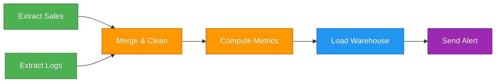
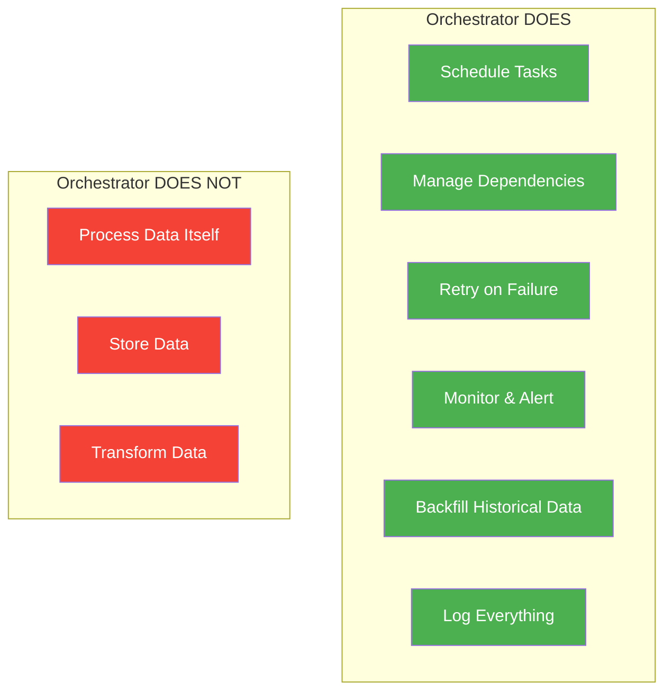

# Workflow Orchestration — Why It Exists

> **Module 00 · Topic 01 · Explanation 01** — Understanding the fundamental problem Airflow solves

---

## The Problem: Manual Pipeline Management

Imagine you're a data engineer at an e-commerce company. Every day, you need to:

1. Extract sales data from a PostgreSQL database
2. Download user behavior logs from S3
3. Merge the data, clean it, compute aggregations
4. Load the results into a data warehouse
5. Send a Slack alert when it's done (or when it fails)

```
┌─────────────────────────────────────────────────────────────┐
│                   THE NAIVE APPROACH                         │
│                                                              │
│  crontab:                                                    │
│  00 01 * * * python extract_sales.py                        │
│  30 01 * * * python extract_logs.py                         │
│  00 02 * * * python merge_and_clean.py    ← What if step    │
│  30 02 * * * python compute_metrics.py       1 isn't done?  │
│  00 03 * * * python load_warehouse.py                       │
│  30 03 * * * python send_alert.py                           │
│                                                              │
│  PROBLEMS:                                                   │
│  ✗ No dependency management between steps                   │
│  ✗ No retry logic if a step fails                           │
│  ✗ No visibility into what's running or failed              │
│  ✗ Hard-coded schedule gaps (hope it finishes in 30 min!)   │
│  ✗ No backfill capability for historical data               │
└─────────────────────────────────────────────────────────────┘
```

This approach is fragile. One slow query and the entire pipeline collapses silently.

---

## The Solution: Workflow Orchestration

**Workflow orchestration** is the automated coordination, scheduling, and monitoring of interdependent tasks in a data pipeline.

Think of it like an **air traffic controller at an airport**:

- Each flight (task) has dependencies (can't take off until the runway is clear)
- The controller (orchestrator) manages the sequence
- If a flight is delayed (task fails), the controller re-routes (retries, alerts)
- You can see the status of every flight on the dashboard (UI)

---

## DAG: The Core Abstraction

Airflow uses a **DAG (Directed Acyclic Graph)** to represent a workflow:



**Key properties:**
- **Directed** — each edge has a direction (task A runs *before* task C)
- **Acyclic** — no cycles allowed (task C cannot depend on itself, directly or indirectly)
- **Graph** — a mathematical structure of nodes (tasks) and edges (dependencies)

```
╔══════════════════════════════════════════════════════════════╗
║  WHY "ACYCLIC"?                                             ║
║                                                              ║
║  VALID (DAG):              INVALID (has cycle):              ║
║                                                              ║
║  A → B → C → D            A → B → C                         ║
║                                ↑       ↓                     ║
║                                └───────┘                     ║
║                                                              ║
║  If C depends on itself, it can never complete.              ║
║  Airflow rejects any graph with cycles at parse time.        ║
╚══════════════════════════════════════════════════════════════╝
```

---

## What an Orchestrator Does (vs What It Doesn't)



> **Critical distinction**: Airflow is an **orchestrator**, not a **processing engine**. It tells Spark *when* to run, it doesn't run Spark itself. It tells a Python script *when* to execute, but the heavy computation happens in the script.

---

## Real-World Analogy

| Concert Concept | Airflow Equivalent |
|----------------|-------------------|
| Concert conductor | Airflow scheduler |
| Musical score (sheet music) | DAG definition (Python file) |
| Each musician playing their part | Individual task execution |
| "Violins play after the intro" | Task dependencies |
| Rehearsal schedule | Cron/timetable schedule |
| Stage manager checking everything | Webserver UI |

---

## Real Company Use Cases

**Airbnb — Orchestrating 10,000+ DAGs at Scale**

Airbnb is where Airflow was born (open-sourced in 2015). Their core problem was exactly the cron-fragility described above — hundreds of independent scripts with time-based dependencies. After building Airflow, they consolidated these into DAGs with real dependency management. By 2020, Airbnb was running over 10,000 DAGs and 1.2 million task instances per day. The key architectural decision that made this scale: Airflow as a pure orchestrator. Every heavy computation — Hive queries, Spark jobs, ML training — runs on dedicated clusters. Airflow tasks are lightweight trigger-and-monitor operations, never data processors themselves.

**Uber — Real-Time ETL to Batch Boundary**

Uber's data engineering team uses Airflow to orchestrate the boundary between their real-time streaming layer (Kafka/Flink) and their batch analytics layer (Hive/Presto). Every hour, Airflow DAGs trigger Hive queries that compact Kafka-landed Parquet files, compute aggregates, and load them into Uber's data warehouse. The critical orchestration requirement: a task cannot start until the previous hour's streaming data has fully landed in S3. Airflow's sensor-based triggering (wait for a `_SUCCESS` file) provides exactly this coordination — something cron cannot do without complex workarounds.

---

## Anti-Patterns and Common Mistakes

**1. Processing data inside Airflow tasks ("Fat PythonOperator")**

Engineers new to Airflow write code like this:

```python
@task()
def process_all_sales():
    import pandas as pd
    df = pd.read_csv("s3://bucket/sales.csv")  # 50GB file!
    df = df.groupby("region").agg({"revenue": "sum"})
    df.to_parquet("s3://bucket/output.parquet")
```

This fails in production because Airflow worker containers typically have 2-4GB RAM. A 50GB CSV will OOMKill the worker, which then appears as a mysterious task failure with no useful error message. **Fix:** Submit the processing to a dedicated compute system and let Airflow monitor it:

```python
@task()
def trigger_spark_job():
    # Trigger a Spark job via the EMR operator — Airflow monitors, Spark processes
    from airflow.providers.amazon.aws.operators.emr import EmrAddStepsOperator
    # ... submission code; Airflow waits for completion, not processes data
```

**2. One monolithic DAG with 300+ tasks**

A common early mistake is combining all pipeline steps into a single DAG. At 300 tasks per run, the scheduler spends significant time evaluating dependencies on every heartbeat. The DAG parse time increases because one Python file does thousands of operator instantiations. A single bug anywhere fails the entire pipeline.

**Fix:** Split into composable DAGs by domain or layer:

```python
# Instead of one 300-task DAG, create domain-specific ones:
# extract_dag.py  — 20 extract tasks
# transform_dag.py — 40 transform tasks, triggered when extract completes
# load_dag.py — 10 load tasks, triggered by transform
# notify_dag.py — triggered by load
```

**3. Using Airflow for real-time/streaming workloads**

Engineers sometimes schedule DAGs at `schedule="* * * * *"` (every minute) thinking this creates near-real-time processing. Airflow's minimum scheduling overhead is 5-30 seconds per DAG Run creation, plus queue time. At sub-minute frequency, the scheduler becomes the bottleneck and starts missing runs.

**Fix:** For sub-minute latency, use Kafka + Flink. Use Airflow for the hourly/daily batch jobs that read from the stream's output.

---

## Interview Q&A

### Senior Data Engineer Level

**Q: What is the difference between a workflow engine and a workflow orchestrator?**

A workflow **engine** (like Apache NiFi or Spark) actually processes data — it moves bytes, transforms records, runs computations. A workflow **orchestrator** (like Airflow) *coordinates* when and in what order those engines run. Airflow doesn't process your data; it tells your data processors when to start, watches for completion, retries on failure, and provides a UI to monitor everything. This separation of concerns is architecturally critical — it means Airflow stays lightweight while your heavy processing runs on dedicated infrastructure (EMR, Databricks, BigQuery). Mixing the two roles is the #1 beginner mistake.

**Q: Why can't you have cycles in a DAG, and what happens if you accidentally create one?**

A cycle creates infinite recursion — if Task A depends on Task B, and Task B depends on Task A, neither can ever start because each is waiting for the other. Airflow detects this at DAG parse time by running a topological sort algorithm on the graph. When a cycle is found, it raises `AirflowDagCycleException` and refuses to load the DAG. The file still appears in the scheduler's error log. This constraint is a feature: it forces deterministic pipeline design. The most common way to accidentally create a cycle is with complex fan-in patterns — always visualise your DAG with `airflow dags show <dag_id>` before deploying.

**Q: A junior engineer proposes deploying 10 separate cron jobs instead of using Airflow. Walk me through your response.**

Three concrete problems with cron at the stated scale: First, no dependency management — you'd have to hardcode time gaps between jobs ("hope job 1 finishes in 30 minutes before job 2 starts"), which breaks the moment one job runs slow. Second, no operational visibility — when a cron job fails at 3 AM, nobody knows until someone manually checks logs hours later. Third, no retry logic — if the database is temporarily unreachable, cron doesn't retry. Airflow solves all three with dependency declarations, a real-time UI, and configurable retry policies. The operational overtime cost of debugging cron failures at scale far exceeds Airflow's setup cost.

### Lead / Principal Data Engineer Level

**Q: Your organisation runs 500 DAGs on Airflow. The scheduler is becoming a bottleneck — DAG Runs are created late, tasks queue for minutes before starting. Walk me through your diagnostic and remediation approach.**

I'd start by measuring, not guessing. The scheduler has specific knobs: first, I'd check `min_file_process_interval` — if it's too low (say, 5 seconds), the scheduler spends all its time parsing files and has no capacity left for scheduling tasks. Set it to 30-60 seconds for large installations. Second, increase `parsing_processes` to match CPU cores minus 1. Third, look for "fat" DAG files with top-level expensive imports or dynamic generation — each one adds parse latency that multiplies across 500 files. Fourth, consider High Availability mode (2+ Scheduler instances) to distribute the parsing load. Finally, if the DB is the bottleneck (scheduler queries), add a read replica and point the scheduler there. I'd monitor `airflow dags report` continuously to track parse times per file and identify the worst offenders.

**Q: A VP of Engineering asks: "Should we use Airflow for our new real-time ML feature store pipeline that needs sub-second updates?" How do you advise?**

No — and I'd explain exactly why. Airflow's scheduling model is batch-first: the minimum practical scheduling interval is around 1 minute (cron precision) and the actual task start overhead (scheduler detection → executor dispatch → worker pickup) adds 5-30 seconds. For a sub-second SLA, Airflow is the wrong layer entirely. The right architecture separates concerns: use Kafka + Flink/Spark Streaming for the real-time feature computation (sub-second), and then use Airflow for the batch maintenance jobs around that system — daily retraining, weekly quality checks, monthly data exports. Airflow and streaming systems are complementary, not competing.

**Q: You're inheriting a codebase where every DAG has 15+ imports at the module level including pandas, sklearn, and custom ML libraries. What's the business impact and how do you fix it at scale?**

The business impact is scheduler degradation: every import runs on every parse cycle (every 30 seconds by default). With 50 DAGs each importing sklearn (200ms import time), the scheduler spends 50 × 0.2s = 10 seconds per cycle just on imports, leaving less time for actual scheduling. This causes DAG Runs to be created late, task queue depth grows, and pipelines miss their SLAs. The fix requires establishing an engineering standard: all heavy imports must live inside task-level functions, not at module level. I'd implement this by adding a custom pre-commit hook that scans for top-level imports exceeding a threshold (using `importtime`), failing the PR with an explanation. For the existing codebase, I'd run `airflow dags report` to baseline parse times, then fix the slowest files first using a refactoring script.

---

## Self-Assessment Quiz

### Concept Check

**Q1**: What does "acyclic" mean in the context of a DAG, and why is this constraint important for pipeline reliability?
<details><summary>Hint</summary>Think about what would happen if Task A waited for Task B, and Task B waited for Task A.</details>
<details><summary>Answer</summary>"Acyclic" means no circular dependencies exist in the graph. This is critical because a cycle would create a deadlock — tasks waiting on each other indefinitely, making the pipeline unable to complete. Airflow enforces this at parse time by traversing the graph and raising an error if any cycle is detected. This constraint guarantees that every DAG has a deterministic execution order.</details>

**Q2**: Your pipeline has 5 steps. Steps 1 and 2 can run in parallel, step 3 needs both, step 4 needs step 3, and step 5 needs step 4. Draw the dependency structure as a DAG.
<details><summary>Hint</summary>Think about which tasks are independent (can run simultaneously) vs which have upstream dependencies.</details>
<details><summary>Answer</summary>Step 1 and Step 2 are roots (no dependencies) and run in parallel. Step 3 has two upstream dependencies (1 and 2). Step 4 depends on 3. Step 5 depends on 4. The DAG looks like: {1, 2} → 3 → 4 → 5. This is called a "diamond" or "fan-in" pattern — common in ETL pipelines where you extract from multiple sources, then merge.</details>

**Q3**: A team is using Airflow to process 50GB CSV files by loading them into memory within a PythonOperator task. The tasks keep getting OOMKilled. What's the root cause?
<details><summary>Hint</summary>Remember what Airflow is designed to do vs what it delegates to external systems.</details>
<details><summary>Answer</summary>The root cause is treating Airflow as a processing engine instead of an orchestrator. Airflow workers typically have 1-4GB of memory — they're designed to trigger external systems, not process data directly. The fix: use Airflow to trigger a Spark job or BigQuery query that processes the 50GB file on dedicated infrastructure, then have Airflow monitor the job until it completes.</details>

### Thought Experiment
> **Scenario**: You're a data engineer at a fintech startup. The CEO asks: "Why can't we just use cron for our 3 daily data pipelines?" You have 2 minutes to convince them.
> Think for 2 minutes before revealing the approach.
<details><summary>Suggested Approach</summary>Frame it around operational risk: (1) When a cron job fails at 2 AM, nobody knows until morning — Airflow sends instant Slack/email alerts, (2) Cron can't handle dependencies — if the database backup runs late, everything downstream breaks silently, (3) As you scale from 3 to 30 pipelines, cron becomes unmaintainable — Airflow's UI shows every pipeline's health in one dashboard, (4) Backfilling historical data with cron requires manual intervention; Airflow handles it with a single command. The upfront cost of Airflow setup pays for itself after the first production incident you avoid.</details>

### Quick Self-Rating
- [ ] I can explain workflow orchestration to a junior engineer
- [ ] I can articulate why Airflow uses DAGs (not just "because it does")
- [ ] I can identify when Airflow is the wrong tool
- [ ] I understand the orchestrator vs processing engine distinction

---

## Further Reading

- [Apache Airflow Docs — Core Concepts: DAGs](https://airflow.apache.org/docs/apache-airflow/stable/core-concepts/dags.html)
- [Maxime Beauchemin — Airflow: a workflow management platform (original blog post)](https://medium.com/airbnb-engineering/airflow-a-workflow-management-platform-46318b977fd8)
- [Airflow Summit Talks — Architecture at Scale](https://airflowsummit.org/)
- [Martin Kleppmann — Designing Data-Intensive Applications, Ch. 10](https://dataintensive.net/)
