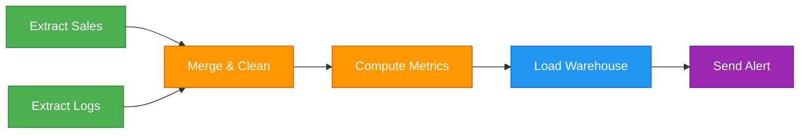
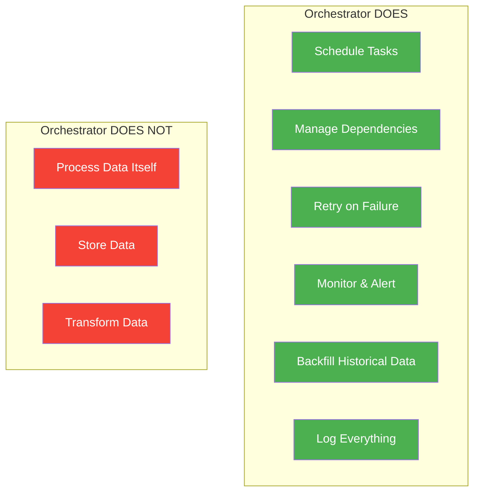

# Workflow Orchestration — Why It Exists

> **Module 00 · Topic 01 · Explanation 01** — Understanding the fundamental problem Airflow solves

---

## The Problem: Manual Pipeline Management

Imagine you're a data engineer at an e-commerce company. Every day, you need to:

1. Extract sales data from a PostgreSQL database
2. Download user behavior logs from S3
3. Merge the data, clean it, compute aggregations
4. Load the results into a data warehouse
5. Send a Slack alert when it's done (or when it fails)

```
┌─────────────────────────────────────────────────────────────┐
│                   THE NAIVE APPROACH                         │
│                                                              │
│  crontab:                                                    │
│  00 01 * * * python extract_sales.py                        │
│  30 01 * * * python extract_logs.py                         │
│  00 02 * * * python merge_and_clean.py    ← What if step    │
│  30 02 * * * python compute_metrics.py       1 isn't done?  │
│  00 03 * * * python load_warehouse.py                       │
│  30 03 * * * python send_alert.py                           │
│                                                              │
│  PROBLEMS:                                                   │
│  ✗ No dependency management between steps                   │
│  ✗ No retry logic if a step fails                           │
│  ✗ No visibility into what's running or failed              │
│  ✗ Hard-coded schedule gaps (hope it finishes in 30 min!)   │
│  ✗ No backfill capability for historical data               │
└─────────────────────────────────────────────────────────────┘
```

This approach is fragile. One slow query and the entire pipeline collapses silently.

---

## The Solution: Workflow Orchestration

**Workflow orchestration** is the automated coordination, scheduling, and monitoring of interdependent tasks in a data pipeline.

Think of it like an **air traffic controller at an airport**:

- Each flight (task) has dependencies (can't take off until the runway is clear)
- The controller (orchestrator) manages the sequence
- If a flight is delayed (task fails), the controller re-routes (retries, alerts)
- You can see the status of every flight on the dashboard (UI)

---

## DAG: The Core Abstraction

Airflow uses a **DAG (Directed Acyclic Graph)** to represent a workflow:



**Key properties:**
- **Directed** — each edge has a direction (task A runs *before* task C)
- **Acyclic** — no cycles allowed (task C cannot depend on itself, directly or indirectly)
- **Graph** — a mathematical structure of nodes (tasks) and edges (dependencies)

```
╔══════════════════════════════════════════════════════════════╗
║  WHY "ACYCLIC"?                                             ║
║                                                              ║
║  VALID (DAG):              INVALID (has cycle):              ║
║                                                              ║
║  A → B → C → D            A → B → C                         ║
║                                ↑       ↓                     ║
║                                └───────┘                     ║
║                                                              ║
║  If C depends on itself, it can never complete.              ║
║  Airflow rejects any graph with cycles at parse time.        ║
╚══════════════════════════════════════════════════════════════╝
```

---

## What an Orchestrator Does (vs What It Doesn't)



> **Critical distinction**: Airflow is an **orchestrator**, not a **processing engine**. It tells Spark *when* to run, it doesn't run Spark itself. It tells a Python script *when* to execute, but the heavy computation happens in the script.

---

## Real-World Analogy

| Concert Concept | Airflow Equivalent |
|----------------|-------------------|
| Concert conductor | Airflow scheduler |
| Musical score (sheet music) | DAG definition (Python file) |
| Each musician playing their part | Individual task execution |
| "Violins play after the intro" | Task dependencies |
| Rehearsal schedule | Cron/timetable schedule |
| Stage manager checking everything | Webserver UI |

---

## Anti-Patterns & Common Mistakes

| Mistake | Why It's Wrong | Correct Approach |
|---------|---------------|-----------------|
| Using Airflow to process large datasets directly | Airflow workers have limited memory; tasks should be lightweight triggers | Use Airflow to trigger Spark/BigQuery, not replace them |
| Creating one massive DAG with 500 tasks | Hard to debug, slow to parse, blocks scheduling | Split into multiple DAGs with `TriggerDagRunOperator` |
| Treating Airflow as a real-time system | Minimum schedule interval is ~1 second; designed for batch | Use Kafka/Flink for streaming, Airflow for batch orchestration |

---

## Interview Q&A

**Q: What is the difference between a workflow engine and a workflow orchestrator?**

> A workflow **engine** (like Apache NiFi or Spark) actually processes data — it moves bytes, transforms records, runs computations. A workflow **orchestrator** (like Airflow) *coordinates* when and in what order those engines run. Airflow doesn't process your data; it tells your data processors when to start, watches for completion, retries on failure, and provides a UI to monitor everything. This separation of concerns is architecturally critical because it means Airflow stays lightweight while your heavy processing runs on dedicated infrastructure (EMR, Databricks, BigQuery).

**Q: Why can't you have cycles in a DAG?**

> A cycle creates infinite recursion — if Task A depends on Task B, and Task B depends on Task A, neither can ever start. Airflow validates the graph at DAG parse time and raises `AirflowDagCycleException` if cycles are detected. This constraint is a feature, not a limitation: it forces engineers to design clean, deterministic pipelines.

**Q: A junior engineer proposes deploying 10 separate cron jobs instead of using Airflow. What's your response?**

> Three problems with cron: (1) No dependency management — you'd hardcode time gaps and pray step N finishes before step N+1 starts, (2) No visibility — when a cron job fails at 3 AM, you won't know until someone checks logs manually, (3) No retry logic — if the database is temporarily unreachable, cron doesn't retry. Airflow solves all three: it runs step N+1 only after N succeeds, provides a UI showing real-time status, and has built-in retry with exponential backoff. The operational overhead of cron at scale is far higher than Airflow's initial setup cost.

---

## Self-Assessment Quiz

### Concept Check

**Q1**: What does "acyclic" mean in the context of a DAG, and why is this constraint important for pipeline reliability?
<details><summary>Hint</summary>Think about what would happen if Task A waited for Task B, and Task B waited for Task A.</details>
<details><summary>Answer</summary>"Acyclic" means no circular dependencies exist in the graph. This is critical because a cycle would create a deadlock — tasks waiting on each other indefinitely, making the pipeline unable to complete. Airflow enforces this at parse time by traversing the graph and raising an error if any cycle is detected. This constraint guarantees that every DAG has a deterministic execution order.</details>

**Q2**: Your pipeline has 5 steps. Steps 1 and 2 can run in parallel, step 3 needs both, step 4 needs step 3, and step 5 needs step 4. Draw the dependency structure as a DAG.
<details><summary>Hint</summary>Think about which tasks are independent (can run simultaneously) vs which have upstream dependencies.</details>
<details><summary>Answer</summary>Step 1 and Step 2 are roots (no dependencies) and run in parallel. Step 3 has two upstream dependencies (1 and 2). Step 4 depends on 3. Step 5 depends on 4. The DAG looks like: {1, 2} → 3 → 4 → 5. This is called a "diamond" or "fan-in" pattern — common in ETL pipelines where you extract from multiple sources, then merge.</details>

**Q3**: A team is using Airflow to process 50GB CSV files by loading them into memory within a PythonOperator task. The tasks keep getting OOMKilled. What's the root cause?
<details><summary>Hint</summary>Remember what Airflow is designed to do vs what it delegates to external systems.</details>
<details><summary>Answer</summary>The root cause is treating Airflow as a processing engine instead of an orchestrator. Airflow workers typically have 1-4GB of memory — they're designed to trigger external systems, not process data directly. The fix: use Airflow to trigger a Spark job or BigQuery query that processes the 50GB file on dedicated infrastructure, then have Airflow monitor the job until it completes.</details>

### Thought Experiment
> **Scenario**: You're a data engineer at a fintech startup. The CEO asks: "Why can't we just use cron for our 3 daily data pipelines?" You have 2 minutes to convince them.
> Think for 2 minutes before revealing the approach.
<details><summary>Suggested Approach</summary>Frame it around operational risk: (1) When a cron job fails at 2 AM, nobody knows until morning — Airflow sends instant Slack/email alerts, (2) Cron can't handle dependencies — if the database backup runs late, everything downstream breaks silently, (3) As you scale from 3 to 30 pipelines, cron becomes unmaintainable — Airflow's UI shows every pipeline's health in one dashboard, (4) Backfilling historical data with cron requires manual intervention; Airflow handles it with a single command. The upfront cost of Airflow setup pays for itself after the first production incident you avoid.</details>

### Quick Self-Rating
- [ ] I can explain workflow orchestration to a junior engineer
- [ ] I can articulate why Airflow uses DAGs (not just "because it does")
- [ ] I can identify when Airflow is the wrong tool
- [ ] I understand the orchestrator vs processing engine distinction

---

## Further Reading

- [Apache Airflow Documentation — Concepts](https://airflow.apache.org/docs/apache-airflow/stable/core-concepts/dags.html)
- [Airflow Summit 2023 — Keynote: Airflow at Scale](https://airflowsummit.org/)
- [Martin Kleppmann — Designing Data-Intensive Applications, Ch. 10](https://dataintensive.net/) (batch processing foundations)
