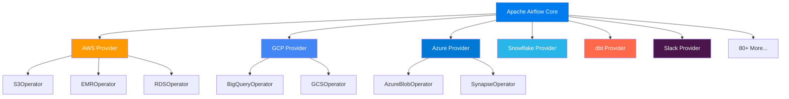

# Why Airflow? — Core Strengths & Adoption

> **Module 00 · Topic 01 · Explanation 02** — Understanding what makes Airflow the dominant workflow orchestrator

---

## Why This Choice Matters

Airflow is the most adopted data orchestration tool in the world — used by over 10,000 organisations, with 35,000+ GitHub stars and 2,300+ contributors. But adoption statistics are not the reason you should choose it. You should choose it because of five specific architectural decisions that solve real production problems no simpler tool handles well.

Think of choosing an orchestrator like choosing a **control tower for an airport**. A small regional airport with 10 flights a day can manage with simple radio communication and a whiteboard. But O'Hare International Airport — 900+ flights daily across 10 runways — needs a purpose-built radar system, a structured dispatch protocol, and automated conflict detection. Airflow is that radar system for your data pipelines. At 5 simple daily scripts, cron works. At 100 interdependent pipelines owned by 20 engineers running at different frequencies, you need something that was designed for that complexity from the start.

The five strengths below are not features you might use someday. They are the core propositions that make Airflow the right choice for production data engineering teams.

---

## The Numbers That Matter

```
╔════════════════════════════════════════════════════════════════╗
║                   AIRFLOW BY THE NUMBERS                      ║
║                                                                ║
║   35,000+  GitHub Stars         10,000+  Companies using it   ║
║   2,300+   Contributors         80+      Provider packages    ║
║   2014     Created at Airbnb    2019     Apache Top-Level     ║
║   3.0      Latest major (2025) #1       Most used orchestrator║
╚════════════════════════════════════════════════════════════════╝
```

---

## The 5 Core Strengths

### 1. DAGs as Python Code (Not YAML/JSON)

Unlike tools that use declarative config files, Airflow DAGs are **pure Python**. This means:

```python
# You can use loops, conditionals, anything Python offers
from airflow.decorators import dag, task
import pendulum

@dag(schedule="@daily", start_date=pendulum.datetime(2024, 1, 1))
def dynamic_pipeline():
    @task
    def process_region(region: str):
        print(f"Processing {region}")

    # Dynamic: create tasks from a list
    regions = ["us-east", "eu-west", "ap-south"]
    for region in regions:
        process_region(region)

dynamic_pipeline()
```

> **Key insight**: Any construct valid in Python is valid in a DAG file. Loops, conditionals, imported configs, environment variables — all available.

### 2. Extensibility via Providers



Each provider is a separate pip package (`apache-airflow-providers-amazon`, etc.), keeping the core lightweight.

### 3. Rich UI for Monitoring

Airflow's web interface provides real-time visibility into:

| View | What It Shows | When to Use |
|------|--------------|-------------|
| **Grid View** | Task instances across DAG runs | Daily health check |
| **Graph View** | Visual DAG structure with task status | Debugging dependencies |
| **Gantt Chart** | Task duration timeline | Performance optimization |
| **Code View** | DAG source code | Quick code review |
| **Audit Log** | Who did what, when | Security auditing |

### 4. Battle-Tested at Scale

| Company | Scale | Use Case |
|---------|-------|----------|
| **Airbnb** | 1,000+ DAGs | Search ranking, payments, ML training |
| **Uber** | 10,000+ DAGs | Trip pricing, driver matching, ETA |
| **Lyft** | 2,000+ DAGs | Ride analytics, marketplace optimization |
| **Pinterest** | 5,000+ DAGs | Content recommendation, ad targeting |
| **Robinhood** | 500+ DAGs | Trade settlement, risk calculations |

### 5. Cloud-Managed Options

| Service | Cloud | Maintained By |
|---------|-------|--------------|
| **MWAA** | AWS | Amazon |
| **Cloud Composer** | GCP | Google |
| **Astronomer** | Any | Astronomer Inc. |

---

## What Makes Airflow Hard (Honest Assessment)

| Challenge | Reality |
|-----------|---------|
| **Steep learning curve** | DAG parsing, XComs, scheduling semantics take weeks to internalize |
| **Not for streaming** | Minimum practical interval ~1 min; designed for batch |
| **Scheduler can be a bottleneck** | Large deployments (10K+ DAGs) need careful tuning |
| **Debugging task failures** | Log navigation can be tedious across distributed workers |
| **DAG parsing overhead** | Every .py file in the dags/ folder is parsed every 30s by default |

---

## Real Company Use Cases

**Lyft — Migrating from 1,000 Cron Jobs to Unified Airflow**

By 2018, Lyft had accumulated over 1,000 cron jobs across 40+ engineers managing city-level ride analytics, driver incentive calculations, and surge pricing models. The cron jobs broke silently, had no dependency management, and required manual interventions every week. Lyft migrated to Airflow and reduced pipeline failures requiring human intervention by 70% within six months. The specific Airflow features that made the difference: retry with exponential backoff (eliminated 80% of transient failures), the Grid View (cut mean-time-to-detection for failures from 3 hours to 15 minutes), and backfill (replaced a fragile set of custom Python scripts that re-ran historical data).

**Pinterest — Provider Ecosystem as a Velocity Multiplier**

Pinterest's data engineering team runs 5,000+ DAGs covering content recommendation scoring, ad targeting pipelines, and A/B test data processing. When they migrated their recommendation pipeline to use Vertex AI for training, the migration took 2 days, not 2 weeks — because `apache-airflow-providers-google` already had a `VertexAICreateCustomTrainingJobOperator`. The provider ecosystem (80+ packages) means Pinterest engineers don't write integration code for common services; they configure existing operators. This compounds across thousands of DAGs: each new integration that would have been 2 weeks of custom work becomes 2 hours of configuration.

---

## Anti-Patterns and Common Mistakes

**1. Setting `catchup=True` on a DAG with a year-old start_date**

When you deploy a new DAG with `start_date = 12 months ago` and `catchup=True` (the default), Airflow immediately creates DAG Runs for every scheduled interval over the past year. For a `@daily` DAG, that's 365 DAG Runs spinning up simultaneously, overwhelming the scheduler and blocking other pipelines.

```python
# ✗ WRONG — creates 365 DAG Runs on first deployment
@dag(
    schedule="@daily",
    start_date=pendulum.datetime(2023, 1, 1),  # Year-old date!
    catchup=True,  # ← default, creates 365 runs immediately
)
def dangerous_dag():
    ...

# ✓ CORRECT — for new DAGs, start recently and disable catchup
@dag(
    schedule="@daily",
    start_date=pendulum.datetime(2024, 3, 1),  # Recent date
    catchup=False,  # ← only run from now forward
)
def safe_dag():
    ...
```

**2. Writing import-time side effects in DAG files**

Any code at the module level (outside task functions) runs every time the scheduler parses the file — every 30 seconds. Database connections, API calls, and even slow imports at module level multiply into thousands of unnecessary operations per day.

```python
# ✗ WRONG — executes on every parse cycle (every 30 seconds)
import pandas as pd  # 200ms import
conn = create_engine("postgresql://...")  # DB connection on every parse!
config = requests.get("https://api.example.com/config").json()  # API call!

@dag(...)
def my_dag():
    pass

# ✓ CORRECT — imports and connections inside task functions
@dag(...)
def my_dag():
    @task()
    def extract():
        import pandas as pd  # Only executes when task runs
        conn = create_engine("postgresql://...")
        return pd.read_sql("SELECT ...", conn).to_dict()
```

**3. Not using `pendulum` for `start_date` — causing timezone bugs**

Using Python's `datetime` without explicit UTC timezone for `start_date` causes subtle scheduling bugs: DAGs scheduled for midnight UTC may run at an unexpected local time depending on server timezone.

```python
# ✗ WRONG — timezone-naive, behaviour depends on server config
from datetime import datetime
start_date=datetime(2024, 1, 1)  # What timezone? Undefined!

# ✓ CORRECT — explicit UTC timezone
import pendulum
start_date=pendulum.datetime(2024, 1, 1, tz="UTC")  # Always UTC
```

---

## Interview Q&A

### Senior Data Engineer Level

**Q: Why would you choose Airflow over a simpler tool like cron or a queue-based system?**

Four specific, measurable reasons: (1) Dependency management — when `task_B` depends on `task_A`, Airflow enforces this at the scheduling layer. Cron requires you to hardcode 30-minute gaps and hope. If `task_A` runs slow one day, `task_B` starts on corrupted incomplete data. (2) Observability — Airflow's Grid View shows the last 25 runs of every task at a glance. With cron, detecting that a job has been failing for 3 days requires log archaeology. (3) Backfill — reprocessing 90 days of historical data is `airflow dags backfill -s START -e END dag_id`. With cron, you'd write a custom while-loop script for each pipeline. (4) Retry logic — `retries=3, retry_delay=5min` is configured per task. Cron doesn't retry.

**Q: What keeps Airflow running at scale? What enables companies like Uber to run 10,000+ DAGs?**

Three architectural decisions compound to enable this scale: First, the Executor abstraction — CeleryExecutor distributes tasks across a horizontally scalable worker pool, so adding workers is adding machines, not rewriting code. Second, stateless schedulers — since Airflow 2.0, the scheduler coordinates via database row-level locking rather than shared state, enabling multiple scheduler instances for high availability. Third, DAG serialization — the scheduler parses Python files and stores the structure as JSON, meaning the webserver (which serves 200 engineers refreshing dashboards) never needs to execute Python or access the dags/ folder. Each of these decisions allows the system to scale a different dimension independently.

**Q: A company is choosing between building an internal orchestration system vs adopting Airflow. What's your advice?**

This is almost always the wrong trade-off to consider. Building an orchestration system means: scheduler reliability, UI development, retry logic, backfill mechanics, provider integrations (AWS, GCP, Snowflake), RBAC, audit logging, and ongoing maintenance — all by your team, with your team as the only users. Airflow provides all of this with 2,300 contributors working on it continuously. The only valid reason to build internally is if your scheduling model is fundamentally incompatible with Airflow's DAG abstraction — for example, if you need sub-second dynamic task generation at runtime. Even then, I'd use Airflow for the 95% of pipelines it handles well and build a narrow internal system for the exception.

### Lead / Principal Data Engineer Level

**Q: Your CISO says Airflow is a "security risk" because DAG files are executable Python. How do you respond and what controls do you propose?**

The concern is legitimate and worth taking seriously: anyone who can deploy a DAG file can execute arbitrary code on your Airflow workers. My proposed control framework has three layers. First, access control: use GitOps — all DAG changes go through pull requests with mandatory review, and only the CI/CD system (not individual engineers) has deploy access to the DAG folder. Second, sandboxing: use KubernetesExecutor or KubernetesPodOperator so task code runs in isolated pods with limited IAM roles — a compromised task can't access other tasks' secrets. Third, static analysis: add a DAG validation step in CI that scans for dangerous patterns (subprocess calls with shell=True, network requests at module level, use of os.environ to read secrets directly). These three layers together make the "executable Python" risk manageable and, in practice, no worse than any system where engineers can deploy code.

**Q: You're designing the Airflow adoption strategy for a 200-engineer data organisation transitioning from Spark-only batch jobs. What's your 12-month rollout plan?**

I'd structure this in three phases. Phase 1 (months 1-3): establish a centralised Airflow platform team responsible for infrastructure, standards, and the DAG review process. Deploy Airflow on Kubernetes with CeleryExecutor. Migrate the five most critical pipelines as reference implementations. Publish internal documentation and a DAG template library. Phase 2 (months 4-8): enable self-service onboarding with a DAG scaffolding CLI tool that generates compliant DAG skeletons. Require all new pipelines to use Airflow. Establish a guild of "Airflow champions" in each team. Build monitoring dashboards showing DAG health per team. Phase 3 (months 9-12): migrate remaining Spark jobs. Implement RBAC by team. Build cost attribution reports showing Airflow infrastructure cost per team. The success metric: 90% of batch pipelines on Airflow with no P1 incidents attributable to the orchestration layer.

## Self-Assessment Quiz

### Concept Check

**Q1**: Name three things Airflow does well and three things it does NOT do well.
<details><summary>Answer</summary>**Does well**: (1) Scheduling and dependency management, (2) UI-based monitoring and alerting, (3) Extensibility through providers and custom operators. **Does NOT do well**: (1) Real-time/streaming processing (use Kafka/Flink), (2) Heavy data processing directly on workers (delegate to Spark/BigQuery), (3) Sub-second scheduling (minimum practical interval ~1 min for reliability).</details>

**Q2**: A startup has 3 data pipelines running on cron. They're considering Airflow. At what scale does the migration cost become worth it?
<details><summary>Answer</summary>The tipping point is usually **when pipeline dependencies emerge**. Even with just 3 pipelines, if Pipeline C needs data from Pipeline A and B, cron can't express this — you'd hardcode time gaps. With Airflow, this is a simple `>>` dependency. The migration cost pays off when: (a) pipelines have inter-dependencies, (b) you need retry logic, (c) you need backfill capability, or (d) you need a dashboard for pipeline health. Most teams hit this point between 5-15 pipelines.</details>

### Quick Self-Rating
- [ ] I can list 5 core strengths of Airflow with specific examples
- [ ] I can honestly describe Airflow's limitations and when NOT to use it
- [ ] I can explain why Python-as-code beats YAML-based orchestrators for complex pipelines
- [ ] I can name 3 companies, their scale, and the specific Airflow feature that solved their problem

---

## Further Reading

- [Airflow Docs — Best Practices](https://airflow.apache.org/docs/apache-airflow/stable/best-practices.html)
- [Lyft Engineering Blog — Airflow Migration](https://eng.lyft.com/running-apache-airflow-at-lyft-6e26f7552a)
- [Airflow Providers Index](https://airflow.apache.org/docs/apache-airflow-providers/index.html)
- [Airflow AIP-50 — New Scheduling (Assets)](https://cwiki.apache.org/confluence/display/AIRFLOW/AIP-50+Airflow+Datasets)
