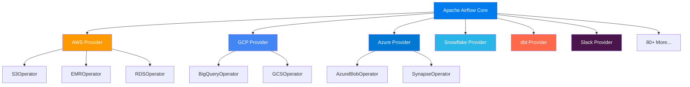

# Why Airflow? — Core Strengths & Adoption
 
> **Module 00 · Topic 01 · Explanation 02** — Understanding what makes Airflow the dominant workflow orchestrator

---

## The Numbers That Matter

```
╔════════════════════════════════════════════════════════════════╗
║                   AIRFLOW BY THE NUMBERS                      ║
║                                                                ║
║   35,000+  GitHub Stars         10,000+  Companies using it   ║
║   2,300+   Contributors         80+      Provider packages    ║
║   2014     Created at Airbnb    2019     Apache Top-Level     ║
║   3.0      Latest major (2025) #1       Most used orchestrator║
╚════════════════════════════════════════════════════════════════╝
```

---

## The 5 Core Strengths

### 1. DAGs as Python Code (Not YAML/JSON)

Unlike tools that use declarative config files, Airflow DAGs are **pure Python**. This means:

```python
# You can use loops, conditionals, anything Python offers
from airflow.decorators import dag, task
import pendulum

@dag(schedule="@daily", start_date=pendulum.datetime(2024, 1, 1))
def dynamic_pipeline():
    @task
    def process_region(region: str):
        print(f"Processing {region}")

    # Dynamic: create tasks from a list
    regions = ["us-east", "eu-west", "ap-south"]
    for region in regions:
        process_region(region)

dynamic_pipeline()
```

> **Key insight**: Any construct valid in Python is valid in a DAG file. Loops, conditionals, imported configs, environment variables — all available.

### 2. Extensibility via Providers



Each provider is a separate pip package (`apache-airflow-providers-amazon`, etc.), keeping the core lightweight.

### 3. Rich UI for Monitoring

Airflow's web interface provides real-time visibility into:

| View | What It Shows | When to Use |
|------|--------------|-------------|
| **Grid View** | Task instances across DAG runs | Daily health check |
| **Graph View** | Visual DAG structure with task status | Debugging dependencies |
| **Gantt Chart** | Task duration timeline | Performance optimization |
| **Code View** | DAG source code | Quick code review |
| **Audit Log** | Who did what, when | Security auditing |

### 4. Battle-Tested at Scale

| Company | Scale | Use Case |
|---------|-------|----------|
| **Airbnb** | 1,000+ DAGs | Search ranking, payments, ML training |
| **Uber** | 10,000+ DAGs | Trip pricing, driver matching, ETA |
| **Lyft** | 2,000+ DAGs | Ride analytics, marketplace optimization |
| **Pinterest** | 5,000+ DAGs | Content recommendation, ad targeting |
| **Robinhood** | 500+ DAGs | Trade settlement, risk calculations |

### 5. Cloud-Managed Options

| Service | Cloud | Maintained By |
|---------|-------|--------------|
| **MWAA** | AWS | Amazon |
| **Cloud Composer** | GCP | Google |
| **Astronomer** | Any | Astronomer Inc. |

---

## What Makes Airflow Hard (Honest Assessment)

| Challenge | Reality |
|-----------|---------|
| **Steep learning curve** | DAG parsing, XComs, scheduling semantics take weeks to internalize |
| **Not for streaming** | Minimum practical interval ~1 min; designed for batch |
| **Scheduler can be a bottleneck** | Large deployments (10K+ DAGs) need careful tuning |
| **Debugging task failures** | Log navigation can be tedious across distributed workers |
| **DAG parsing overhead** | Every .py file in the dags/ folder is parsed every 30s by default |

---

## Interview Q&A

**Q: Why would you choose Airflow over a simpler tool like cron or a queue-based system?**

> Four reasons: (1) **Dependency management** — cron has no concept of "run B only after A succeeds", Airflow does natively, (2) **Observability** — Airflow's UI shows exactly which tasks succeeded, failed, or are retrying across all pipeline runs, (3) **Backfill** — reprocessing historical data is a single CLI command in Airflow; with cron, you'd need custom scripts for each pipeline, (4) **Extensibility** — 80+ provider packages give you pre-built integrations with AWS, GCP, Snowflake, dbt, etc.

**Q: What keeps Airflow running at scale? What architectural decisions enable companies like Uber to run 10,000+ DAGs?**

> Three key architectural decisions: (1) **Executor abstraction** — the Celery/Kubernetes executor distributes tasks across a pool of workers, so scaling is horizontal, (2) **Metadata database** — a PostgreSQL/MySQL backend stores all state, enabling stateless scheduler instances (you can run multiple schedulers since Airflow 2.0), (3) **Provider separation** — core Airflow is lightweight; providers are separate packages, so you only install what you need.

---

## Self-Assessment Quiz

### Concept Check

**Q1**: Name three things Airflow does well and three things it does NOT do well.
<details><summary>Answer</summary>**Does well**: (1) Scheduling and dependency management, (2) UI-based monitoring and alerting, (3) Extensibility through providers and custom operators. **Does NOT do well**: (1) Real-time/streaming processing (use Kafka/Flink), (2) Heavy data processing directly on workers (delegate to Spark/BigQuery), (3) Sub-second scheduling (minimum practical interval ~1 min for reliability).</details>

**Q2**: A startup has 3 data pipelines running on cron. They're considering Airflow. At what scale does the migration cost become worth it?
<details><summary>Answer</summary>The tipping point is usually **when pipeline dependencies emerge**. Even with just 3 pipelines, if Pipeline C needs data from Pipeline A and B, cron can't express this — you'd hardcode time gaps. With Airflow, this is a simple `>>` dependency. The migration cost pays off when: (a) pipelines have inter-dependencies, (b) you need retry logic, (c) you need backfill capability, or (d) you need a dashboard for pipeline health. Most teams hit this point between 5-15 pipelines.</details>

### Quick Self-Rating
- [ ] I can list 5 core strengths of Airflow
- [ ] I can honestly describe Airflow's limitations
- [ ] I can explain why Airflow uses Python code instead of YAML
- [ ] I can name 3 companies using Airflow at scale
