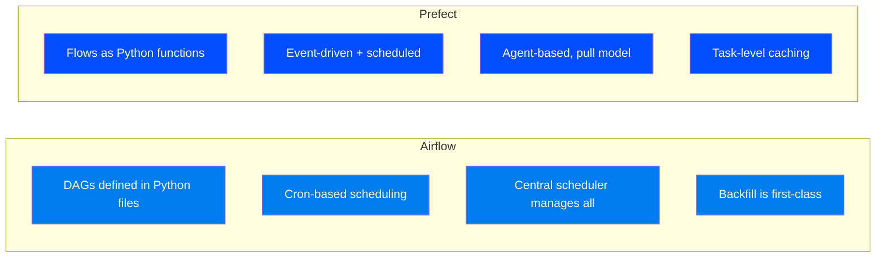
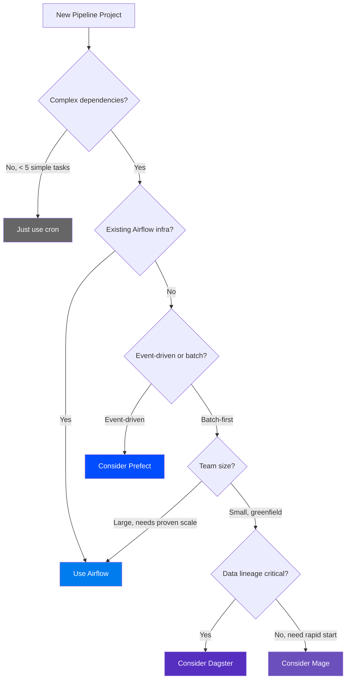

# Airflow vs Alternatives — Choosing the Right Orchestrator

> **Module 00 · Topic 01 · Explanation 03** — Head-to-head comparison with Luigi, Prefect, Dagster, Mage, and AWS Step Functions

---

## The Orchestrator Landscape (2025)

```
╔══════════════════════════════════════════════════════════════════════╗
║                    ORCHESTRATOR LANDSCAPE                           ║
║                                                                      ║
║  BATCH-FIRST                          EVENT-FIRST                    ║
║  ┌────────────┐  ┌────────────┐      ┌────────────┐                ║
║  │  Airflow   │  │  Dagster   │      │  Prefect   │                ║
║  │  (Apache)  │  │ (Elementl) │      │ (Prefect)  │                ║
║  │ 2014, 35K★ │  │ 2018, 11K★ │      │ 2018, 16K★ │                ║
║  └────────────┘  └────────────┘      └────────────┘                ║
║                                                                      ║
║  LIGHTWEIGHT                          CLOUD-NATIVE                   ║
║  ┌────────────┐  ┌────────────┐      ┌────────────┐                ║
║  │   Luigi    │  │   Mage     │      │  AWS Step  │                ║
║  │ (Spotify)  │  │ (Mage AI)  │      │ Functions  │                ║
║  │ 2012, 17K★ │  │ 2022, 7K★  │      │  (Amazon)  │                ║
║  └────────────┘  └────────────┘      └────────────┘                ║
╚══════════════════════════════════════════════════════════════════════╝
```

---

## Comparison Matrix

| Feature | Airflow | Prefect | Dagster | Luigi | Mage |
|---------|---------|---------|---------|-------|------|
| **DAG Definition** | Python code | Python decorators | Python + assets | Python classes | Python + UI blocks |
| **Scheduling** | Cron/timetable | Server + triggers | Cron/sensor | Cron (basic) | Built-in scheduler |
| **UI Quality** | ★★★★☆ | ★★★★★ | ★★★★☆ | ★★☆☆☆ | ★★★★☆ |
| **Backfill** | ★★★★★ | ★★★☆☆ | ★★★★☆ | ★★☆☆☆ | ★★★☆☆ |
| **Community Size** | ★★★★★ | ★★★★☆ | ★★★☆☆ | ★★★☆☆ | ★★☆☆☆ |
| **Learning Curve** | Steep | Moderate | Steep | Easy | Easy |
| **Cloud Managed** | MWAA, Composer | Prefect Cloud | Dagster Cloud | None | Mage Cloud |
| **Provider Ecosystem** | 80+ packages | 50+ integrations | growing | limited | limited |
| **Data Awareness** | Assets (3.0) | Native | Software-defined Assets | None | Native |
| **Best For** | Complex batch ETL | Event-driven flows | Modern data platform | Simple pipelines | Rapid prototyping |

---

## Head-to-Head Comparisons

### Airflow vs Prefect



| Dimension | Choose Airflow | Choose Prefect |
|-----------|---------------|----------------|
| **Scheduling** | Complex cron schedules, data-interval-aware | Event-driven, API-triggered flows |
| **Scale** | 10,000+ DAGs proven at Uber/Airbnb | Better for 100s of flows |
| **Backfill** | First-class support via CLI | Manual re-runs |
| **Infrastructure** | Self-hosted or managed (MWAA) | Prefect Cloud simplifies ops |
| **Team Experience** | Team knows Airflow or has complex pipelines | New team wanting modern DX |

### Airflow vs Dagster

| Dimension | Choose Airflow | Choose Dagster |
|-----------|---------------|----------------|
| **Philosophy** | Task-centric: "run this task, then that task" | Asset-centric: "produce this dataset" |
| **Data Lineage** | Manual (metadata + docs) | First-class via Software-Defined Assets |
| **Type Safety** | Loose (XCom is pickle/JSON) | Strong (IO Managers, type annotations) |
| **Testing** | Growing support (pytest) | Built-in test harness |
| **When to Choose** | Existing Airflow infra, proven scale | Greenfield modern data platform |

### Airflow vs Luigi (Spotify)

| Dimension | Airflow | Luigi |
|-----------|---------|-------|
| **Active development** | Very active (monthly releases) | Maintenance mode |
| **UI** | Full-featured web app | Minimal task status viewer |
| **Scheduling** | Built-in scheduler + timetables | No built-in scheduler (needs cron) |
| **Verdict** | **Choose for new projects** | Legacy only — migrate away |

---

## Decision Framework



---

## Interview Q&A

**Q: Your company uses Airflow for 200 DAGs. A new team member suggests migrating to Dagster because it's "more modern." How do you respond?**

> I'd frame this as a risk-benefit analysis: (1) **Migration cost** — rewriting 200 DAGs is 6-12 months of engineering effort during which both systems need maintenance, (2) **Team expertise** — the existing team knows Airflow; Dagster has a different mental model (asset-centric vs task-centric), (3) **Diminishing returns** — for batch ETL with complex scheduling, Airflow and Dagster produce similar outcomes; the "modern" label doesn't translate to measurable improvements for our use case, (4) **Airflow 3.0 narrows the gap** — the new Asset-based scheduling brings asset-awareness to Airflow. However, if we were starting a new *isolated* project with strong data lineage requirements, I'd consider Dagster for that project while keeping existing Airflow infrastructure.

---

## Self-Assessment Quiz

### Concept Check

**Q1**: When would you recommend Prefect over Airflow for a new project? Give specific criteria.
<details><summary>Answer</summary>Recommend Prefect when: (1) The pipeline is primarily event-driven (API triggers, webhook responses) rather than scheduled, (2) The team is small and wants managed infrastructure without Kubernetes overhead, (3) Dynamic, parameterized flow runs are the primary pattern (Prefect's functional API handles this more naturally), (4) The project doesn't need complex backfill or data-interval-aware scheduling — Airflow's core strengths.</details>

**Q2**: A startup asks you: "We have 5 data pipelines. Which orchestrator should we pick?" What's your answer?
<details><summary>Answer</summary>At 5 pipelines, the orchestrator choice matters less than just picking one and building expertise. My recommendation depends on the trajectory: If they plan to scale to 100+ pipelines with complex scheduling, start with Airflow — the learning investment pays off and the ecosystem is proven. If they're a small event-driven API backend, Prefect's simpler model may be faster to adopt. If they have zero data engineering experience and want to ship fast, Mage's UI-first approach reduces time-to-first-pipeline. The worst decision is analysis paralysis — just pick one.</details>

### Quick Self-Rating
- [ ] I can compare Airflow to at least 3 alternatives with specific trade-offs
- [ ] I can use the decision framework to recommend an orchestrator for a given scenario
- [ ] I can articulate when migration from Airflow to another tool is justified
