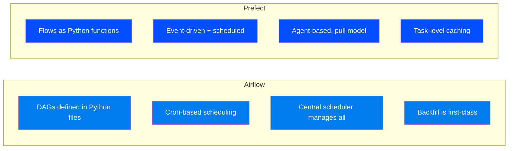
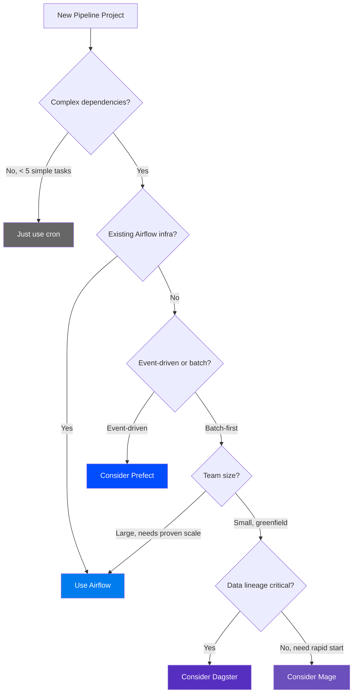

# Airflow vs Alternatives — Choosing the Right Orchestrator

> **Module 00 · Topic 01 · Explanation 03** — Head-to-head comparison with Luigi, Prefect, Dagster, Mage, and AWS Step Functions

---

## Why This Decision Is Consequential

Choosing an orchestrator is not like choosing a Python library you can swap in an afternoon. It is an infrastructure foundation decision — your team's mental model, tooling integrations, CI/CD pipelines, monitoring systems, and years of institutional knowledge will be built on top of it. Getting it wrong means a painful 12-18 month migration while maintaining two systems simultaneously.

Think of this like choosing a **rail gauge for a railway network**. Spain's original Iberian gauge (1668mm) was chosen in 1844 for military reasons. When Spain later needed to integrate with the rest of Europe's standard gauge (1435mm), every train at the border required a gauge-change bogie exchange — adding 20 minutes to every international trip. The gauge was technically fine for Spain's internal needs, but the switching cost was enormous. Choosing an orchestrator is your gauge decision. Make it deliberately.

The comparison that follows is not about which tool is "best" in the abstract. It's about which tool fits your team's specific constraints: existing expertise, pipeline complexity, scheduling semantics, and 3-year scale trajectory.

---

## The Orchestrator Landscape (2025)

```
╔══════════════════════════════════════════════════════════════════════╗
║                    ORCHESTRATOR LANDSCAPE                           ║
║                                                                      ║
║  BATCH-FIRST                          EVENT-FIRST                    ║
║  ┌────────────┐  ┌────────────┐      ┌────────────┐                ║
║  │  Airflow   │  │  Dagster   │      │  Prefect   │                ║
║  │  (Apache)  │  │ (Elementl) │      │ (Prefect)  │                ║
║  │ 2014, 35K★ │  │ 2018, 11K★ │      │ 2018, 16K★ │                ║
║  └────────────┘  └────────────┘      └────────────┘                ║
║                                                                      ║
║  LIGHTWEIGHT                          CLOUD-NATIVE                   ║
║  ┌────────────┐  ┌────────────┐      ┌────────────┐                ║
║  │   Luigi    │  │   Mage     │      │  AWS Step  │                ║
║  │ (Spotify)  │  │ (Mage AI)  │      │ Functions  │                ║
║  │ 2012, 17K★ │  │ 2022, 7K★  │      │  (Amazon)  │                ║
║  └────────────┘  └────────────┘      └────────────┘                ║
╚══════════════════════════════════════════════════════════════════════╝
```

---

## Comparison Matrix

| Feature | Airflow | Prefect | Dagster | Luigi | Mage |
|---------|---------|---------|---------|-------|------|
| **DAG Definition** | Python code | Python decorators | Python + assets | Python classes | Python + UI blocks |
| **Scheduling** | Cron/timetable | Server + triggers | Cron/sensor | Cron (basic) | Built-in scheduler |
| **UI Quality** | ★★★★☆ | ★★★★★ | ★★★★☆ | ★★☆☆☆ | ★★★★☆ |
| **Backfill** | ★★★★★ | ★★★☆☆ | ★★★★☆ | ★★☆☆☆ | ★★★☆☆ |
| **Community Size** | ★★★★★ | ★★★★☆ | ★★★☆☆ | ★★★☆☆ | ★★☆☆☆ |
| **Learning Curve** | Steep | Moderate | Steep | Easy | Easy |
| **Cloud Managed** | MWAA, Composer | Prefect Cloud | Dagster Cloud | None | Mage Cloud |
| **Provider Ecosystem** | 80+ packages | 50+ integrations | growing | limited | limited |
| **Data Awareness** | Assets (3.0) | Native | Software-defined Assets | None | Native |
| **Best For** | Complex batch ETL | Event-driven flows | Modern data platform | Simple pipelines | Rapid prototyping |

---

## Head-to-Head Comparisons

### Airflow vs Prefect



| Dimension | Choose Airflow | Choose Prefect |
|-----------|---------------|----------------|
| **Scheduling** | Complex cron schedules, data-interval-aware | Event-driven, API-triggered flows |
| **Scale** | 10,000+ DAGs proven at Uber/Airbnb | Better for 100s of flows |
| **Backfill** | First-class support via CLI | Manual re-runs |
| **Infrastructure** | Self-hosted or managed (MWAA) | Prefect Cloud simplifies ops |
| **Team Experience** | Team knows Airflow or has complex pipelines | New team wanting modern DX |

### Airflow vs Dagster

| Dimension | Choose Airflow | Choose Dagster |
|-----------|---------------|----------------|
| **Philosophy** | Task-centric: "run this task, then that task" | Asset-centric: "produce this dataset" |
| **Data Lineage** | Manual (metadata + docs) | First-class via Software-Defined Assets |
| **Type Safety** | Loose (XCom is pickle/JSON) | Strong (IO Managers, type annotations) |
| **Testing** | Growing support (pytest) | Built-in test harness |
| **When to Choose** | Existing Airflow infra, proven scale | Greenfield modern data platform |

### Airflow vs Luigi (Spotify)

| Dimension | Airflow | Luigi |
|-----------|---------|-------|
| **Active development** | Very active (monthly releases) | Maintenance mode |
| **UI** | Full-featured web app | Minimal task status viewer |
| **Scheduling** | Built-in scheduler + timetables | No built-in scheduler (needs cron) |
| **Verdict** | **Choose for new projects** | Legacy only — migrate away |

---

## Decision Framework



---

## Real Company Use Cases

**Netflix — Why They Built Maestro Instead of Staying on Airflow**

Netflix ran Airflow at scale for years but ultimately built their own orchestrator (Maestro, open-sourced in 2024) after hitting specific limitations: (1) dynamic task generation at runtime (Airflow's DAG structure is fixed at parse time, before any data is read), (2) 100,000+ step workflows that exceeded Airflow's task limit per DAG Run, and (3) hierarchical workflow composition (a workflow calling sub-workflows as first-class objects). Netflix's decision is the clearest example of the rule: stick with Airflow until you need something it architecturally cannot do. Their specific unmet needs — runtime dynamic tasks, 100K+ steps, nested workflows — are not common. For 99% of data engineering use cases, Airflow's fixed-structure DAGs are a feature, not a limitation.

**Twitter/X — Choosing Airflow Over Home-Grown Systems**

Twitter ran several home-grown workflow systems before standardising on Airflow across their data platform. The decision drivers: (1) the Airflow community provides more ongoing development than Twitter could sustain internally, (2) provider packages eliminated custom code for S3, Kafka, and BigQuery integrations, (3) shared tooling across teams (UI, CLI, alerting) reduced the total number of internal developer tools to support. Twitter's lesson: the ecosystem and community of an open-source standard almost always outweigh the flexibility of an internal tool, because the community handles the 80% of infrastructure work that isn't unique to your business.

---

## Anti-Patterns and Common Mistakes

**1. Migrating away from Airflow because of "modern DX" without measuring actual pain**

Teams sometimes migrate to Dagster or Prefect because the demo looks cleaner or the blog posts are more recent. But if migration is driven by aesthetics rather than measured pain points ("our backfill latency is X", "our lineage gap costs us Y hours per week"), the migration cost will exceed the benefit.

**Fix:** Before any migration discussion, document the specific Airflow limitations you hit:

```python
# Quantify your actual pain before migrating:
pain_points = {
    "backfill_issues": "How many hours/week spent on backfill issues? _",
    "lineage_gaps": "How many incidents caused by missing lineage? _",
    "dep_conflicts": "How many tasks need incompatible Python versions? _",
    "scheduler_latency": "How many minutes between schedule and task start? _",
}
# If all answers are 0 or very low, don't migrate.
# Migration cost: 12-18 months of dual-system maintenance + retraining.
```

**2. Choosing KubernetesExecutor for a 5-DAG startup**

KubernetesExecutor is production-grade infrastructure for scale. For a startup with 5 pipelines, it adds 30-60 seconds of cold-start latency to every task, requires a K8s cluster to maintain, and introduces debugging complexity (pod logs, image pulls, resource limits) that dwarfs the actual pipeline logic.

```yaml
# WRONG for small deployments: forces every task through K8s pod spin-up
executor: KubernetesExecutor

# RIGHT for small deployments: tasks run as local processes, no overhead  
executor: LocalExecutor
# Upgrade to CeleryExecutor when you need > 1 worker machine
# Upgrade to KubernetesExecutor when you need task-level isolation
```

**3. Running Airflow for pure event-driven pipelines**

Airflow is a schedule-first system. Its core abstraction is "run this graph of tasks at this cron schedule." Event-driven workflows — where pipelines are triggered by API events, file arrivals, or message queue depth thresholds — are awkward in Airflow, requiring either sensors (that poll and burn slots) or external API triggers.

```python
# WRONG: using a sensor that burns a worker slot for hours waiting
from airflow.providers.amazon.aws.sensors.s3 import S3KeySensor

# This holds a worker slot for up to 7 hours, blocking other work
wait_for_file = S3KeySensor(
    task_id="wait_for_report",
    bucket_name="reports",
    bucket_key="daily/report_{{ ds }}.csv",
    timeout=3600 * 7,  # Holds slot for 7 hours!
    poke_interval=60,
)

# CORRECT: use a deferrable sensor (Airflow 2.2+) or an event-driven tool
from airflow.providers.amazon.aws.sensors.s3 import S3KeySensorAsync  # deferrable
wait_for_file = S3KeySensorAsync(
    task_id="wait_for_report",  # Releases worker slot while waiting
    bucket_name="reports",
    bucket_key="daily/report_{{ ds }}.csv",
)
```

---

## Interview Q&A

### Senior Data Engineer Level

**Q: Your company uses Airflow for 200 DAGs. A new team member suggests migrating to Dagster because it's "more modern." How do you respond?**

I'd frame this as a risk-benefit analysis requiring evidence, not opinion. First: what specific, quantified pain points does Dagster solve that we can't solve in Airflow? Dagster's primary differentiator is Software-Defined Assets — if we don't have data lineage issues causing incidents, this is a solution looking for a problem. Second: migration cost for 200 DAGs is 6-12 months of dual-system maintenance, testing, and retraining — that's engineering time not spent on business value. Third: Airflow 3.0's Assets system now provides asset-aware scheduling, closing the main gap. My answer: pick one new project as a Dagster pilot. If after 3 months it demonstrably solves measured problems, we migrate. If not, we continue using a tool that already works.

**Q: When would you recommend Prefect over Airflow for a new project?**

Three specific scenarios: (1) The pipeline is primarily triggered by events — API calls, webhooks, file arrival — rather than fixed cron schedules. Prefect's deployment model handles ad-hoc triggers more naturally. (2) The team is small (2-4 engineers) and wants managed infrastructure without Kubernetes operational overhead. Prefect Cloud provides serverless worker management that dramatically reduces ops burden. (3) Dynamic, parameterised flows are the primary pattern and the team doesn't need sophisticated backfill. If any of these three don't apply, and especially if you need complex cron scheduling or Airflow's ecosystem of 80+ providers, stick with Airflow.

**Q: A startup asks: "We have 5 pipelines. Should we use Airflow?" What's your honest answer?**

Honest answer: probably not yet, unless they expect to scale quickly. At exactly 5 pipelines, the operational overhead of Airflow (maintaining a scheduler, webserver, metadata DB, and Celery/K8s executor) exceeds the value it provides. A startup at this scale should use Prefect Cloud (managed, no infrastructure) or even cron + basic logging. The trigger point for Airflow is when: (a) pipelines have inter-dependencies, (b) multiple engineers own different pipelines, (c) backfill is needed for historical data, or (d) they plan to reach 50+ pipelines in the next year. At that point, learning investment in Airflow pays off.

### Lead / Principal Data Engineer Level

**Q: Your organisation is evaluating a move from self-hosted Airflow to AWS MWAA (Managed Airflow). What are the trade-offs you analyse and how do you make the recommendation?**

I evaluate five dimensions: Cost structure — MWAA pricing is per environment-hour plus task execution; at high task volume, self-hosted on EKS is typically 40-60% cheaper, but requires a dedicated platform engineer. Operational burden — MWAA eliminates scheduler HA, DB management, and Airflow upgrades; self-hosted requires these. Customisation ceiling — MWAA restricts certain Airflow configurations and custom plugin types; if your team has complex custom operators or non-standard executors, self-hosted is necessary. Version lag — MWAA typically runs 1-2 major versions behind latest Airflow; if you need new features quickly, self-hosted wins. Security posture — MWAA's network isolation model (VPC-only) matches most enterprise requirements. My recommendation framework: teams under 10 data engineers without dedicated platform engineers should strongly prefer MWAA. Teams with 20+ engineers, complex custom operators, or cost sensitivity at scale should self-host on EKS with a dedicated platform team.

**Q: Netflix built Maestro instead of using Airflow for XM+ step workflows. What architectural limitations of Airflow led to this, and how would you work around them for a use case requiring 50,000 tasks per run?**

Airflow's structural limitation for 50,000-task DAGs has three root causes: (1) DAG parsing — the dag file must be fully parsed (all task objects created) before any run can start. 50,000 TaskGroup/task objects at parse time is prohibitively slow. (2) Task instance table growth — each run creates 50,000 rows in `task_instance`. Over 100 runs, that's 5 million rows in a single DAG's history, degrading query performance across the entire system. (3) the Graph View becomes unusable with 50,000 nodes. My workaround strategy: use Dynamic Task Mapping (Airflow 2.3+) to generate task instances at runtime from a small static DAG structure, combined with `max_map_index` controls. Alternatively, decompose into a meta-DAG that orchestrates 50 sub-DAGs of 1,000 tasks each using TriggerDagRunOperator. Neither eliminates the limitation — they work around it. At true Netflix-scale, a specialised system is the right answer.

## Self-Assessment Quiz

### Concept Check

**Q1**: When would you recommend Prefect over Airflow for a new project? Give specific criteria.
<details><summary>Answer</summary>Recommend Prefect when: (1) The pipeline is primarily event-driven (API triggers, webhook responses) rather than scheduled, (2) The team is small and wants managed infrastructure without Kubernetes overhead, (3) Dynamic, parameterized flow runs are the primary pattern (Prefect's functional API handles this more naturally), (4) The project doesn't need complex backfill or data-interval-aware scheduling — Airflow's core strengths.</details>

**Q2**: A startup asks you: "We have 5 data pipelines. Which orchestrator should we pick?" What's your answer?
<details><summary>Answer</summary>At 5 pipelines, the orchestrator choice matters less than just picking one and building expertise. My recommendation depends on the trajectory: If they plan to scale to 100+ pipelines with complex scheduling, start with Airflow — the learning investment pays off and the ecosystem is proven. If they're a small event-driven API backend, Prefect's simpler model may be faster to adopt. If they have zero data engineering experience and want to ship fast, Mage's UI-first approach reduces time-to-first-pipeline. The worst decision is analysis paralysis — just pick one.</details>

### Quick Self-Rating
- [ ] I can compare Airflow to at least 3 alternatives with specific, quantified trade-offs
- [ ] I can use the decision framework to recommend an orchestrator for a given scenario
- [ ] I can articulate when migration from Airflow to another tool is justified with evidence
- [ ] I understand what architectural limitations drove Netflix to build Maestro

---

## Further Reading

- [Netflix Engineering — Maestro: Netflix's Workflow Orchestrator](https://netflixtechblog.com/maestro-netflixs-workflow-orchestrator-ee13a06f9c78)
- [Airflow vs Prefect comparison (2024)](https://www.astronomer.io/blog/airflow-vs-prefect/)
- [Airflow vs Dagster comparison (2024)](https://www.astronomer.io/blog/airflow-vs-dagster/)
- [Airflow 3.0 Assets — AIP-50](https://cwiki.apache.org/confluence/display/AIRFLOW/AIP-50+Airflow+Datasets)
