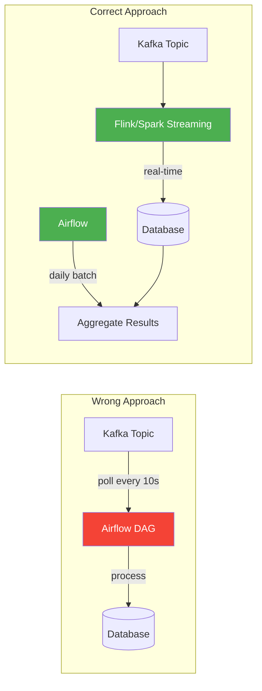
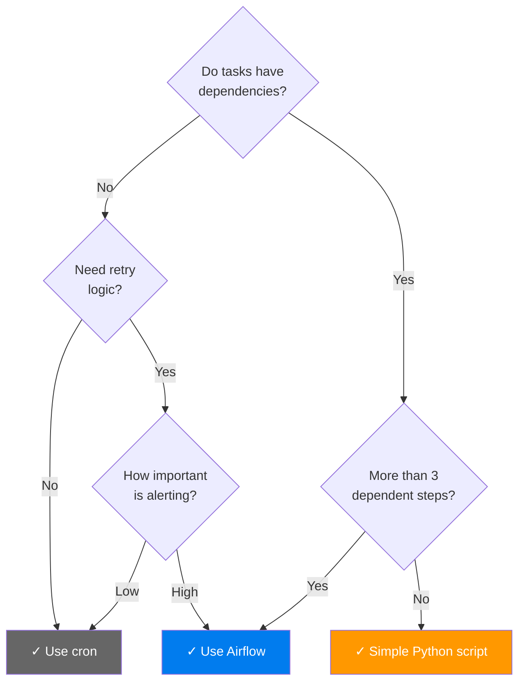

# When NOT to Use Airflow — Anti-Patterns & Limitations

> **Module 00 · Topic 01 · Explanation 04** — Critical knowledge for architectural decision-making

---

## The Anti-Patterns

Knowing when **not** to use a tool is as important as knowing when to use it. Principal-level engineers are expected to identify these anti-patterns in design reviews.

```
╔══════════════════════════════════════════════════════════════╗
║              AIRFLOW ANTI-PATTERNS                          ║
║                                                              ║
║  ✗ Real-time streaming pipelines                            ║
║  ✗ Sub-second scheduling requirements                       ║
║  ✗ Heavy data processing ON the worker                     ║
║  ✗ Simple 1-2 step cron jobs                               ║
║  ✗ Stateful long-running services                          ║
║  ✗ CI/CD pipelines (use GitHub Actions/Jenkins)            ║
╚══════════════════════════════════════════════════════════════╝
```

---

## Anti-Pattern 1: Real-Time Streaming



**Why it fails**: Airflow's scheduler has a minimum heartbeat of ~5 seconds. Even with `schedule="@continuous"`, the overhead of DAG parsing, task scheduling, and worker allocation makes sub-minute reliable processing impractical. You'll hit race conditions, duplicate processing, and resource starvation.

**Correct approach**: Use Kafka + Flink/Spark Streaming for real-time, and Airflow for the batch aggregation layer that runs daily/hourly on the streaming output.

---

## Anti-Pattern 2: Data Processing on Airflow Workers

```python
# ✗ WRONG — Processing 10GB in worker memory
@task
def process_huge_file():
    import pandas as pd
    df = pd.read_csv("s3://bucket/10gb_file.csv")  # OOM!
    result = df.groupby("category").agg({"sales": "sum"})
    result.to_parquet("s3://bucket/output.parquet")

# ✓ CORRECT — Trigger external processing, monitor completion
@task
def trigger_spark_job():
    """Submit job to EMR and return job ID for monitoring."""
    from airflow.providers.amazon.aws.hooks.emr import EmrHook
    hook = EmrHook(aws_conn_id="aws_default")
    job_flow_id = hook.create_job_flow(job_flow_overrides={...})
    return job_flow_id
```

**Rule of thumb**: If your task needs more than **512MB of memory**, it should run on dedicated infrastructure (Spark, BigQuery, Snowflake) triggered by Airflow.

---

## Anti-Pattern 3: Simple Cron Replacement

If your "pipeline" is:
```bash
# Just one command, no dependencies, no retries needed
0 2 * * * /usr/bin/python3 /scripts/daily_backup.py
```

Airflow's overhead (scheduler, webserver, metadata DB, worker) is **massive overkill**. Use cron. The break-even point where Airflow becomes worthwhile:

| Criteria | Cron is Fine | Airflow is Better |
|----------|-------------|-------------------|
| Number of tasks | 1-3 independent | 4+ with dependencies |
| Failure handling | Doesn't matter | Need retry, alerting |
| Observability | Check logs manually | Need dashboard |
| Backfill | Not needed | Critical |
| Team size | Solo | 2+ engineers |

---

## Anti-Pattern 4: Stateful Long-Running Services

Airflow tasks are designed to be **short-lived and idempotent**. They start, do work, and finish.

```
╔══════════════════════════════════════════════════════════════╗
║  WRONG: Using Airflow to run a web server                   ║
║                                                              ║
║  @task                                                       ║
║  def run_flask_app():                                       ║
║      app = Flask(__name__)                                  ║
║      app.run(port=5000)  # ← Runs forever, blocks worker   ║
║                                                              ║
║  CORRECT: Use Kubernetes, ECS, or systemd for services      ║
╚══════════════════════════════════════════════════════════════╝
```

---

## Anti-Pattern 5: CI/CD Pipelines

While technically possible, using Airflow for CI/CD is like using a bulldozer to plant flowers:

| CI/CD Need | Airflow Limitation | Better Tool |
|-----------|-------------------|-------------|
| Git trigger on push | No native webhook trigger | GitHub Actions, GitLab CI |
| Build Docker image | Worker needs docker-in-docker | Jenkins, BuildKite |
| Run test suite | No test result visualization | GitHub Actions, CircleCI |
| Deploy to K8s | Can do it, but no rollback UX | ArgoCD, Flux |

---

## The Decision: When to Add Airflow



---

## Interview Q&A

**Q: A team is processing IoT sensor data arriving every 200ms. They want to use Airflow. Is this a good idea?**

> Absolutely not. Airflow's scheduler operates on a heartbeat of several seconds, and DAG parsing adds additional latency. For 200ms data, you need a streaming engine like Apache Kafka + Flink, or even direct socket processing. Airflow could orchestrate the *batch aggregation* of that streaming data (e.g., hourly rollups), but it cannot handle the real-time ingestion path.

**Q: Name three scenarios where adding Airflow would be over-engineering.**

> (1) A single nightly backup script with no dependencies — cron is sufficient, (2) A startup's MVP with two API endpoints that need to run sequentially — a simple Python script with try/except is enough, (3) A CI/CD pipeline for building and deploying a Docker image — GitHub Actions or Jenkins are purpose-built for this. The common thread: if there's no dependency graph, no backfill need, and no complex scheduling, Airflow's operational overhead (scheduler + webserver + database) isn't justified.

---

## Self-Assessment Quiz

### Concept Check

**Q1**: Your company processes financial trades. Some need batch aggregation (daily reports), some need real-time alerts (price threshold breaches). How would you architect this with Airflow?
<details><summary>Answer</summary>Split the architecture: (1) Real-time path: Kafka → Flink/Spark Streaming → real-time alerts (no Airflow here), (2) Batch path: Airflow DAG runs daily, reads from the stream's output tables, computes aggregates, generates reports, sends to data warehouse. Airflow orchestrates the batch layer only — it doesn't touch the streaming path. This is a classic Lambda Architecture where Airflow handles the batch layer.</details>

**Q2**: What's the difference between "Airflow can't do this" and "Airflow shouldn't do this"?
<details><summary>Answer</summary>"Can't" = technical impossibility (e.g., processing data at 200ms intervals — scheduler can't keep up). "Shouldn't" = technically possible but architecturally wrong (e.g., processing 10GB in a worker task — it works until you OOM, and it violates the orchestrator-vs-engine separation). The "shouldn't" cases are more dangerous because they work initially and fail at scale.</details>

### Quick Self-Rating
- [ ] I can identify 5 anti-patterns where Airflow is the wrong choice
- [ ] I can recommend the right tool for streaming vs batch scenarios
- [ ] I can distinguish "can't" from "shouldn't" limitations
- [ ] I can advise when to use cron vs Airflow
