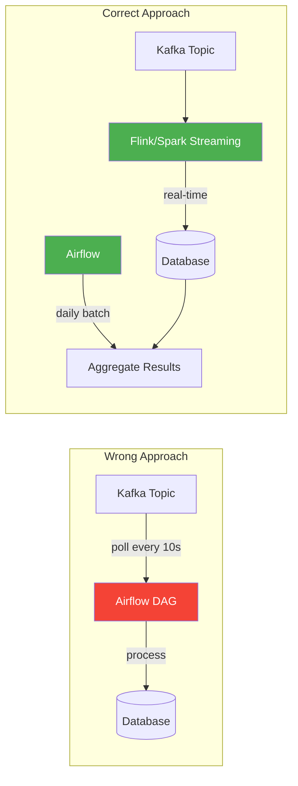
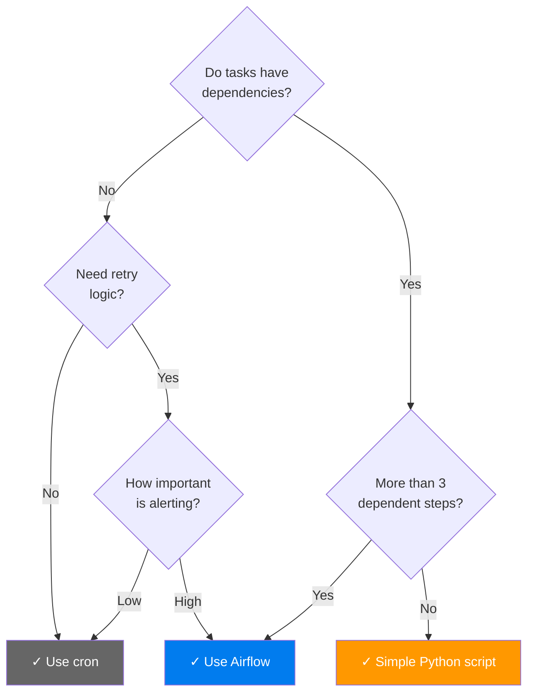

# When NOT to Use Airflow — Anti-Patterns & Limitations

> **Module 00 · Topic 01 · Explanation 04** — Critical knowledge for architectural decision-making

---

## Why Knowing the Limits Matters More Than Knowing the Features

Every engineer can tell you what Airflow does. Principal-level engineers can tell you where Airflow breaks down — and that distinction is tested in every senior interview because it reveals whether you've actually run Airflow at production scale or just read the docs. The ability to say "no, we shouldn't use Airflow here, and here's what we should use instead" is a mark of architectural maturity.

Think of this like a **specialist surgeon saying 'this patient needs a cardiologist, not me'**. The most dangerous surgeon is the one who believes all problems are surgical. The most dangerous data engineer is the one who believes all orchestration problems are Airflow problems. A streaming analytics requirement, a CI/CD pipeline, a sub-second data processing job — these are not Airflow problems, and forcing Airflow onto them will create fragile, expensive, unmaintainable systems.

The five anti-patterns below are the most common places where Airflow is chosen incorrectly. At each one, the correct alternative is named and justified.

---

## The Anti-Patterns

```
╔══════════════════════════════════════════════════════════════╗
║              AIRFLOW ANTI-PATTERNS                          ║
║                                                              ║
║  ✗ Real-time streaming pipelines                            ║
║  ✗ Sub-second scheduling requirements                       ║
║  ✗ Heavy data processing ON the worker                     ║
║  ✗ Simple 1-2 step cron jobs                               ║
║  ✗ Stateful long-running services                          ║
║  ✗ CI/CD pipelines (use GitHub Actions/Jenkins)            ║
╚══════════════════════════════════════════════════════════════╝
```

---

## Anti-Pattern 1: Real-Time Streaming



**Why it fails**: Airflow's scheduler has a minimum heartbeat of ~5 seconds. Even with `schedule="@continuous"`, the overhead of DAG parsing, task scheduling, and worker allocation makes sub-minute reliable processing impractical. You'll hit race conditions, duplicate processing, and resource starvation.

**Correct approach**: Use Kafka + Flink/Spark Streaming for real-time, and Airflow for the batch aggregation layer that runs daily/hourly on the streaming output.

---

## Anti-Pattern 2: Data Processing on Airflow Workers

```python
# ✗ WRONG — Processing 10GB in worker memory
@task
def process_huge_file():
    import pandas as pd
    df = pd.read_csv("s3://bucket/10gb_file.csv")  # OOM!
    result = df.groupby("category").agg({"sales": "sum"})
    result.to_parquet("s3://bucket/output.parquet")

# ✓ CORRECT — Trigger external processing, monitor completion
@task
def trigger_spark_job():
    """Submit job to EMR and return job ID for monitoring."""
    from airflow.providers.amazon.aws.hooks.emr import EmrHook
    hook = EmrHook(aws_conn_id="aws_default")
    job_flow_id = hook.create_job_flow(job_flow_overrides={...})
    return job_flow_id
```

**Rule of thumb**: If your task needs more than **512MB of memory**, it should run on dedicated infrastructure (Spark, BigQuery, Snowflake) triggered by Airflow.

---

## Anti-Pattern 3: Simple Cron Replacement

If your "pipeline" is:
```bash
# Just one command, no dependencies, no retries needed
0 2 * * * /usr/bin/python3 /scripts/daily_backup.py
```

Airflow's overhead (scheduler, webserver, metadata DB, worker) is **massive overkill**. Use cron. The break-even point where Airflow becomes worthwhile:

| Criteria | Cron is Fine | Airflow is Better |
|----------|-------------|-------------------|
| Number of tasks | 1-3 independent | 4+ with dependencies |
| Failure handling | Doesn't matter | Need retry, alerting |
| Observability | Check logs manually | Need dashboard |
| Backfill | Not needed | Critical |
| Team size | Solo | 2+ engineers |

---

## Anti-Pattern 4: Stateful Long-Running Services

Airflow tasks are designed to be **short-lived and idempotent**. They start, do work, and finish.

```
╔══════════════════════════════════════════════════════════════╗
║  WRONG: Using Airflow to run a web server                   ║
║                                                              ║
║  @task                                                       ║
║  def run_flask_app():                                       ║
║      app = Flask(__name__)                                  ║
║      app.run(port=5000)  # ← Runs forever, blocks worker   ║
║                                                              ║
║  CORRECT: Use Kubernetes, ECS, or systemd for services      ║
╚══════════════════════════════════════════════════════════════╝
```

---

## Anti-Pattern 5: CI/CD Pipelines

While technically possible, using Airflow for CI/CD is like using a bulldozer to plant flowers:

| CI/CD Need | Airflow Limitation | Better Tool |
|-----------|-------------------|-------------|
| Git trigger on push | No native webhook trigger | GitHub Actions, GitLab CI |
| Build Docker image | Worker needs docker-in-docker | Jenkins, BuildKite |
| Run test suite | No test result visualization | GitHub Actions, CircleCI |
| Deploy to K8s | Can do it, but no rollback UX | ArgoCD, Flux |

---

## The Decision: When to Add Airflow



---

## Real Company Use Cases

**Spotify — Keeping Luigi for the Right Use Case**

Spotify created Luigi in 2012 and was one of the first companies to evaluate migrating to Airflow. They chose to keep Luigi for their core music recommendation pipelines — a decision that seems counterintuitive given Luigi's feature gap. The reason: Spotify's recommendation pipelines are single-command, no-retry, high-memory jobs (reading entire listening graphs into RAM). The "over-engineering" of Airflow's scheduler, executor pool, webserver, and metadata DB added complexity with no benefit. Spotify migrated to Airflow only for cross-team orchestration workflows with real dependency chains. The lesson: tool choice is pipeline-type-specific, not organisation-wide. Some of your pipelines are cron jobs and should stay that way.

**Slack — Airflow for Batch, Kafka/Flink for Streaming**

Slack's data team runs a clean architectural separation: all message delivery metrics, notification analytics, and workspace activity data arrive via a Kafka → Flink streaming pipeline (sub-second latency, handled without Airflow). Airflow handles the daily and hourly batch layer: aggregating usage metrics for billing, generating team activity reports, and orchestrating data warehouse loads. When an engineer proposed using an Airflow sensor to trigger jobs on Kafka topic depth, the platform team rejected it. An Airflow sensor holding a worker slot for hours monitoring a Kafka topic is both more expensive and less reliable than a Flink application running a threshold trigger natively. The right tool boundaries let Slack run both systems efficiently without either one overreaching.

---

## Interview Q&A

### Senior Data Engineer Level

**Q: A team is processing IoT sensor data arriving every 200ms. They want to use Airflow. Is this a good idea?**

Absolutely not, and here's the technical reason: Airflow's scheduler heartbeat has a minimum loop interval of several seconds, and task startup overhead (queueing, worker pickup, task context loading) adds 5-30 seconds before any code runs. For 200ms data intervals, you need a streaming engine — Apache Kafka + Flink handles 200ms data natively, with millisecond-level event processing. Airflow's correct role in this architecture: orchestrate the *batch aggregation* of that streaming data, running hourly or daily jobs that read from Flink's output state store. Airflow handles the batch-layer orchestration; Flink handles the streaming-layer processing.

**Q: Name three scenarios where adding Airflow would be over-engineering.**

(1) A single nightly database backup script with no dependencies and no retry requirement — cron is sufficient, zero additional infrastructure. (2) A startup MVP where two API calls need to run sequentially and failure just sends a Slack alert — a 20-line Python script with try/except is enough. (3) A CI/CD pipeline for building a Docker image and deploying to staging — GitHub Actions is purpose-built for this with better secrets management, container caching, and deployment integrations. The common thread: if there is no dependency graph, no backfill need, and no complex scheduling, the operational overhead of Airflow (scheduler + webserver + database) is not justified.

**Q: An engineer asks: "Can we use Airflow to run a long-running Flask API server as a task?" How do you respond?**

This is a fundamental misuse of Airflow's task model. Airflow tasks are designed to be short-lived and finite — they start, execute a bounded piece of work, and exit. A Flask server that `app.run()` blocks indefinitely would occupy a worker slot forever, preventing other tasks from using it. The task would never report `success`, so the DAG Run would never complete. When the Airflow worker process restarts (scheduled maintenance, deployment, crash), the Flask server dies with it — no graceful shutdown, no state preservation. The correct tool for a long-running service is a container orchestrator: Kubernetes, ECS, or even systemd. Airflow could trigger the deployment of that service (via KubernetesPodOperator or ECSOperator), but it must not host the service itself.

### Lead / Principal Data Engineer Level

**Q: Your company processes financial trades. Some need batch aggregation (daily settlement reports), some need real-time alerts (price threshold breaches). How do you architect this, and where does Airflow fit?**

This is a classic Lambda Architecture problem — two layers with different latency requirements. The streaming layer handles real-time: Kafka ingests trade events, Flink processes them with millisecond latency, emitting price alerts and running position calculations continuously. No Airflow in this path — Airflow's scheduling latency would introduce unacceptable lag for real-time price alerts. The batch layer is where Airflow operates: a daily DAG runs at market close to read from Flink's output tables, compute settlement totals, run reconciliation against the general ledger, and generate regulatory reports. Airflow also orchestrates the end-of-day archive job that moves Kafka topic data to S3 for 7-year regulatory retention. The clean separation: Flink owns the real-time path, Airflow owns the batch path. They share the data store but not the processing responsibility.

**Q: You're given the task of evaluating whether to replace a home-grown Python bash-based scheduler (100+ pipelines) with Airflow. What is your evaluation framework and what would make you say no?**

My evaluation framework has four gates. Gate 1 — Dependency complexity: does the existing system have inter-pipeline dependencies that are currently managed by hardcoded time waits or custom scripts? If yes, Airflow's dependency graph solves a real problem. Gate 2 — Ops burden: how many engineering-hours per week are spent maintaining the home-grown scheduler vs what Airflow's ongoing maintenance would cost? If the home-grown system takes > 5 hrs/week of ops, Airflow pays for itself. Gate 3 — Migration feasibility: can we run both systems in parallel during migration? If not, the risk of a "big bang" cutover may be unacceptable for a financial system. Gate 4 — Feature requirements: does the team need backfill, RBAC, audit logging, or retry logic? If the home-grown system provides all of these adequately, the migration may not deliver enough value. I'd say no if: migration risk is high AND the home-grown system is stable AND ops burden is low AND no new Airflow features are needed. In practice, the answer is almost always yes — because home-grown schedulers accumulate technical debt and lack the community support that keeps Airflow secure and updated.

## Self-Assessment Quiz

### Concept Check

**Q1**: Your company processes financial trades. Some need batch aggregation (daily reports), some need real-time alerts (price threshold breaches). How would you architect this with Airflow?
<details><summary>Answer</summary>Split the architecture: (1) Real-time path: Kafka → Flink/Spark Streaming → real-time alerts (no Airflow here), (2) Batch path: Airflow DAG runs daily, reads from the stream's output tables, computes aggregates, generates reports, sends to data warehouse. Airflow orchestrates the batch layer only — it doesn't touch the streaming path. This is a classic Lambda Architecture where Airflow handles the batch layer.</details>

**Q2**: What's the difference between "Airflow can't do this" and "Airflow shouldn't do this"?
<details><summary>Answer</summary>"Can't" = technical impossibility (e.g., processing data at 200ms intervals — scheduler can't keep up). "Shouldn't" = technically possible but architecturally wrong (e.g., processing 10GB in a worker task — it works until you OOM, and it violates the orchestrator-vs-engine separation). The "shouldn't" cases are more dangerous because they work initially and fail at scale.</details>

### Quick Self-Rating
- [ ] I can identify 5 anti-patterns where Airflow is the wrong choice
- [ ] I can recommend the right tool for streaming vs batch scenarios
- [ ] I can distinguish structural limitations ("can't") from architectural misuse ("shouldn't")
- [ ] I can explain the Lambda Architecture and Airflow's role within it

---

## Further Reading

- [Airflow Docs — Best Practices: Not Processing Data in Airflow](https://airflow.apache.org/docs/apache-airflow/stable/best-practices.html#communication)
- [Spotify Engineering — The Age of Data Orchestration](https://engineering.atspotify.com/2022/)
- [Martin Fowler — Lambda Architecture](https://martinfowler.com/bliki/LambdaArchitecture.html)
- [Airflow Sensors vs Deferrable Operators](https://airflow.apache.org/docs/apache-airflow/stable/authoring-and-scheduling/deferring.html)
