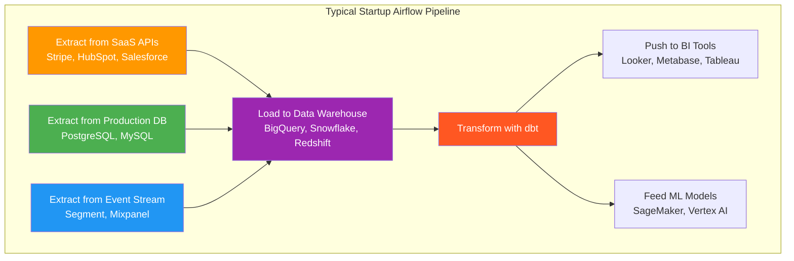

# Company Use Cases — Who Uses Airflow and How?

> **Module 00 · Topic 01 · Use Cases** — Real-world adoption patterns from industry leaders

---

## Tier 1: Tech Giants (10,000+ DAGs)

### Airbnb (Origin Story)

| Detail | Value |
|--------|-------|
| **Scale** | 1,000+ DAGs, millions of task instances/month |
| **Use Cases** | Search ranking pipelines, payment processing, experimentation platform, ML model training |
| **Why Airflow?** | They *created* Airflow in 2014 because nothing else handled their dependency management needs |

**Key patterns from Airbnb:**
- Dynamic DAG generation from a central registry
- Custom operators for internal ML training infrastructure
- Extensive use of Sensors for cross-DAG coordination

### Uber

| Detail | Value |
|--------|-------|
| **Scale** | 10,000+ DAGs, managing petabyte-scale data |
| **Use Cases** | Trip pricing, driver matching, ETA prediction, financial reporting |
| **Why Airflow?** | Unified orchestration across MapReduce, Spark, Hive, and Presto jobs |

### Lyft

| Detail | Value |
|--------|-------|
| **Scale** | 2,000+ DAGs |
| **Use Cases** | Marketplace optimization, ride analytics, driver incentive calculations |
| **Why Airflow?** | Centralized orchestration platform for 50+ data engineering teams |

---

## Tier 2: Large Enterprises (500-5,000 DAGs)

### Pinterest

| Detail | Value |
|--------|-------|
| **Scale** | 5,000+ DAGs |
| **Use Cases** | Content recommendation engine, ad targeting optimization, image processing pipelines |
| **Architecture Insight** | Uses CeleryExecutor with auto-scaling workers to handle bursty workloads |

### Robinhood

| Detail | Value |
|--------|-------|
| **Scale** | 500+ DAGs |
| **Use Cases** | Trade settlement pipelines, regulatory reporting, risk calculations |
| **Architecture Insight** | Strict SLA enforcement — financial data must be processed within regulatory time windows |

### Shopify

| Detail | Value |
|--------|-------|
| **Scale** | 1,000+ DAGs |
| **Use Cases** | Merchant analytics, payment reconciliation, inventory forecasting |
| **Architecture Insight** | Heavy use of KubernetesExecutor for task-level resource isolation |

---

## Tier 3: Startups & Mid-Size (50-500 DAGs)

### Common Startup Patterns

### What Startups Get Right
- Start with Docker Compose (LocalExecutor), scale to managed (MWAA/Composer) later
- Use `apache-airflow-providers-*` packages instead of raw API calls
- Keep DAGs simple — 10-20 tasks max

### What Startups Get Wrong
- Over-engineering: building custom operators when `PythonOperator` suffices
- Under-monitoring: no alerting until a pipeline silently fails for 3 days
- Ignoring backfill: designing pipelines that can't reprocess historical data

---

## Industry Verticals

| Industry | Common Use Cases | Key Operators |
|----------|-----------------|---------------|
| **Fintech** | Trade settlement, risk calculations, regulatory reporting | PostgresOperator, S3 operators |
| **E-commerce** | Inventory sync, pricing updates, recommendation feeds | HttpOperator, BigQueryOperator |
| **Healthcare** | Claims processing, patient analytics, HIPAA-compliant data movement | Custom operators with encryption |
| **Media/Advertising** | Ad performance aggregation, content recommendation, audience segmentation | SparkSubmitOperator |
| **Logistics** | Route optimization data prep, fleet analytics, demand forecasting | GCS operators, dbt operators |

---

## Key Takeaway

> **Airflow is the default choice for batch data orchestration in 2025.** The question isn't *whether* to use Airflow — it's *how* to use it well. Companies that succeed with Airflow invest in: (1) proper monitoring and alerting, (2) DAG design patterns that scale, and (3) separating orchestration from processing.
