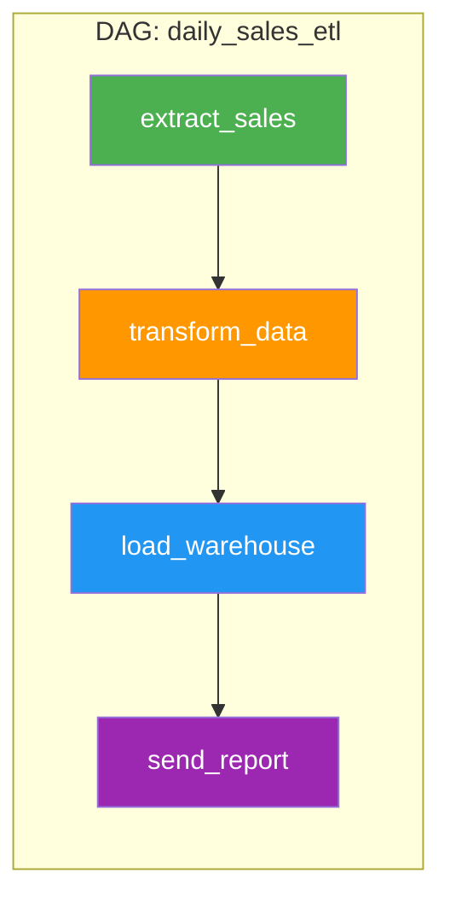
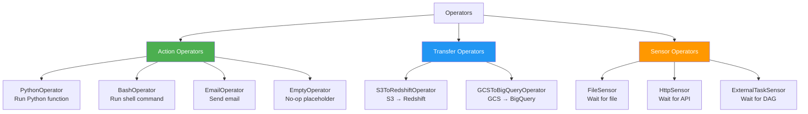
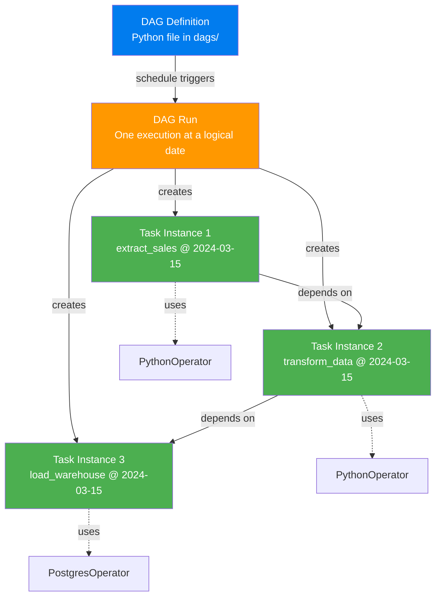

# DAG, Task, Operator — The Three Pillars

> **Module 00 · Topic 02 · Explanation 01** — The fundamental building blocks of every Airflow pipeline

---

## The Hierarchy

```
╔══════════════════════════════════════════════════════════════╗
║                    AIRFLOW DATA MODEL                        ║
║                                                              ║
║  DAG ───────────────────────────────────────────────         ║
║  │  dag_id: "daily_sales_etl"                               ║
║  │  schedule: "@daily"                                       ║
║  │                                                           ║
║  ├─ Task ──────────────────────────────────────              ║
║  │  │  task_id: "extract_sales"                              ║
║  │  │  operator: PythonOperator                              ║
║  │  │                                                        ║
║  │  └─ Task Instance ─────────────────────                   ║
║  │     │  execution_date: 2024-03-15                         ║
║  │     │  state: SUCCESS                                     ║
║  │     └─ try_number: 1                                      ║
║  │                                                           ║
║  ├─ Task ──────────────────────────────────────              ║
║  │  │  task_id: "transform_data"                             ║
║  │  │  operator: PythonOperator                              ║
║  │  │  upstream: ["extract_sales"]                           ║
║  │  │                                                        ║
║  └─ Task ──────────────────────────────────────              ║
║     │  task_id: "load_warehouse"                             ║
║     │  operator: PostgresOperator                            ║
║     │  upstream: ["transform_data"]                          ║
╚══════════════════════════════════════════════════════════════╝
```

---

## Concept 1: DAG (Directed Acyclic Graph)

A DAG is a **collection of tasks with defined dependencies**. It's a Python file that tells Airflow: "Here are my tasks, here's the order they run, and here's the schedule."



**Key properties:**

| Property | Purpose | Example |
|----------|---------|---------|
| `dag_id` | Unique identifier | `"daily_sales_etl"` |
| `schedule` | When to run | `"@daily"`, `"0 2 * * *"` |
| `start_date` | First possible execution | `pendulum.datetime(2024, 1, 1)` |
| `catchup` | Backfill missed runs? | `False` (usually for dev) |
| `tags` | UI organization | `["sales", "production"]` |
| `default_args` | Shared task config | `{"retries": 3, "owner": "data-team"}` |

> **DAG vs DAG Run**: A DAG is the *definition* (like a class). A DAG Run is one *execution* of that DAG (like an instance). Each DAG Run has a `logical_date` (formerly `execution_date`) — the date the run *represents*, not when it actually started.

---

## Concept 2: Task

A Task is a **single unit of work** within a DAG. It wraps an Operator with specific parameters.

```python
# Two ways to define a task:

# Method 1: Traditional (using Operator directly)
from airflow.operators.python import PythonOperator

extract_task = PythonOperator(
    task_id="extract_sales",
    python_callable=my_extract_function,
)

# Method 2: Modern (using @task decorator) — PREFERRED
from airflow.decorators import task

@task()
def extract_sales():
    """Extract sales data from the source database."""
    return {"records": 1000}
```

**Task vs Task Instance**:

| Term | What It Is | Analogy |
|------|-----------|---------|
| **Task** | The *definition* of what to do | A recipe |
| **Task Instance** | One *execution* of that task at a specific logical date | Cooking that recipe on Tuesday |

A single Task creates many Task Instances — one per DAG Run:

```
Task: extract_sales
├── Task Instance (2024-03-13) → SUCCESS
├── Task Instance (2024-03-14) → SUCCESS
├── Task Instance (2024-03-15) → RUNNING
└── Task Instance (2024-03-16) → QUEUED
```

---

## Concept 3: Operator

An Operator defines **what type of work** a task performs. Think of it as a template:



| Category | What It Does | Blocks Pipeline? |
|----------|-------------|-----------------|
| **Action** | Executes something (function, command, API call) | Yes — runs and completes |
| **Transfer** | Moves data from source to destination | Yes — waits for transfer |
| **Sensor** | Waits for a condition to become true | Yes — polls until satisfied |

---

## The Complete Picture: How They Relate



---

## Interview Q&A

**Q: What's the difference between a Task and a Task Instance?**

> A Task is the **definition** — it exists in the DAG file and defines *what* work to do (which operator, which parameters). A Task Instance is a **specific execution** of that task for a particular DAG Run (tied to a logical date). One Task creates many Task Instances over time — one per scheduled run. When you "clear" a task in the UI, you're resetting a specific Task Instance, not the Task definition.

**Q: Why does Airflow distinguish between "logical date" (execution_date) and actual execution time?**

> Because Airflow is designed for **batch processing of time-partitioned data**. If a DAG runs daily and processes "yesterday's data," the logical date represents *which day's data* is being processed, not *when the processing happened*. A DAG scheduled for midnight processes the *previous day's* data. This decoupling also enables backfill — you can create a DAG Run for any historical date and reprocess that date's data.

---

## Self-Assessment Quiz

### Concept Check

**Q1**: You have a DAG with 5 tasks running daily since January 1, 2024. It's now March 15, 2024. How many Task Instances exist in total?
<details><summary>Answer</summary>75 days × 5 tasks = 375 Task Instances (assuming catchup=True and no failures that prevented task creation). Each day creates one DAG Run, and each DAG Run creates one Task Instance per task.</details>

**Q2**: What's the difference between an Operator and a Task? Can you have an Operator without a Task?
<details><summary>Answer</summary>An Operator is a **class** (a template for work — e.g., PythonOperator, BashOperator). A Task is an **instance** of an Operator configured with specific parameters (task_id, callable, etc.). You cannot have a useful Operator without wrapping it in a Task — the Operator class alone has no task_id, no DAG association, and can't be scheduled. It's like having a recipe template vs actually deciding to cook something specific with it.</details>

### Quick Self-Rating
- [ ] I can distinguish DAG, DAG Run, Task, Task Instance, and Operator
- [ ] I can explain why logical date differs from actual execution time
- [ ] I can categorize any operator into action/transfer/sensor
