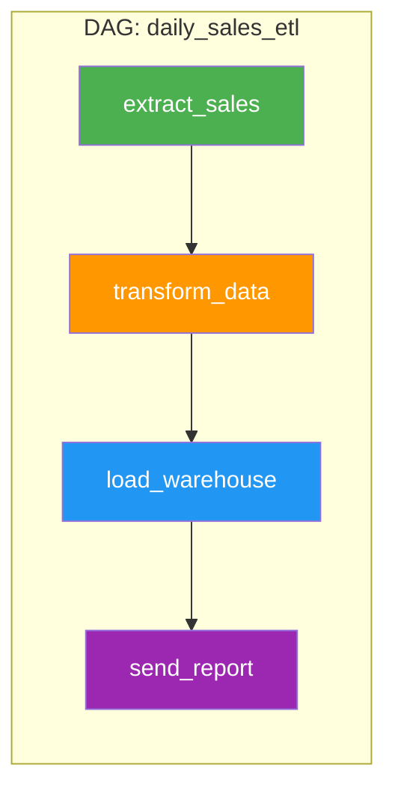
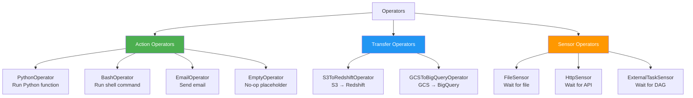
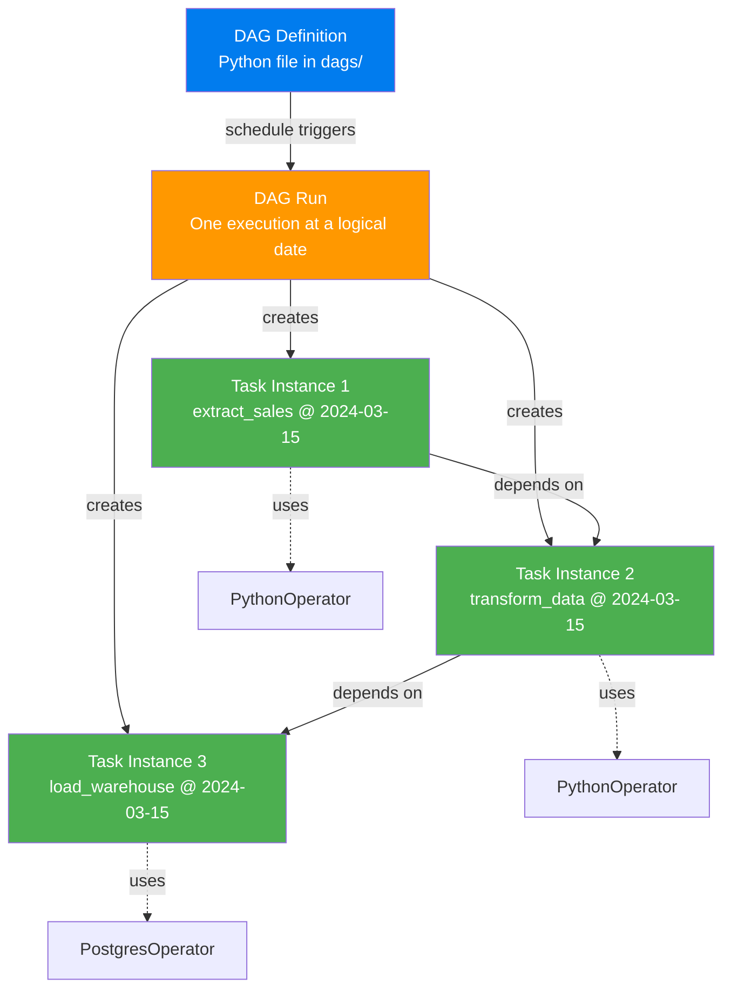

# DAG, Task, Operator — The Three Pillars

> **Module 00 · Topic 02 · Explanation 01** — The fundamental building blocks of every Airflow pipeline

---

## What These Terms Mean and Why They're Designed This Way

Every Airflow pipeline is built from three nested abstractions: the DAG, the Task, and the Operator. Understanding not just what they are but *why* they're separated this way is the foundation of writing maintainable pipelines. Engineers who don't internalise this distinction write brittle pipelines with mismatched responsibilities, untestable task logic, and poor retry behaviour.

Think of building a **hospital's surgical schedule**. The schedule itself is like the DAG — it defines what procedures happen, in what order, on what days. Each line-item on the schedule ("Patient A: knee replacement, 9 AM, OR-3") is like a Task — a specific unit of work with a specific context. The surgical technique being used ("laparoscopic, minimally invasive") is like the Operator — the *how*. You can use the same surgical technique (Operator) for different patients on different days (Task Instances), and the schedule (DAG) coordinates all of them. The separation matters: if you conflate the schedule with the procedure, you can't reuse techniques, and you can't reschedule without rewriting everything.

This three-level hierarchy is Airflow's most important design decision. It enables: reusable operators across teams, testable task logic independent of scheduling, and the ability to backfill (rerun specific Task Instances) without touching the DAG definition.

---

## The Hierarchy

```
╔══════════════════════════════════════════════════════════════╗
║                    AIRFLOW DATA MODEL                        ║
║                                                              ║
║  DAG ───────────────────────────────────────────────         ║
║  │  dag_id: "daily_sales_etl"                               ║
║  │  schedule: "@daily"                                       ║
║  │                                                           ║
║  ├─ Task ──────────────────────────────────────              ║
║  │  │  task_id: "extract_sales"                              ║
║  │  │  operator: PythonOperator                              ║
║  │  │                                                        ║
║  │  └─ Task Instance ─────────────────────                   ║
║  │     │  execution_date: 2024-03-15                         ║
║  │     │  state: SUCCESS                                     ║
║  │     └─ try_number: 1                                      ║
║  │                                                           ║
║  ├─ Task ──────────────────────────────────────              ║
║  │  │  task_id: "transform_data"                             ║
║  │  │  operator: PythonOperator                              ║
║  │  │  upstream: ["extract_sales"]                           ║
║  │  │                                                        ║
║  └─ Task ──────────────────────────────────────              ║
║     │  task_id: "load_warehouse"                             ║
║     │  operator: PostgresOperator                            ║
║     │  upstream: ["transform_data"]                          ║
╚══════════════════════════════════════════════════════════════╝
```

---

## Concept 1: DAG (Directed Acyclic Graph)

A DAG is a **collection of tasks with defined dependencies**. It's a Python file that tells Airflow: "Here are my tasks, here's the order they run, and here's the schedule."



**Key properties:**

| Property | Purpose | Example |
|----------|---------|---------|
| `dag_id` | Unique identifier | `"daily_sales_etl"` |
| `schedule` | When to run | `"@daily"`, `"0 2 * * *"` |
| `start_date` | First possible execution | `pendulum.datetime(2024, 1, 1)` |
| `catchup` | Backfill missed runs? | `False` (usually for dev) |
| `tags` | UI organization | `["sales", "production"]` |
| `default_args` | Shared task config | `{"retries": 3, "owner": "data-team"}` |

> **DAG vs DAG Run**: A DAG is the *definition* (like a class). A DAG Run is one *execution* of that DAG (like an instance). Each DAG Run has a `logical_date` (formerly `execution_date`) — the date the run *represents*, not when it actually started.

---

## Concept 2: Task

A Task is a **single unit of work** within a DAG. It wraps an Operator with specific parameters.

```python
# Two ways to define a task:

# Method 1: Traditional (using Operator directly)
from airflow.operators.python import PythonOperator

extract_task = PythonOperator(
    task_id="extract_sales",
    python_callable=my_extract_function,
)

# Method 2: Modern (using @task decorator) — PREFERRED
from airflow.decorators import task

@task()
def extract_sales():
    """Extract sales data from the source database."""
    return {"records": 1000}
```

**Task vs Task Instance**:

| Term | What It Is | Analogy |
|------|-----------|---------|
| **Task** | The *definition* of what to do | A recipe |
| **Task Instance** | One *execution* of that task at a specific logical date | Cooking that recipe on Tuesday |

A single Task creates many Task Instances — one per DAG Run:

```
Task: extract_sales
├── Task Instance (2024-03-13) → SUCCESS
├── Task Instance (2024-03-14) → SUCCESS
├── Task Instance (2024-03-15) → RUNNING
└── Task Instance (2024-03-16) → QUEUED
```

---

## Concept 3: Operator

An Operator defines **what type of work** a task performs. Think of it as a template:



| Category | What It Does | Blocks Pipeline? |
|----------|-------------|-----------------|
| **Action** | Executes something (function, command, API call) | Yes — runs and completes |
| **Transfer** | Moves data from source to destination | Yes — waits for transfer |
| **Sensor** | Waits for a condition to become true | Yes — polls until satisfied |

---

## The Complete Picture: How They Relate



---

## Real Company Use Cases

**WePay — Custom Operators as Organisational Standards**

WePay (acquired by Chase) built a library of custom operators that wraps their internal services: `WepaySnowflakeOperator`, `WepayDbtOperator`, and `WepayAlertOperator`. Every pipeline in the organisation must use these standardised operators rather than raw provider operators. The `WepaySnowflakeOperator` adds company-mandated behaviour on top of the standard Snowflake operator: it logs every query to an audit table, enforces query timeouts via Snowflake session parameters, and automatically routes to the correct Snowflake warehouse based on the task's `pool` assignment. This means every engineer gets security compliance and cost management for free — they just use the operator. The architecture works because Airflow's Operator abstraction is a clean extension point: you subclass `BaseOperator`, override `execute()`, and every future pipeline inherits the new behaviour automatically.

**Etsy — Task Instance Data as Business Intelligence**

Etsy's data platform team queryies the `task_instance` table directly in their internal analytics system. They built a BI dashboard that shows: which tasks run the longest, which tasks fail most frequently, and which DAG owners have the worst SLA track record — all based on `task_instance.duration`, `task_instance.state`, and `task_instance.dag_id`. This is possible because every execution of every Task creates a Task Instance record in the metadata DB. The Task / Task Instance distinction is not just conceptual — it's a Postgres table, queryable like any other data source. Etsy's dashboard runs from a query like `SELECT task_id, avg(duration) FROM task_instance WHERE state='success' GROUP BY task_id ORDER BY avg(duration) DESC`.

---

## Anti-Patterns and Common Mistakes

**1. Using PythonOperator instead of the TaskFlow API for all new code**

The traditional `PythonOperator` requires you to pass `python_callable=my_function` and manually handle XCom pushes/pulls. The `@task` decorator (TaskFlow API, Airflow 2.0+) eliminates all of this boilerplate and makes data flow between tasks explicit through return values.

```python
# ✗ OLD STYLE — verbose, manual XCom, harder to read
from airflow.operators.python import PythonOperator

def extract_fn(**context):
    data = {"rows": 1000}
    context["task_instance"].xcom_push(key="extracted", value=data)
    return data

def load_fn(**context):
    data = context["task_instance"].xcom_pull(task_ids="extract", key="extracted")
    print(f"Loading: {data}")

extract_task = PythonOperator(task_id="extract", python_callable=extract_fn)
load_task = PythonOperator(task_id="load", python_callable=load_fn)
extract_task >> load_task

# ✓ TASKFLOW API — clean, return values automatically become XComs
from airflow.decorators import dag, task

@dag(schedule="@daily", start_date=pendulum.datetime(2024, 1, 1))
def my_pipeline():
    @task()
    def extract() -> dict:
        return {"rows": 1000}  # auto-pushed to XCom

    @task()
    def load(data: dict):  # data auto-pulled from XCom
        print(f"Loading: {data}")

    load(extract())  # dependency is explicit from function call

my_pipeline()
```

**2. Putting business logic in the DAG file outside task functions**

Code written at the DAG file's module level runs every time the scheduler parses the file (every 30 seconds). Database queries, API calls, and business logic at module level execute thousands of times per day for zero benefit, adding parse-time latency and potential failures.

```python
# ✗ WRONG — business logic executes on every scheduler parse
from mylib.config import get_active_regions  # if this fails, DAG disappears from UI
ACTIVE_REGIONS = get_active_regions(db_conn)  # DB query every 30 seconds!

@dag(...)
def my_dag():
    for region in ACTIVE_REGIONS:  # stale list baked in at parse time
        process_region(region)

# ✓ CORRECT — dynamic values fetched at task execution time
@dag(...)
def my_dag():
    @task()
    def get_regions() -> list:
        from mylib.config import get_active_regions  # import inside task
        return get_active_regions(db_conn)  # runs once, when task executes

    @task()
    def process_region(region: str):
        print(f"Processing {region}")

    process_region.expand(region=get_regions())  # dynamic task mapping
```

**3. Creating a Sensor to wait for tasks in the same DAG**

Engineers sometimes use `ExternalTaskSensor` to wait for another task in the same DAG to complete. This is unnecessary — Airflow's dependency resolution (`>>` operator) already handles intra-DAG dependencies. Using a sensor adds a polling worker slot, adds latency, and creates circular dependency risk.

```python
# ✗ WRONG — sensor waiting for task in same DAG
extract = PythonOperator(task_id="extract", ...)
wait_for_extract = ExternalTaskSensor(
    task_id="wait_for_extract",
    external_dag_id="my_dag",  # same DAG!
    external_task_id="extract",  # burns a slot polling for a task already in this DAG
)
load = PythonOperator(task_id="load", ...)
wait_for_extract >> load  # incorrect workaround

# ✓ CORRECT — use >> to express intra-DAG dependencies directly
extract >> load  # Airflow handles this natively
```

---

## Interview Q&A

### Senior Data Engineer Level

**Q: What's the difference between a Task and a Task Instance?**

A Task is the definition — it exists in the DAG file and defines *what* work to do (which operator, which parameters, which dependencies). A Task Instance is a specific execution of that task for a particular DAG Run, tied to a `logical_date`. One Task creates many Task Instances over time: one per scheduled DAG Run per schedule interval. When you "clear" a task in the UI, you're resetting specific Task Instances (their state goes back to `None`), not the Task definition. The Task definition changes only when you edit the DAG Python file.

**Q: Why does Airflow distinguish between `logical_date` (execution_date) and the actual execution wall-clock time?**

Because Airflow is designed for batch processing of time-partitioned data. If a daily DAG processes "yesterday's sales data," the `logical_date` represents *which day's data* is being processed, not *when the processing ran*. A DAG scheduled for midnight represents the previous day's interval. This decoupling enables backfill: you can create a DAG Run with any historical `logical_date` and reprocess that date's data using the same task code. Without this distinction, backfill would require special-casing the date logic inside every task.

**Q: You have a custom Snowflake query that all 50 of your teams' DAGs need to run before their main ETL. How do you avoid copy/pasting this across 50 DAG files?**

Two approaches depending on complexity. If the query is simple: create a shared utility function in a module under `dags/shared/` and import it in each team's DAG file — they call it inside a `@task`. If the pattern is complex and needs its own retry logic, connection handling, and alert configuration: create a custom operator by subclassing `BaseOperator` and publishing it as a shared Python package (`my_company_airflow_operators`). All DAGs `pip install` this package and use `MySnowflakeAuditOperator`. The custom operator approach is preferable at scale because it centralises the implementation — if the Snowflake connection changes, you update one file and redeploy, not 50 DAG files.

### Lead / Principal Data Engineer Level

**Q: You're designing a company-wide DAG standards framework. What conventions do you establish for DAG ID naming, task ID naming, tag taxonomy, and default_args?**

DAG ID convention: `{team}_{domain}_{pipeline}_{frequency}` — e.g., `payments_transactions_settlement_daily`. This makes ownership and scope immediately readable. Task ID convention: `{verb}_{subject}_{destination}` — e.g., `extract_transactions_postgres`, `load_settlement_snowflake`. Tags taxonomy: mandatory `team:{team}`, `tier:{1|2|3}`, `domain:{domain}`, optional `upstream:{source_system}`. This enables RBAC, on-call alerting, and cost attribution. default_args convention: establish a company-wide `DEFAULT_ARGS` dict in a shared module — it sets `owner` from a team registry lookup, `retries=3`, `retry_delay=5min`, `email_on_failure=True` with team distribution list. All DAGs import this and override only what they need. This guarantees that every pipeline has retry logic and alerting by default, not as an afterthought.

**Q: A data engineer asks: "When should I use a custom Operator vs a PythonOperator calling a function?" What's your principled answer?**

Use a custom Operator when: (1) the behaviour is reused across three or more DAGs — at that point, the packaging overhead pays off, (2) the Operator needs to manage a connection lifecycle (open, use, close) that should be centralised, (3) the Operator has configuration that should be validated at DAG parse time, not at task runtime — custom Operators can raise in `__init__` if misconfigured, giving parse-time feedback instead of a runtime failure. Use a `@task`-decorated function when: (1) the logic is specific to one pipeline, (2) the function is already tested in isolation as a pure Python function, (3) you want the simplest possible construction. The rule of thumb: if you're about to copy a PythonOperator's callable from one DAG file to another, that's the signal to wrap it in a custom Operator instead.

## Self-Assessment Quiz

### Concept Check

**Q1**: You have a DAG with 5 tasks running daily since January 1, 2024. It's now March 15, 2024. How many Task Instances exist in total?
<details><summary>Answer</summary>75 days × 5 tasks = 375 Task Instances (assuming catchup=True and no failures that prevented task creation). Each day creates one DAG Run, and each DAG Run creates one Task Instance per task.</details>

**Q2**: What's the difference between an Operator and a Task? Can you have an Operator without a Task?
<details><summary>Answer</summary>An Operator is a **class** (a template for work — e.g., PythonOperator, BashOperator). A Task is an **instance** of an Operator configured with specific parameters (task_id, callable, etc.). You cannot have a useful Operator without wrapping it in a Task — the Operator class alone has no task_id, no DAG association, and can't be scheduled. It's like having a recipe template vs actually deciding to cook something specific with it.</details>

### Quick Self-Rating
- [ ] I can distinguish DAG, DAG Run, Task, Task Instance, and Operator from memory
- [ ] I can explain why `logical_date` differs from actual execution time with a concrete example
- [ ] I can categorise any operator into action/transfer/sensor and explain the difference
- [ ] I can write a complete DAG using the TaskFlow API with proper dependency expression

---

## Further Reading

- [Airflow Docs — TaskFlow API Tutorial](https://airflow.apache.org/docs/apache-airflow/stable/tutorial/taskflow.html)
- [Airflow Docs — DAG Concepts](https://airflow.apache.org/docs/apache-airflow/stable/core-concepts/dags.html)
- [Airflow Docs — Custom Operators](https://airflow.apache.org/docs/apache-airflow/stable/howto/custom-operator.html)
- [Airflow Docs — Dynamic Task Mapping](https://airflow.apache.org/docs/apache-airflow/stable/authoring-and-scheduling/dynamic-task-mapping.html)
