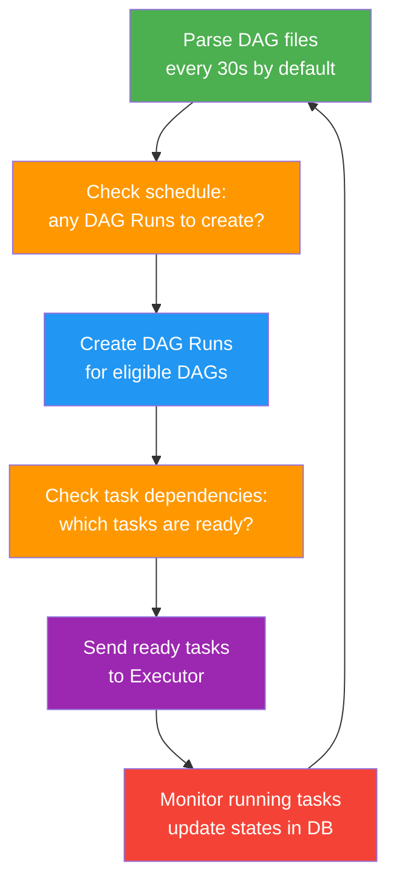
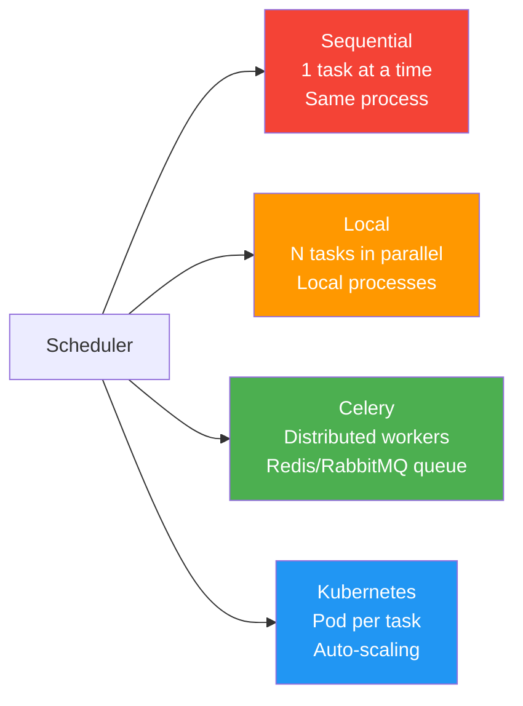

# Scheduler, Executor, Worker — The Runtime Triad

> **Module 00 · Topic 02 · Explanation 02** — How Airflow actually runs your tasks

---

## The Big Picture

```
╔══════════════════════════════════════════════════════════════════╗
║                    AIRFLOW RUNTIME ARCHITECTURE                  ║
║                                                                  ║
║  ┌────────────┐     ┌────────────┐     ┌────────────────────┐   ║
║  │ Webserver  │     │ Scheduler  │     │    Metadata DB     │   ║
║  │ (Flask UI) │     │ (Loop)     │     │   (PostgreSQL)     │   ║
║  │            │────>│            │<───>│                    │   ║
║  │ Read-only  │     │ Parses DAGs│     │ Source of Truth    │   ║
║  │ dashboard  │     │ Creates    │     │ for all state      │   ║
║  └────────────┘     │ DAG Runs   │     └────────────────────┘   ║
║                     │ Queues     │                               ║
║                     │ Tasks      │                               ║
║                     └─────┬──────┘                               ║
║                           │                                      ║
║                     ┌─────▼──────┐                               ║
║                     │  Executor  │                               ║
║                     │ (Strategy) │                               ║
║                     └─────┬──────┘                               ║
║                           │                                      ║
║               ┌───────────┼───────────┐                          ║
║               ▼           ▼           ▼                          ║
║         ┌─────────┐ ┌─────────┐ ┌─────────┐                    ║
║         │ Worker 1│ │ Worker 2│ │ Worker N│                    ║
║         │(Process)│ │(Process)│ │  (Pod)  │                    ║
║         └─────────┘ └─────────┘ └─────────┘                    ║
╚══════════════════════════════════════════════════════════════════╝
```

---

## Component 1: Scheduler

The Scheduler is the **brain** of Airflow. It runs in a continuous loop:



**Key facts:**
- Since **Airflow 2.0**, you can run **multiple schedulers** (HA mode)
- The scheduler reads ALL `.py` files in the `dags/` folder — keep it clean
- `min_file_process_interval = 30` (seconds between re-parsing the same file)

---

## Component 2: Executor

The Executor determines **how** and **where** tasks run. It's a plug-in strategy:

| Executor | How Tasks Run | Use Case |
|----------|--------------|----------|
| **SequentialExecutor** | One task at a time, in-process | Dev/testing only |
| **LocalExecutor** | Multiple tasks as local processes | Small production |
| **CeleryExecutor** | Distributed across Celery workers | Medium-large production |
| **KubernetesExecutor** | Each task in its own K8s pod | Cloud-native, resource isolation |



> **Interview tip**: Know the trade-offs. CeleryExecutor needs Redis/RabbitMQ infrastructure. KubernetesExecutor has cold-start latency (pod spin-up) but perfect isolation.

---

## Component 3: Worker

Workers are the **muscles** — they actually execute your task code:

```
╔═══════════════════════════════════════════════════╗
║                    WORKER LIFECYCLE                ║
║                                                    ║
║  1. Receive task from executor (via queue/API)    ║
║  2. Import the DAG file to get task definition    ║
║  3. Execute the operator's execute() method       ║
║  4. Capture stdout/stderr to log storage          ║
║  5. Update task state in metadata DB              ║
║  6. Push any return values to XCom                ║
║  7. Report completion to scheduler               ║
╚═══════════════════════════════════════════════════╝
```

---

## Interview Q&A

**Q: What happens if the Scheduler goes down?**

> Running tasks continue executing on their workers — the scheduler doesn't control running tasks, it only *starts* them. However, no new DAG Runs will be created, and no new tasks will be scheduled. In Airflow 2.0+, you can run multiple scheduler instances for high availability, with the metadata DB providing distributed locking to prevent duplicate scheduling.

**Q: CeleryExecutor vs KubernetesExecutor — when to choose which?**

> **CeleryExecutor**: persistent worker pool with fast task start (no cold start), good for high-throughput workloads with similar resource needs. But all tasks share the same Python environment and dependencies. **KubernetesExecutor**: each task gets its own pod with custom Docker image, perfect dependency isolation, and auto-scaling — but pod startup adds 10-30s latency. Choose Celery for throughput, Kubernetes for isolation.

---

## Self-Assessment Quiz

**Q1**: The scheduler parses your dags/ folder every 30 seconds. You have 500 Python files. What performance concern should you have?
<details><summary>Answer</summary>DAG parsing overhead. Each .py file is imported as a Python module. If files have expensive top-level imports or computations, parsing 500 files every 30 seconds consumes significant CPU. Mitigation: (1) Use `.airflowignore` to exclude non-DAG files, (2) Avoid top-level `import pandas` — use lazy imports inside task functions, (3) Increase `min_file_process_interval`, (4) Enable DAG serialization (stored in DB, read-only by webserver).</details>

**Q2**: You notice Task Instance #45878 is stuck in "queued" state for 2 hours. Where do you look first?
<details><summary>Answer</summary>Check the Executor and workers: (1) If CeleryExecutor — check if Celery workers are running (`celery inspect active`), check the broker (Redis), check pool availability (`airflow pools list`), (2) If KubernetesExecutor — check pod status (`kubectl get pods`), resource quotas, pending pods, (3) In all cases, check the scheduler logs for errors related to task dispatch, and check if the task's `pool` is full.</details>

### Quick Self-Rating
- [ ] I can draw the Scheduler → Executor → Worker flow from memory
- [ ] I can compare all 4 executor types with trade-offs
- [ ] I can debug a stuck task by identifying the component to investigate
