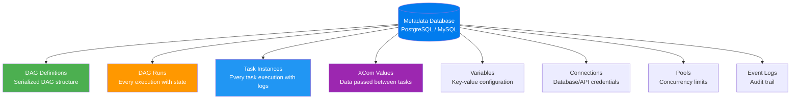

# Metadata Database — The Source of Truth

> **Module 00 · Topic 02 · Explanation 03** — Everything Airflow knows lives here

---

## What the Metadata DB Stores

The metadata database is the **single source of truth** for Airflow's entire state. Without it, Airflow has no memory.



---

## Key Tables (PostgreSQL)

```
╔══════════════════════════════════════════════════════════╗
║  TABLE                    │  WHAT IT STORES              ║
╠══════════════════════════════════════════════════════════╣
║  dag                      │  DAG metadata (schedule,     ║
║                           │  owner, is_paused, etc.)     ║
║  dag_run                  │  One row per DAG execution   ║
║                           │  (run_id, state, logical_    ║
║                           │  date, start_date, end_date) ║
║  task_instance            │  One row per task execution  ║
║                           │  (state, try_number,         ║
║                           │  start_date, duration, etc.) ║
║  xcom                     │  Return values from tasks    ║
║                           │  (key, value, timestamp)     ║
║  variable                 │  Key-value pairs for config  ║
║  connection               │  External system credentials ║
║  slot_pool                │  Pool definitions            ║
║  log                      │  Audit log (user actions)    ║
║  serialized_dag           │  Full DAG structure as JSON  ║
╚══════════════════════════════════════════════════════════╝
```

---

## Production Considerations

| Concern | Recommendation |
|---------|---------------|
| **Database choice** | PostgreSQL for production (never SQLite) |
| **Connection pooling** | Use PgBouncer to avoid connection exhaustion |
| **Backup** | Daily automated backups — this is your entire pipeline state |
| **Cleanup** | Use `airflow db clean` to purge old task instances (keep 90 days) |
| **Sizing** | 1,000 DAGs with 30-day retention ≈ 50-100GB |

---

## Interview Q&A

**Q: What happens if the metadata database goes down?**

> Everything stops. The scheduler can't read task states, the webserver can't display the UI, workers can't update task completion status. Running tasks may continue executing but their results won't be recorded. This is why production Airflow deployments use managed PostgreSQL (RDS, Cloud SQL) with multi-AZ failover and automated backups. The metadata DB is the #1 critical infrastructure component.

**Q: Why does Airflow serialize DAGs into the database?**

> DAG Serialization (enabled by default since Airflow 2.0) solves a critical problem: without it, the webserver needs direct filesystem access to the dags/ folder to display DAG structure. With serialization, the scheduler parses DAG files and stores the structure as JSON in the `serialized_dag` table. The webserver reads from the DB only — no filesystem access needed. This enables architectures where the webserver runs on a separate machine from the scheduler.

---

## Self-Assessment Quiz

**Q1**: You need to migrate your Airflow instance to a new server. What's the minimum you need to preserve to maintain full pipeline history?
<details><summary>Answer</summary>The metadata database. It contains ALL state: DAG run history, task instance results, XCom values, Variables, Connections, audit logs. The DAG files (Python code) should also be migrated, but they can be redeployed from version control. Without the metadata DB, you lose all historical run data, all configured connections and variables, and all XCom values.</details>

### Quick Self-Rating
- [ ] I can name 5 tables in the metadata database and what each stores
- [ ] I understand why PostgreSQL is required for production
- [ ] I can explain DAG serialization and why it matters
