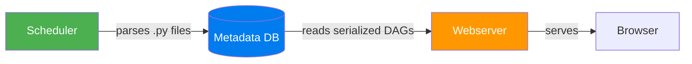

# Webserver — The User Interface Layer

> **Module 01 · Topic 01 · Explanation 01** — How the Airflow UI works under the hood

---

## Architecture

```
╔══════════════════════════════════════════════════════════════╗
║                     WEBSERVER STACK                          ║
║                                                              ║
║  ┌──────────────────────────────────────────────────────┐   ║
║  │                    BROWSER (Client)                    │   ║
║  └──────────────────────────┬───────────────────────────┘   ║
║                              │ HTTP/HTTPS                    ║
║  ┌──────────────────────────▼───────────────────────────┐   ║
║  │                   GUNICORN (WSGI)                      │   ║
║  │              4 workers (default), sync mode            │   ║
║  └──────────────────────────┬───────────────────────────┘   ║
║                              │                               ║
║  ┌──────────────────────────▼───────────────────────────┐   ║
║  │                    FLASK-APPBUILDER                     │   ║
║  │   Authentication │ RBAC │ REST API │ View Templates    │   ║
║  └──────────────────────────┬───────────────────────────┘   ║
║                              │ SQL (read-only)               ║
║  ┌──────────────────────────▼───────────────────────────┐   ║
║  │                  METADATA DATABASE                      │   ║
║  │   serialized_dag │ dag_run │ task_instance │ xcom      │   ║
║  └──────────────────────────────────────────────────────┘   ║
╚══════════════════════════════════════════════════════════════╝
```

---

## Key Principles

### 1. The Webserver is Read-Only

The webserver **does not parse DAG files**. Since Airflow 2.0 with DAG serialization:



This separation means:
- Webserver doesn't need access to the `dags/` folder
- Webserver can run on a completely separate machine
- UI always shows the last successfully parsed version of a DAG

### 2. Available Views

| View | What It Shows | Production Use |
|------|--------------|----------------|
| **Grid View** | Matrix of DAG Runs × Tasks with color-coded status | Daily health monitoring |
| **Graph View** | Visual DAG structure with nodes and edges | Understanding dependencies |
| **Gantt Chart** | Task durations as horizontal bars on a timeline | Performance bottleneck identification |
| **Calendar View** | DAG Run status per day (green/red/yellow) | Monthly trend analysis |
| **Code View** | DAG source code (read-only) | Quick code review |
| **Audit Log** | WHO did WHAT and WHEN | Security compliance |

### 3. REST API

The webserver exposes a REST API at `/api/v1/`:

```bash
# List all DAGs
curl -u admin:admin http://localhost:8080/api/v1/dags

# Trigger a DAG run
curl -X POST -u admin:admin \
  -H "Content-Type: application/json" \
  -d '{"conf": {}}' \
  http://localhost:8080/api/v1/dags/my_dag/dagRuns

# Get task instance status
curl -u admin:admin \
  http://localhost:8080/api/v1/dags/my_dag/dagRuns/run_id/taskInstances
```

---

## Performance Tuning

| Config | Default | Recommendation |
|--------|---------|---------------|
| `webserver.workers` | 4 | `2 * CPU_CORES + 1` |
| `webserver.worker_refresh_interval` | 6000 (100min) | Keep default |
| `webserver.web_server_worker_timeout` | 120s | Increase if complex DAGs |
| `webserver.dag_default_view` | `grid` | Keep for monitoring |

---

## Interview Q&A

**Q: Why doesn't the webserver parse DAG files directly?**

> Security and performance. Parsing DAG files means executing Python code — if the webserver ran that code, a malicious DAG could compromise the UI server. With DAG serialization, the scheduler parses DAGs in a controlled environment and stores the structure as JSON in the database. The webserver only reads that JSON — it never executes DAG code. This also prevents DAG import errors from crashing the UI.

---

## Self-Assessment Quiz

**Q1**: The webserver is showing an old version of your DAG even though you updated the file 5 minutes ago. What's happening?
<details><summary>Answer</summary>The scheduler hasn't re-parsed the DAG file yet. The webserver reads from the serialized_dag table, which is updated only when the scheduler parses the file. Check: (1) Is the scheduler running? (2) Is the file in the dags/ folder? (3) Is the file excluded by .airflowignore? (4) Does the file have syntax errors preventing parsing?</details>

### Quick Self-Rating
- [ ] I can draw the webserver architecture from memory
- [ ] I can explain DAG serialization and why it matters
- [ ] I can use the REST API to trigger and monitor DAGs
