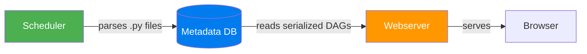

# Webserver — The User Interface Layer

> **Module 01 · Topic 01 · Explanation 01** — How the Airflow UI works under the hood

---

## What the Webserver Is and Why It Matters

The Airflow Webserver is the observability and control layer — the instrument panel through which every data engineer, on-call engineer, and stakeholder interacts with the pipeline system. It renders the UI, serves the REST API, handles authentication, and enforces RBAC permissions. But here is the most important thing to understand about it: **the webserver does not run any pipeline logic**. It reads. It displays. It accepts commands. It delegates all actual execution to the Scheduler and Executor.

Think of the webserver like a **hospital's nurse station dashboard**. The dashboard shows patient vitals, medication schedules, and alert indicators for every patient on the floor. Nurses can trigger actions from the dashboard ("administer medication", "call doctor"). But the dashboard itself doesn't administer anything — it sends instructions to the right people. The dashboard doesn't know the chemistry behind each medication; it just knows the patient's current state. In the same way, the Airflow webserver shows you DAG states, task instance statuses, and XCom values — and lets you trigger actions — but it delegates all pipeline intelligence to the Scheduler.

The webserver earns its operational importance through the API. Every modern Airflow deployment treats the UI as secondary and the REST API as primary — CI/CD pipelines trigger DAG Runs via API, monitoring tools query task states via API, and data consumers check pipeline health via API. Understanding the webserver means understanding both its UI and its API surface.

---

## Architecture

```
╔══════════════════════════════════════════════════════════════╗
║                     WEBSERVER STACK                          ║
║                                                              ║
║  ┌──────────────────────────────────────────────────────┐   ║
║  │                    BROWSER (Client)                    │   ║
║  └──────────────────────────┬───────────────────────────┘   ║
║                              │ HTTP/HTTPS                    ║
║  ┌──────────────────────────▼───────────────────────────┐   ║
║  │                   GUNICORN (WSGI)                      │   ║
║  │              4 workers (default), sync mode            │   ║
║  └──────────────────────────┬───────────────────────────┘   ║
║                              │                               ║
║  ┌──────────────────────────▼───────────────────────────┐   ║
║  │                    FLASK-APPBUILDER                     │   ║
║  │   Authentication │ RBAC │ REST API │ View Templates    │   ║
║  └──────────────────────────┬───────────────────────────┘   ║
║                              │ SQL (read-only)               ║
║  ┌──────────────────────────▼───────────────────────────┐   ║
║  │                  METADATA DATABASE                      │   ║
║  │   serialized_dag │ dag_run │ task_instance │ xcom      │   ║
║  └──────────────────────────────────────────────────────┘   ║
╚══════════════════════════════════════════════════════════════╝
```

---

## Key Principles

### 1. The Webserver is Read-Only

The webserver **does not parse DAG files**. Since Airflow 2.0 with DAG serialization:



This separation means:
- Webserver doesn't need access to the `dags/` folder
- Webserver can run on a completely separate machine
- UI always shows the last successfully parsed version of a DAG

### 2. Available Views

| View | What It Shows | Production Use |
|------|--------------|----------------|
| **Grid View** | Matrix of DAG Runs × Tasks with color-coded status | Daily health monitoring |
| **Graph View** | Visual DAG structure with nodes and edges | Understanding dependencies |
| **Gantt Chart** | Task durations as horizontal bars on a timeline | Performance bottleneck identification |
| **Calendar View** | DAG Run status per day (green/red/yellow) | Monthly trend analysis |
| **Code View** | DAG source code (read-only) | Quick code review |
| **Audit Log** | WHO did WHAT and WHEN | Security compliance |

### 3. REST API

The webserver exposes a REST API at `/api/v1/`:

```bash
# List all DAGs
curl -u admin:admin http://localhost:8080/api/v1/dags

# Trigger a DAG run
curl -X POST -u admin:admin \
  -H "Content-Type: application/json" \
  -d '{"conf": {}}' \
  http://localhost:8080/api/v1/dags/my_dag/dagRuns

# Get task instance status
curl -u admin:admin \
  http://localhost:8080/api/v1/dags/my_dag/dagRuns/run_id/taskInstances
```

---

## Performance Tuning

| Config | Default | Recommendation |
|--------|---------|---------------|
| `webserver.workers` | 4 | `2 * CPU_CORES + 1` |
| `webserver.worker_refresh_interval` | 6000 (100min) | Keep default |
| `webserver.web_server_worker_timeout` | 120s | Increase if complex DAGs |
| `webserver.dag_default_view` | `grid` | Keep for monitoring |

---

## Real Company Use Cases

**Uber — REST API as the Primary Interface**

Uber's data platform engineering team runs Airflow in a multi-tenant configuration where over 200 data engineers submit and monitor DAGs. Rather than having engineers log into the Airflow UI directly, Uber built an internal data portal that interacts with Airflow exclusively through the REST API. Engineers submit DAG Runs, check statuses, and view logs through the portal — the Airflow webserver is an implementation detail beneath the abstraction. This architecture allowed Uber to add LDAP-based team-level access control, custom alerting integrations, and cost tracking on top of standard Airflow without modifying Airflow itself. The lesson: treat the Airflow REST API as a programmable interface, not just a debugging convenience.

**Pinterest — RBAC Zones by Data Sensitivity**

Pinterest uses Airflow's RBAC system to create security zones within a single deployment. Their `pii_data_team` role has `View` access to all DAGs but `Edit` (trigger, clear) access only to DAGs tagged with `team:pii`. Their `analyst` role has `View` access to non-PII DAGs and no visibility into the PII pipelines at all. This allowed Pinterest to consolidate their multi-cluster Airflow deployment into a single shared instance while maintaining compliance with their data privacy controls. The webserver's RBAC system — backed by Flask-AppBuilder — is what makes this possible without maintaining separate infrastructure per team.

---

## Anti-Patterns and Common Mistakes

**1. Triggering production DAGs directly from the webserver UI without a deployment process**

In many teams, engineers trigger DAG runs manually from the UI as their "deployment" process. This bypasses version control, run metadata is fragmented (no CI/CD audit trail), and there's no repeatability — if the same DAG needs to be triggered on 5 environments, someone clicks 5 times.

**Fix:** Use the REST API in your CI/CD pipeline as the canonical trigger mechanism:

```bash
# In your deployment pipeline (after tests pass):
curl -X POST \
  -H "Authorization: Bearer ${AIRFLOW_API_TOKEN}" \
  -H "Content-Type: application/json" \
  -d "{\"conf\": {\"deploy_version\": \"${GIT_SHA}\", \"environment\": \"prod\"}}" \
  "${AIRFLOW_URL}/api/v1/dags/${DAG_ID}/dagRuns"
```

**2. Not configuring Worker Timeout — leading to silent 502 errors**

The webserver's Gunicorn workers time out after 120 seconds by default (`web_server_worker_timeout`). If a UI request (e.g., rendering the Graph View for a 500-task DAG) takes > 120 seconds, Gunicorn kills the worker and the user sees a 502 error with no explanation.

**Fix:** Increase the timeout and add more Gunicorn workers for large DAGs:

```ini
# airflow.cfg
[webserver]
workers = 8                       # 2 × CPU_CORES + 1 is the formula
web_server_worker_timeout = 300   # 5 minutes for complex DAG rendering
```

**3. Running the webserver without HTTPS in production**

The webserver transmits authentication credentials and connection details (Connections page) over HTTP by default. In a network where traffic is not encrypted, credentials can be intercepted.

**Fix:** Always terminate TLS at the load balancer or reverse proxy in production:

```nginx
# nginx.conf — reverse proxy with TLS termination
server {
    listen 443 ssl;
    ssl_certificate     /etc/ssl/airflow.crt;
    ssl_certificate_key /etc/ssl/airflow.key;
    location / {
        proxy_pass http://localhost:8080;
    }
}
```

---

## Interview Q&A

### Senior Data Engineer Level

**Q: Why doesn't the webserver parse DAG files directly?**

Security and performance. Parsing DAG files means executing Python code at import time — if the webserver ran that code, a malicious or broken DAG could crash the UI server or compromise it. With DAG serialization (enabled by default since Airflow 2.0), the Scheduler parses DAGs in a controlled environment and stores the resulting structure as JSON in the `serialized_dag` table. The webserver only reads that JSON — it never executes DAG code directly. This separation also means the webserver doesn't need access to the `dags/` directory at all, enabling deployments where the UI server is on a completely separate machine from the DAG files.

**Q: The Airflow webserver is slow — clicking on the Grid View takes 15 seconds. Walk me through how you'd diagnose and fix it.**

I'd start with the symptom specifics: is it all DAGs or one? If one DAG is slow, it's likely that DAG has hundreds of tasks and the metadata DB is returning a large result set. Fix: limit `max_active_runs` and purge old DAG Run history with `airflow db clean`. If all DAGs are slow, the issue is systemic. Check Gunicorn worker count — at default 4 workers under high traffic, workers are waiting for DB connections. Increase workers to 8-12. Second, check the metadata DB query performance — add a pg_stat_statements extension and find slow queries (typically on `task_instance` table scans without proper indexes). Third, confirm DAG serialization is enabled — without it, the webserver parses files on every page load, making it extremely slow.

**Q: How do you restrict a team to only seeing and triggering their own DAGs and nothing else?**

Airflow's RBAC system (backed by Flask-AppBuilder) supports custom roles. Create a role like `data_eng_payments` with: (1) `View` on the `DAG` resource filtered to `dag_id` patterns matching `payments_*`, (2) `Can Dag Run` permission restricted to those same DAGs. The filtering by DAG ID is done via the webserver's FAB configuration. You can also use the `access_control` parameter directly in the DAG definition: `access_control={'data_eng_payments': {'can_read', 'can_edit', 'can_delete'}}` — this ties the access policy to the DAG code itself, making it version-controlled.

### Lead / Principal Data Engineer Level

**Q: You're designing a multi-tenant Airflow platform for 500 engineers across 30 teams. The webserver becomes a shared bottleneck — some teams' complex DAGs render slowly and impact other teams' experience. How do you architect around this?**

The root issue is a shared webserver serving heterogeneous workloads. My architectural approach: separate the read and write API paths. The REST API (used for CI/CD triggers and monitoring integrations) should have a dedicated high-availability webserver pool (3+ instances behind a load balancer) with `max_active_runs=1` for the webserver DAG to prevent runaway requests. The browsable UI (the human interaction path) can share a separate pool tuned for human latency (more workers, longer timeouts). Add a Redis/Memcached caching layer for DAG serialization reads — the `serialized_dag` table doesn't change every second, and caching these reads dramatically reduces DB load under concurrent UI access. Long-term, federate the control plane: 10 Airflow instances each serving 50-team subsets, with a meta-portal providing a unified view via API aggregation.

**Q: The REST API is enabled but your security team flags that any authenticated user can read all Connections (including passwords). How do you lock this down?**

Airflow's default RBAC system grants `View` on Connections to the `Op` role, which means anyone with basic access can call `GET /api/v1/connections/{conn_id}` and get credentials. The fix has three layers: (1) At the webserver level — remove the `can_read` on `Connections` from all roles except `Admin`. This prevents the UI and API from exposing connection details to non-admins. (2) For the credentials themselves — migrate all connections to use a secrets backend (AWS Secrets Manager, Vault, or GCP Secret Manager) so the password field in the metadata DB is empty and the actual secret is fetched at task execution time from an encrypted store. (3) At the network level — restrict the API endpoint `/api/v1/connections` to admin CIDR ranges via the reverse proxy. Defense in depth: even if a bug bypasses RBAC, the network layer catches it.

---

## Self-Assessment Quiz

**Q1**: The webserver is showing an old version of your DAG even though you updated the file 5 minutes ago. What's happening?
<details><summary>Answer</summary>The scheduler hasn't re-parsed the DAG file yet. The webserver reads from the `serialized_dag` table in the metadata DB, which is only updated when the scheduler successfully parses the DAG file. Check: (1) Is the scheduler running? (2) Is the file in the dags/ folder? (3) Is it excluded by .airflowignore? (4) Does the file have a Python syntax error preventing import? Run `airflow dags list` — if the DAG is absent, the scheduler rejected the file.</details>

**Q2**: You want to trigger a DAG Run with a custom configuration key `{"report_date": "2024-03-15"}` from the command line. Write the curl command to do it via the REST API.
<details><summary>Answer</summary>`curl -X POST -u admin:password -H "Content-Type: application/json" -d '{"conf": {"report_date": "2024-03-15"}}' http://localhost:8080/api/v1/dags/my_dag_id/dagRuns`. Inside the DAG, access this with `context['dag_run'].conf.get('report_date')` in a PythonOperator, or `{{ dag_run.conf['report_date'] }}` in a Jinja template.</details>

**Q3**: What is the security risk of the Airflow webserver's Connections page, and how does a secrets backend mitigate it?
<details><summary>Answer</summary>The Connections page (Admin → Connections) displays credentials stored in the metadata DB. Anyone with `View` access on Connections can read passwords in plaintext. A secrets backend (Vault, AWS Secrets Manager) solves this by storing an empty or null password in the DB and instead fetching the real credential from the external secrets store at runtime. Even if someone reads the metadata DB directly or accesses the Connections API, they get no secret — just a reference key.</details>

### Quick Self-Rating
- [ ] I can draw the webserver architecture from memory
- [ ] I understand why DAG serialization exists and what problem it solves
- [ ] I can use the REST API to trigger, monitor, and manage DAGs programmatically
- [ ] I know how to configure RBAC to restrict access by team

---

## Further Reading

- [Airflow Docs — REST API Reference](https://airflow.apache.org/docs/apache-airflow/stable/stable-rest-api-ref.html)
- [Airflow Docs — Security: RBAC](https://airflow.apache.org/docs/apache-airflow/stable/security/access-control.html)
- [Airflow Docs — DAG Serialization](https://airflow.apache.org/docs/apache-airflow/stable/administration-and-deployment/dag-serialization.html)
- [Airflow Docs — Secrets Backends](https://airflow.apache.org/docs/apache-airflow/stable/security/secrets/secrets-backend/index.html)
