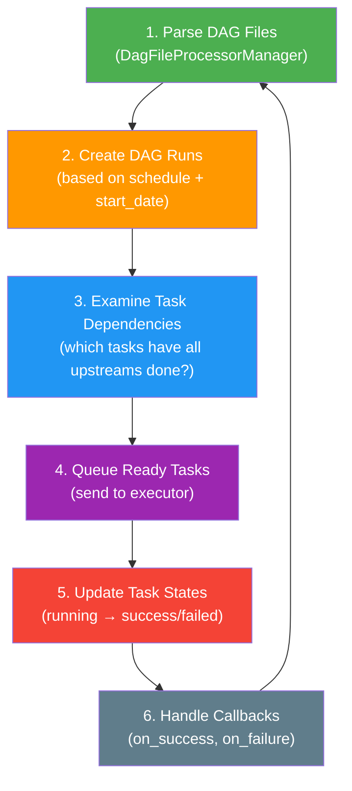
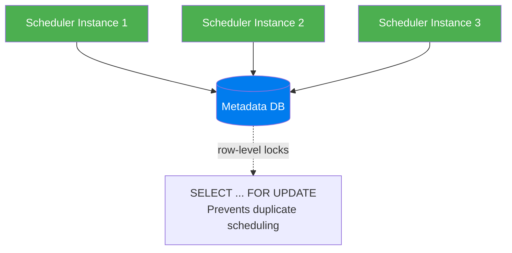

# Scheduler — The Brain of Airflow

> **Module 01 · Topic 01 · Explanation 02** — How the scheduler orchestrates everything

---

## The Scheduler Loop

The scheduler runs a **continuous loop** that is the heartbeat of the entire system:



```
╔══════════════════════════════════════════════════════════════╗
║              SCHEDULER INTERNAL PROCESS                      ║
║                                                              ║
║  DAG File Processor                                          ║
║  ├── Process 1: parsing dags/etl_pipeline.py                ║
║  ├── Process 2: parsing dags/ml_training.py                 ║
║  ├── Process 3: parsing dags/reporting.py                   ║
║  └── Process N: (configurable via parsing_processes=2)      ║
║                                                              ║
║  Scheduler Main Thread                                       ║
║  ├── Check min_file_process_interval (30s default)          ║
║  ├── Create DAG Runs where schedule says "it's time"        ║
║  ├── For each DAG Run:                                      ║
║  │   ├── Check which tasks have all upstreams SUCCESS       ║
║  │   ├── Set ready tasks to SCHEDULED state                 ║
║  │   └── Send SCHEDULED tasks to Executor queue             ║
║  └── Process completed tasks (update state, run callbacks)  ║
╚══════════════════════════════════════════════════════════════╝
```

---

## Key Configuration

| Config | Default | What It Controls |
|--------|---------|-----------------|
| `scheduler.min_file_process_interval` | `30` | Seconds between re-parsing the same DAG file |
| `scheduler.dag_dir_list_interval` | `300` | Seconds between scanning for new DAG files |
| `scheduler.parsing_processes` | `2` | Number of processes parsing DAG files in parallel |
| `core.parallelism` | `32` | Max tasks running simultaneously across ALL DAGs |
| `core.max_active_runs_per_dag` | `16` | Max concurrent DAG Runs per DAG |
| `core.max_active_tasks_per_dag` | `16` | Max concurrent tasks per DAG |

---

## High Availability (Airflow 2.0+)



Multiple schedulers coordinate via **database row-level locking**. No message broker needed — the DB is the coordination layer.

---

## Common Scheduler Issues

| Symptom | Likely Cause | Fix |
|---------|-------------|-----|
| DAGs not appearing in UI | Syntax error in .py file | Check scheduler logs for ImportError |
| Tasks stuck in "scheduled" | Executor can't reach workers | Check worker health, broker connectivity |
| DAG runs not created on time | Scheduler overloaded | Increase `parsing_processes`, use `.airflowignore` |
| All tasks running slowly | `parallelism` too low | Increase `core.parallelism` |

---

## Interview Q&A

**Q: How does the scheduler decide which task to run next?**

> The scheduler uses a **priority-based queue**. For each DAG Run, it checks task dependencies: if all upstream tasks of a task are in SUCCESS state, that task is marked SCHEDULED. The executor then picks up SCHEDULED tasks based on: (1) pool availability, (2) priority_weight (higher runs first), (3) FIFO within the same priority. Tasks in different DAGs compete for the global `parallelism` limit, while tasks within the same DAG compete for `max_active_tasks_per_dag`.

**Q: What's the difference between `parallelism`, `max_active_runs_per_dag`, and `max_active_tasks_per_dag`?**

> Three different concurrency layers: (1) `parallelism` — global limit across ALL DAGs (e.g., 32 means max 32 tasks running simultaneously on the entire Airflow instance), (2) `max_active_runs_per_dag` — per-DAG limit on concurrent DAG Runs (e.g., 16 means a single DAG can have at most 16 runs executing simultaneously), (3) `max_active_tasks_per_dag` — per-DAG limit on concurrent task instances (e.g., 16 means within a single DAG Run, max 16 tasks run simultaneously). A common mistake is setting `parallelism` too low for the number of DAGs.

---

## Self-Assessment Quiz

**Q1**: You have 100 DAGs. The scheduler takes 10 minutes to parse all of them. Tasks aren't getting scheduled for several minutes after they become ready. What's happening and how do you fix it?
<details><summary>Answer</summary>The scheduler is bottlenecked on DAG parsing. With `parsing_processes=2` (default) and 100 DAGs, the file processor can't keep up. Fixes: (1) Increase `parsing_processes` to 4-8 (match available CPU cores), (2) Increase `min_file_process_interval` to 60s for stable DAGs, (3) Add `.airflowignore` to exclude non-DAG files, (4) Optimize DAG files — avoid expensive top-level imports (move `import pandas` inside task functions), (5) Use `@dag` decorator instead of module-level DAG() to reduce parse-time object creation. At 100+ DAGs, consider running multiple scheduler instances.</details>

### Quick Self-Rating
- [ ] I can explain the 6-step scheduler loop
- [ ] I can tune all key scheduler configuration parameters
- [ ] I can diagnose common scheduler performance issues
