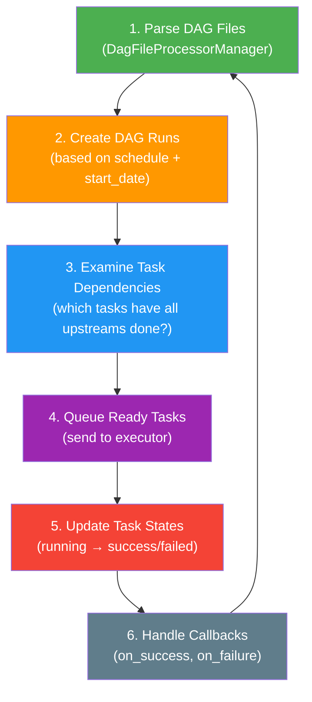
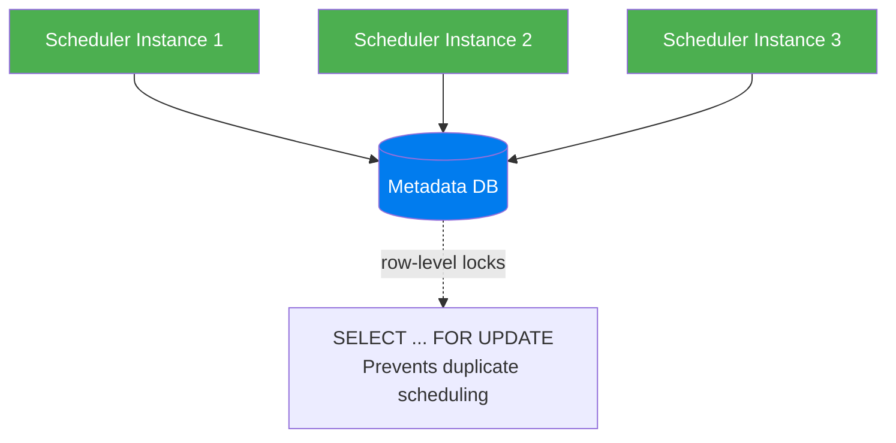

# Scheduler — The Brain of Airflow

> **Module 01 · Topic 01 · Explanation 02** — How the scheduler orchestrates everything

---

## What the Scheduler Actually Does

The Airflow scheduler is the central nervous system of the entire platform. It makes three decisions repeatedly: *what is ready to run*, *when should it run*, and *what to do when it completes*. Everything else in Airflow — the webserver, the workers, the metadata DB — serves the scheduler.

Think of the scheduler like the **conductor of a symphony orchestra**. The conductor doesn't play any instrument — they don't generate music. Instead, they read the score (the DAG definition), watch which musicians have finished their part (upstream task success), and cue the next section (queue the next tasks) at exactly the right moment. If the conductor is slow to turn the page, the entire performance lags. If the conductor has bad information about who's finished, musicians play over each other. The conductor's job is pure coordination, at high frequency.

The three things that make the scheduler hard to reason about: (1) it runs on a **heartbeat loop** — it never stops, (2) it must coordinate across hundreds or thousands of concurrent DAGs without losing state, and (3) it parses Python files repeatedly, which means your DAG file code runs thousands of times a day at the module level — a critical reason to keep DAG files free of side effects.

---

## The Scheduler Loop

The scheduler runs a **continuous loop** that is the heartbeat of the entire system:



```
╔══════════════════════════════════════════════════════════════╗
║              SCHEDULER INTERNAL PROCESS                      ║
║                                                              ║
║  DAG File Processor                                          ║
║  ├── Process 1: parsing dags/etl_pipeline.py                ║
║  ├── Process 2: parsing dags/ml_training.py                 ║
║  ├── Process 3: parsing dags/reporting.py                   ║
║  └── Process N: (configurable via parsing_processes=2)      ║
║                                                              ║
║  Scheduler Main Thread                                       ║
║  ├── Check min_file_process_interval (30s default)          ║
║  ├── Create DAG Runs where schedule says "it's time"        ║
║  ├── For each DAG Run:                                      ║
║  │   ├── Check which tasks have all upstreams SUCCESS       ║
║  │   ├── Set ready tasks to SCHEDULED state                 ║
║  │   └── Send SCHEDULED tasks to Executor queue             ║
║  └── Process completed tasks (update state, run callbacks)  ║
╚══════════════════════════════════════════════════════════════╝
```

---

## Key Configuration

| Config | Default | What It Controls |
|--------|---------|-----------------|
| `scheduler.min_file_process_interval` | `30` | Seconds between re-parsing the same DAG file |
| `scheduler.dag_dir_list_interval` | `300` | Seconds between scanning for new DAG files |
| `scheduler.parsing_processes` | `2` | Number of processes parsing DAG files in parallel |
| `core.parallelism` | `32` | Max tasks running simultaneously across ALL DAGs |
| `core.max_active_runs_per_dag` | `16` | Max concurrent DAG Runs per DAG |
| `core.max_active_tasks_per_dag` | `16` | Max concurrent tasks per DAG |

---

## High Availability (Airflow 2.0+)



Multiple schedulers coordinate via **database row-level locking**. No message broker needed — the DB is the coordination layer.

---

## Common Scheduler Issues

| Symptom | Likely Cause | Fix |
|---------|-------------|-----|
| DAGs not appearing in UI | Syntax error in .py file | Check scheduler logs for ImportError |
| Tasks stuck in "scheduled" | Executor can't reach workers | Check worker health, broker connectivity |
| DAG runs not created on time | Scheduler overloaded | Increase `parsing_processes`, use `.airflowignore` |
| All tasks running slowly | `parallelism` too low | Increase `core.parallelism` |

---

## Interview Q&A

### Senior Data Engineer Level

**Q: How does the scheduler decide which task to run next?**

The scheduler uses a priority queue. For each DAG Run, it checks task dependencies: if all upstream tasks of a task are in `SUCCESS` state, that task is marked `SCHEDULED`. The executor then picks up `SCHEDULED` tasks based on: (1) pool slot availability — if the task's pool is exhausted, it waits regardless of priority, (2) `priority_weight` — tasks with higher weight run before lower-weight tasks in the same pool, (3) FIFO within the same priority weight. Tasks from different DAGs compete for the global `parallelism` limit, while tasks within the same DAG compete for `max_active_tasks_per_dag`.

**Q: What's the difference between `parallelism`, `max_active_runs_per_dag`, and `max_active_tasks_per_dag`?**

Three different concurrency layers that operate independently: `parallelism` is the global ceiling — no more than N tasks can run simultaneously across the entire Airflow instance (default: 32). `max_active_runs_per_dag` is a per-DAG ceiling on how many DAG Runs can be executing simultaneously — critical for preventing stacking of slow DAGs. `max_active_tasks_per_dag` caps concurrency within a single DAG's execution — useful when tasks of the same DAG compete for the same resource (a database with connection limits). A common misconfiguration: `parallelism=32` with 50 active DAGs each allowed 16 concurrent tasks — you'll hit the global limit immediately.

**Q: A DAG that usually runs in 20 minutes suddenly takes 2 hours. How do you diagnose using scheduler-level information?**

Four-step scheduler-focused diagnosis: (1) Check the Gantt view in the Airflow UI — if tasks are showing long `queued` time before `running`, the issue is scheduler-side (pool exhaustion, parallelism limit hit, or executor queue backlog). If tasks start immediately but run long, the issue is task-side (slow query, external API latency). (2) Query `SELECT state, count(*) FROM task_instance WHERE dag_id='my_dag' GROUP BY state` — lots of `queued` rows confirms scheduler congestion. (3) Check `core.parallelism` — if you've hit the global limit, tasks queue even when workers are idle. (4) Check pool usage — `SELECT pool, occupied_slots, used_slots FROM slot_pool` shows if a specific pool is saturated.

### Lead / Principal Data Engineer Level

**Q: You're running 500 DAGs and the scheduler is falling 15 minutes behind schedule. Walk me through the optimisation process.**

I'd work through this systematically in three layers. Layer 1 — Parse overhead: measure parsing time per file using `airflow dags report` and look for files with high parse time. Common culprits: top-level imports of heavy libraries, multiple DAGs in one file, no `.airflowignore`. Fixes: increase `parsing_processes`, move imports inside tasks, add `.airflowignore`. Layer 2 — DAG complexity: check `core.max_active_runs_per_dag` and `core.max_active_tasks_per_dag` — if these are too high, the scheduler processes too many task instances per loop. Reduce max active runs for non-critical DAGs. Layer 3 — HA scaling: if layers 1 and 2 are addressed and lag persists, add a second scheduler instance (Airflow 2.0+ supports active-active HA). Two schedulers coordinate via DB locks and can handle twice the parsing and scheduling throughput. Target: scheduler heartbeat latency under 5 seconds for 500 DAGs.

**Q: Explain the exact mechanism by which Airflow 2.0+ prevents two scheduler instances from double-scheduling the same task.**

Airflow 2.0+ uses PostgreSQL's `SELECT ... FOR UPDATE SKIP LOCKED` on the `dag_run` and `task_instance` tables. When a scheduler instance wants to create a DAG Run or mark a task as SCHEDULED, it: (1) begins a transaction, (2) issues `SELECT id FROM dag_run WHERE state='queued' AND dag_id='...' LIMIT 1 FOR UPDATE SKIP LOCKED` — this atomically locks the row if it's unlocked, or skips it if already locked by another scheduler, (3) if it acquires the lock, it updates the state and commits. The other scheduler's `SKIP LOCKED` means it skips rows locked by the first scheduler — no waiting, no deadlock, no duplicate scheduling. This is why PostgreSQL (not MySQL) is increasingly preferred — `SELECT FOR UPDATE SKIP LOCKED` has been available in PostgreSQL since 9.5 but was only added to MySQL in 8.0.

**Q: A new team wants to deploy 200 new DAGs to your shared Airflow instance. What guardrails do you require before approving the deployment?**

Five non-negotiable guardrails: (1) Parse time — each DAG file must parse in under 2 seconds (`airflow dags report` shows parse duration). Files exceeding this will degrade scheduler performance for all 500 existing DAGs. (2) `max_active_runs` — all DAGs must set `max_active_runs` explicitly, not relying on the global default. Long-running DAGs must set this to 1-2. (3) `.airflowignore` compliance — all non-DAG files (utils, tests) must be excluded. (4) Pool assignment — DAGs that hit external APIs or databases must use specific pools with appropriate slot limits — no unbounded external API hammering. (5) Tag requirements — all DAGs must include `team:`, `tier:`, and `domain:` tags so on-call routing and cost attribution works. Deployment fails CI if any of these checks fail.

---

## Self-Assessment Quiz

**Q1**: You have 100 DAGs. The scheduler takes 10 minutes to parse all of them. Tasks aren't getting scheduled for several minutes after they become ready. What's happening and how do you fix it?
<details><summary>Answer</summary>The scheduler is bottlenecked on DAG parsing. With `parsing_processes=2` (default) and 100 DAGs, the file processor can't keep up. Fixes: (1) Increase `parsing_processes` to 4-8 (match available CPU cores), (2) Increase `min_file_process_interval` to 60s for stable DAGs, (3) Add `.airflowignore` to exclude non-DAG files, (4) Optimize DAG files — avoid expensive top-level imports, (5) Use `@dag` decorator to reduce parse-time object creation. At 100+ DAGs, consider running multiple scheduler instances.</details>

**Q2**: What's the minimum database required for CeleryExecutor, and why doesn't SQLite work?
<details><summary>Answer</summary>PostgreSQL or MySQL is required. SQLite uses file-level locking, meaning only one process can write at a time. With CeleryExecutor, multiple workers are simultaneously writing task state back to the metadata DB. SQLite's single-writer model causes deadlocks and data corruption under concurrent writes. PostgreSQL's row-level locking handles concurrent writes from dozens of workers without contention.</details>

**Q3**: A task is in SCHEDULED state for 30 minutes without ever becoming RUNNING. What are the possible causes?
<details><summary>Answer</summary>Three main causes: (1) Pool exhaustion — the task's pool has no open slots; check pool usage in the Airflow UI. (2) Global parallelism limit hit — `core.parallelism` tasks are already running; check the count of RUNNING tasks. (3) Executor can't reach workers — if using CeleryExecutor, the Redis/RabbitMQ broker may be unreachable; check Flower and worker logs. (4) Worker processes crashed silently — workers may be running but not picking up tasks; restart workers.</details>

### Quick Self-Rating
- [ ] I can explain the 6-step scheduler loop from memory
- [ ] I can tune all key scheduler configuration parameters for a given scenario
- [ ] I can diagnose and fix scheduler performance issues under load
- [ ] I can design a high-availability scheduler deployment for a 500+ DAG instance

---

## Further Reading

- [Airflow Docs — Scheduler](https://airflow.apache.org/docs/apache-airflow/stable/administration-and-deployment/scheduler.html)
- [Airflow Docs — Fine-tuning the Scheduler Performance](https://airflow.apache.org/docs/apache-airflow/stable/best-practices.html#reducing-dag-complexity)
- [Airflow Scheduler HA (Multiple Schedulers)](https://airflow.apache.org/docs/apache-airflow/stable/administration-and-deployment/scheduler.html#running-more-than-one-scheduler)
- [PostgreSQL SELECT FOR UPDATE SKIP LOCKED](https://www.postgresql.org/docs/current/sql-select.html#SQL-FOR-UPDATE-SHARE)
