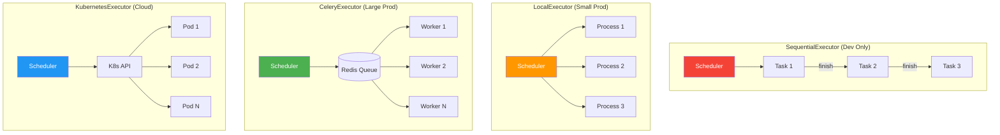
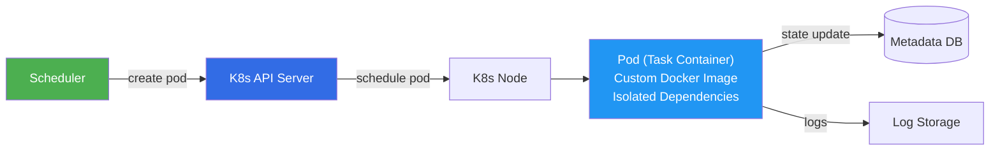

# Executor — The Task Distribution Strategy

> **Module 01 · Topic 01 · Explanation 03** — How Airflow decides WHERE your tasks run

---

## Executor Comparison



---

## Detailed Comparison

| Feature | Sequential | Local | Celery | Kubernetes |
|---------|-----------|-------|--------|------------|
| **Parallelism** | 1 task | N tasks (CPU-bound) | Unlimited (add workers) | Unlimited (auto-scale) |
| **Database** | SQLite OK | PostgreSQL required | PostgreSQL required | PostgreSQL required |
| **Extra Infra** | None | None | Redis/RabbitMQ | K8s cluster |
| **Isolation** | None | Process-level | Process-level | Container-level |
| **Cold Start** | Instant | Instant | Instant | 10-30s (pod spin-up) |
| **Dependency Mgmt** | Shared env | Shared env | Shared env | Custom image per task |
| **Best For** | Dev/testing | Small teams | Medium-large orgs | Cloud-native, mixed deps |
| **Scaling** | Not scalable | Vertical only | Horizontal | Horizontal + auto-scale |

---

## CeleryExecutor Deep Dive

```
╔══════════════════════════════════════════════════════════════╗
║                 CELERY EXECUTOR ARCHITECTURE                 ║
║                                                              ║
║  Scheduler ──→ Redis/RabbitMQ (Message Broker)              ║
║                     │                                        ║
║           ┌─────────┼─────────┐                              ║
║           ▼         ▼         ▼                              ║
║       Worker 1  Worker 2  Worker 3                           ║
║       (Server A) (Server B) (Server C)                       ║
║           │         │         │                              ║
║           └─────────┼─────────┘                              ║
║                     ▼                                        ║
║              Metadata DB (shared)                            ║
║                                                              ║
║  Monitoring: Flower (localhost:5555)                         ║
╚══════════════════════════════════════════════════════════════╝
```

**Setup requirements:**
1. Message broker (Redis recommended, RabbitMQ supported)
2. Shared results backend (can use Redis or the metadata DB)
3. All workers must have same DAG files and Python environment
4. Flower for monitoring worker health

---

## KubernetesExecutor Deep Dive



**Key advantages:**
- Each task runs in its own container → perfect dependency isolation
- Task A can use Python 3.9 + pandas, Task B can use Python 3.11 + TensorFlow
- Auto-scaling: no tasks = no pods = no cost (pay per use)

**Key trade-off:**
- Pod startup adds 10-30 seconds to every task (unavoidable K8s overhead)

---

## Interview Q&A

**Q: Your organization runs 500 DAGs with 10,000 tasks/day. Which executor do you recommend and why?**

> CeleryExecutor with Redis. At this scale, you need horizontal scaling (adding workers across machines). Kubernetes adds pod startup latency that would be noticeable at 10,000 tasks/day. However, if different tasks have incompatible Python dependencies, consider the **CeleryKubernetesExecutor** — a hybrid where most tasks use Celery (fast start), but specific tasks that need custom environments get routed to K8s pods. Monitor with Flower and set up auto-scaling for workers based on queue depth.

---

## Self-Assessment Quiz

**Q1**: You're seeing random task failures with "Worker went away" errors. What's happening?
<details><summary>Answer</summary>Worker processes are being killed, likely due to Out-Of-Memory (OOM). When a task consumes more memory than the worker process limit, the OS kills it. Fixes: (1) Check worker memory usage with `htop` or `kubectl top pods`, (2) Move heavy processing to external systems (Spark, BigQuery), (3) Increase worker memory limits (in docker-compose or K8s resource requests), (4) Use pools to limit concurrent heavy tasks.</details>

### Quick Self-Rating
- [ ] I can compare all 4 executors with specific trade-offs
- [ ] I can design an executor strategy for a given scale
- [ ] I can troubleshoot common executor-related failures
