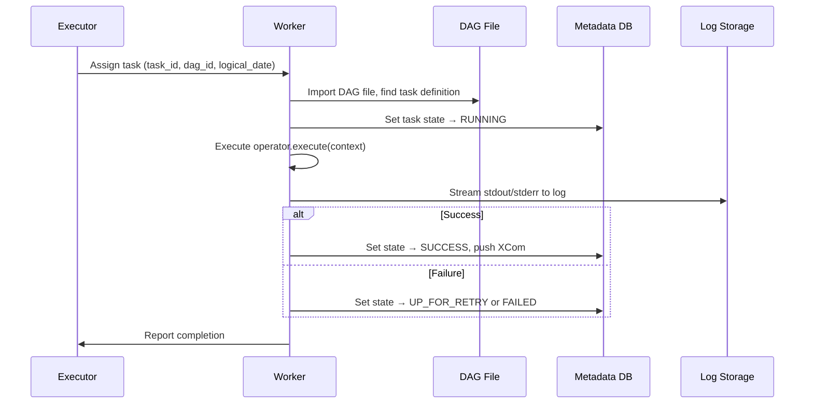

# Workers — The Execution Layer

> **Module 01 · Topic 01 · Explanation 04** — Where your task code actually runs

---

## Worker Lifecycle



---

## Worker Types by Executor

| Executor | Worker Type | Lifecycle |
|----------|-----------|-----------|
| **Sequential** | Same process as scheduler | Persistent, reused |
| **Local** | Forked child process | Created per task, dies after |
| **Celery** | Long-running Celery process | Persistent, handles many tasks |
| **Kubernetes** | K8s Pod | Created per task, destroyed after |

---

## Resource Management

```
╔══════════════════════════════════════════════════════════════╗
║               WORKER RESOURCE LIMITS                         ║
║                                                              ║
║  LocalExecutor:                                              ║
║    Bounded by machine resources (CPU, RAM)                   ║
║    No per-task isolation                                     ║
║                                                              ║
║  CeleryExecutor:                                             ║
║    worker_concurrency = 16 (tasks per worker)               ║
║    Worker can be configured with CELERYD_OPTS                ║
║                                                              ║
║  KubernetesExecutor:                                         ║
║    resources:                                                ║
║      requests:                                               ║
║        memory: "256Mi"                                       ║
║        cpu: "250m"                                           ║
║      limits:                                                 ║
║        memory: "1Gi"                                         ║
║        cpu: "1000m"                                          ║
╚══════════════════════════════════════════════════════════════╝
```

---

## Log Management

| Log Destination | Configuration | Use Case |
|----------------|---------------|----------|
| Local filesystem | Default, logs in `$AIRFLOW_HOME/logs/` | Development |
| S3 | `remote_logging=True`, `remote_base_log_folder=s3://bucket/logs` | AWS production |
| GCS | Similar config with `gs://` prefix | GCP production |
| Azure Blob | `wasb://` prefix | Azure production |
| Elasticsearch | Requires provider package | Searchable centralized logs |

---

## Interview Q&A

**Q: A task runs successfully on your local machine but fails on the Celery worker. What do you check?**

> Three things: (1) **Python dependencies** — the worker might be missing a package that your local machine has. Check `pip list` on the worker vs your machine. (2) **Environment variables** — the worker runs in a different environment. Ensure all required env vars (API keys, database URLs) are available on workers. (3) **File system access** — if your task reads a local file, that file doesn't exist on the worker machine. Use shared storage (S3, NFS) or pass data via XCom.

---

## Self-Assessment Quiz

**Q1**: What happens to a running task if the worker crashes mid-execution?
<details><summary>Answer</summary>The task state remains RUNNING in the metadata DB (a "zombie task"). The scheduler's zombie detection mechanism periodically checks for tasks that have been RUNNING longer than expected without a heartbeat from the worker. It then either clears them for retry (if retries remain) or marks them FAILED. You can configure `scheduler.zombie_detection_interval` and `scheduler.scheduler_zombie_task_backfill_depth`.</details>

### Quick Self-Rating
- [ ] I can explain the worker lifecycle for all 4 executor types
- [ ] I can configure remote logging for production
- [ ] I can debug tasks that work locally but fail on workers
