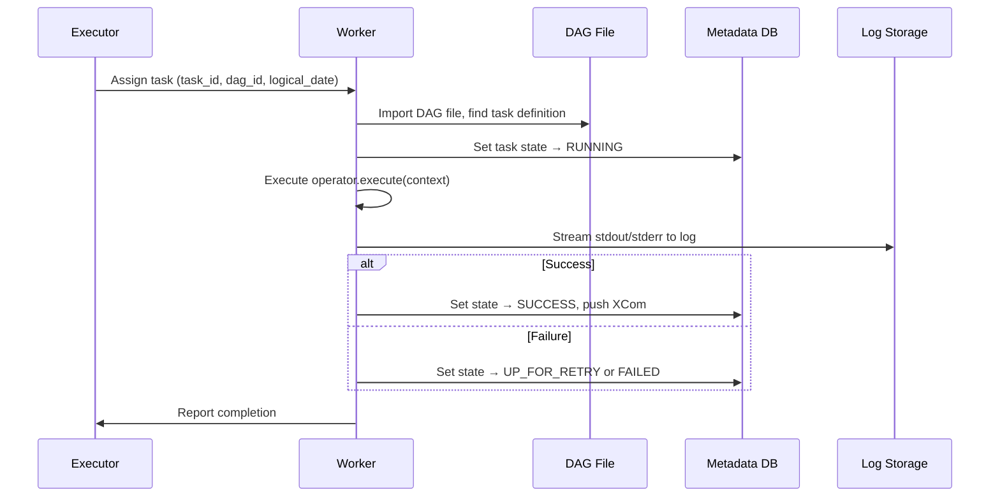

# Workers — The Execution Layer

> **Module 01 · Topic 01 · Explanation 04** — Where your task code actually runs

---

## What Workers Are

Workers are the only components in Airflow that actually run your code. Everything else — the scheduler, the webserver, the metadata database — coordinates, plans, and tracks. Workers execute. When you write a task function, the code inside that function runs on a worker.

Think of workers like **kitchen staff in a restaurant**. The scheduler is the head chef who reads orders, determines which dish needs to be prepared next, and passes instructions. Workers are the line cooks — they actually prepare the food. The number of line cooks (worker concurrency) determines how many dishes can be prepared simultaneously. If you don't have enough line cooks, orders pile up. If you have too many line cooks for the kitchen size (memory/CPU), they get in each other's way and the quality drops. The head chef never touches the food; the line cooks never decide what to cook next.

The critical insight: **workers parse the DAG file independently to find the task definition**. Every time a worker receives a task assignment, it imports the DAG Python file to find the operator and its configuration. This means your DAG file code runs both in the scheduler process (for parsing) and in the worker process (for execution). Any bugs in module-level code break both.

---

## Worker Lifecycle



---

## Worker Types by Executor

| Executor | Worker Type | Lifecycle |
|----------|-----------|-----------|
| **Sequential** | Same process as scheduler | Persistent, reused |
| **Local** | Forked child process | Created per task, dies after |
| **Celery** | Long-running Celery process | Persistent, handles many tasks |
| **Kubernetes** | K8s Pod | Created per task, destroyed after |

---

## Resource Management

```
╔══════════════════════════════════════════════════════════════╗
║               WORKER RESOURCE LIMITS                         ║
║                                                              ║
║  LocalExecutor:                                              ║
║    Bounded by machine resources (CPU, RAM)                   ║
║    No per-task isolation                                     ║
║                                                              ║
║  CeleryExecutor:                                             ║
║    worker_concurrency = 16 (tasks per worker)               ║
║    Worker can be configured with CELERYD_OPTS                ║
║                                                              ║
║  KubernetesExecutor:                                         ║
║    resources:                                                ║
║      requests:                                               ║
║        memory: "256Mi"                                       ║
║        cpu: "250m"                                           ║
║      limits:                                                 ║
║        memory: "1Gi"                                         ║
║        cpu: "1000m"                                          ║
╚══════════════════════════════════════════════════════════════╝
```

---

## Log Management

| Log Destination | Configuration | Use Case |
|----------------|---------------|----------|
| Local filesystem | Default, logs in `$AIRFLOW_HOME/logs/` | Development |
| S3 | `remote_logging=True`, `remote_base_log_folder=s3://bucket/logs` | AWS production |
| GCS | Similar config with `gs://` prefix | GCP production |
| Azure Blob | `wasb://` prefix | Azure production |
| Elasticsearch | Requires provider package | Searchable centralized logs |

---

## Real Company Use Cases

**Walmart — Worker Fleet Scaling for Black Friday**

Walmart's data engineering team runs inventory reconciliation, demand forecasting, and supply chain analytics pipelines on Airflow. Their challenge: Black Friday creates a 40x spike in pipeline volume compared to a typical Tuesday. Rather than provisioning permanent workers for peak load (extraordinarily expensive), they built an auto-scaling Celery worker fleet. Workers are ECS Fargate containers (effectively K8s-like), scaled by a custom CloudWatch metric on Redis queue depth. When queue depth exceeds 50 messages, new workers spin up. When queue depth drops to 0 for 5 minutes, excess workers are terminated. Black Friday traffic runs across 800+ workers; typical Tuesday runs on 20. This is why `worker_concurrency` tuning matters: each Fargate container has fixed CPU/memory limits, and setting `worker_concurrency` to match the container's vCPU count prevents OOM kills.

**Reddit — Worker Log Aggregation at Scale**

Reddit's data platform runs thousands of tasks daily across Celery workers distributed across multiple AWS regions. Their operational challenge: when a task fails, engineers need to find the logs quickly. With workers spread across many machines, worker-local log storage meant log retrieval required SSHing into the specific worker that ran the task — often unavailable after auto-scaling. Reddit implemented remote logging to S3 immediately on day one: `remote_logging=True, remote_base_log_folder=s3://reddit-airflow-logs/`. Every task's stdout/stderr is streamed to S3 in real-time. The Airflow UI fetches logs directly from S3 on demand. Engineers can access any task's logs for any run from any machine in under 2 seconds. Reddit open-sourced their log infrastructure patterns via their data engineering blog.

---

## Anti-Patterns and Common Mistakes

**1. Reading local files on a worker when files only exist on the scheduler machine**

With CeleryExecutor, workers run on different machines than the scheduler. A task that reads `/data/input.csv` will fail on workers unless that path exists on the worker machine. This is one of the most common "works locally, fails in prod" issues.

```python
# ✗ WRONG: task reads a local file that only exists on the machine where you developed
@task()
def process_config():
    with open("/home/me/projects/airflow/config.json") as f:  # Only exists locally!
        config = json.load(f)
    return config

# ✓ CORRECT: read from shared storage (S3, GCS, NFS) accessible from any worker
@task()
def process_config():
    import boto3
    s3 = boto3.client("s3")
    obj = s3.get_object(Bucket="my-airflow-configs", Key="config.json")
    config = json.loads(obj["Body"].read())
    return config

# ✓ ALSO CORRECT: for small configs, use Airflow Variables which are stored in the DB
@task()
def process_config():
    from airflow.models import Variable
    config = json.loads(Variable.get("pipeline_config"))  # Fetched from DB, works everywhere
    return config
```

**2. Setting `worker_concurrency` without considering memory limits**

`worker_concurrency` controls how many tasks a single Celery worker runs simultaneously. If each task uses 1 GB of memory and you set `worker_concurrency=16` on a machine with 8 GB RAM, the machine will OOM kill tasks at random.

```python
# airflow.cfg
# ✗ WRONG: worker_concurrency far exceeds what the machine can support
[celery]
worker_concurrency = 32  # Each task uses 2GB RAM; machine has 16GB = 8 tasks max

# ✓ CORRECT: size worker_concurrency to match available resources
# Formula: worker_concurrency = floor(available_ram_GB / task_peak_ram_GB)
# With 16GB machine and tasks using ~2GB each: 16 / 2 = 8 (leave headroom)
worker_concurrency = 6  # 6 concurrent tasks, leaving 4GB for OS + worker overhead

# For CPU-bound tasks, also consider:
# worker_concurrency <= number of vCPUs on the machine
# Mixed CPU + memory-bound: take the minimum of both constraints
```

**3. Using default local file logging in production (logs lost on worker restart)**

By default, Airflow writes task logs to the worker's local filesystem at `$AIRFLOW_HOME/logs/dag_id/task_id/`. When a worker container is replaced by auto-scaling, the logs are gone. Engineers lose critical debugging information for failed tasks.

```python
# airflow.cfg
# ✗ WRONG: default config stores logs only on the worker's local disk
[logging]
remote_logging = False  # Logs only exist on the worker filesystem
# If worker restarts, all logs from that worker are lost!

# ✓ CORRECT: stream logs to S3 (or GCS/Azure) on write
remote_logging = True
remote_base_log_folder = s3://my-company-airflow-logs
encrypt_s3_logs = True
# Logs are written to S3 concurrently with local disk
# Worker restarts don't lose logs; UI fetches directly from S3
```

---

## Interview Q&A

### Senior Data Engineer Level

**Q: A task runs successfully on your local machine but fails on the Celery worker. What do you check?**

Three systematic checks: (1) Python dependencies — the worker's pip environment may be missing a package your local machine has. Run `pip list | grep package_name` on the worker (via `airflow tasks run --local` which runs on the current machine, then compare with worker env). The fix is to ensure the worker Docker image or virtualenv matches the development environment exactly. (2) Environment variables — the worker runs in a different process environment. If your task reads `os.environ["API_KEY"]`, that variable must exist on the worker machine. Set via worker config, Airflow `Variables`, or `Connections`. (3) File system access — if your task reads a local file path, that path exists only on your machine, not on the distributed worker. Move data to shared storage (S3, GCS) and reference by URI.

**Q: How does a Celery worker know which tasks it should process? What happens if two workers receive the same task?**

Celery uses its broker (Redis/RabbitMQ) as a task queue. The scheduler pushes task messages to a specific queue (default: `default` queue). Workers subscribe to queues and use the broker's `BLPOP` (Redis) or channel consume (RabbitMQ) to receive tasks. The broker guarantees at-most-once delivery — once a worker pops a message from the queue, it's gone. No other worker can receive the same task. If the worker dies before acknowledging completion, the broker re-queues the message (this is why zombie task detection matters — the broker may re-deliver and Airflow needs to handle the duplicate). You can route specific tasks to specific worker queues using the `queue` parameter on tasks and starting workers with `--queues=specialised_queue`.

**Q: What causes zombie tasks and how does Airflow handle them?**

A zombie task is a Task Instance in `RUNNING` state whose actual process no longer exists. This happens when: (1) a worker crashes (OOM kill, machine reboot, network partition), (2) the task process is killed externally (Docker container stop, k8s pod eviction). The scheduler's zombie detection mechanism runs periodically: it queries task instances that have been in `RUNNING` state longer than expected without a recent heartbeat update from the worker. When detected, the scheduler sets the zombie task to `FAILED` if no retries remain, or `UP_FOR_RETRY` if retries are available. Configuration: `scheduler.zombie_detection_interval` (default: 15 minutes) and `scheduler.scheduler_zombie_task_backfill_depth`.

### Lead / Principal Data Engineer Level

**Q: Design a worker fleet architecture that handles both 5-minute ETL tasks and 4-hour ML training tasks without either queue type blocking the other.**

The solution is queue segregation with dedicated worker pools. Implementation: (1) Define two Celery queues: `etl` and `ml_training`. (2) Start two worker groups: `airflow celery worker --queues=etl --concurrency=16` on 5 small machines (16 concurrent fast tasks), and `airflow celery worker --queues=ml_training --concurrency=2` on 2 large GPU machines (2 concurrent 4-hour training jobs per machine). (3) Tag tasks in DAGs: ETL tasks use `queue='etl'` (default), ML training tasks use `queue='ml_training'`. This ensures a 4-hour training job never occupies a slot that a 5-minute ETL task needs. Extend this with auto-scaling: ETL workers scale based on `etl` queue depth, ML workers scale based on `ml_training` queue depth. Pool assignments prevent ETL tasks from consuming ML machine resources and vice versa.

**Q: Your Celery workers consume from Redis, but tasks are occasionally processed twice. What's happening and how do you prevent it?**

Double processing with Celery happens from the intersection of two behaviours: task acknowledgment and worker visibility timeout. When a worker pops a task from Redis, it acknowledges it immediately (`acks_early=True`, the default in some Celery configurations). If the worker then crashes before completing the task, the message is already acknowledged — gone from the queue. However, with `acks_late=True`, the worker only acknowledges after success — but if it crashes during a 3-hour task and the Redis visibility timeout (default: 1 hour) elapses, Redis re-queues the message. Another worker picks it up, and you have two workers running the same task. Fix: set `CELERY_TASK_ACKS_LATE=True` in Airflow workers AND set Redis visibility timeout (`BROKER_TRANSPORT_OPTIONS={'visibility_timeout': 86400}`) longer than your longest task. Also make tasks idempotent — if a task is accidentally run twice for the same `logical_date`, it should produce the same result (write to overwrite not append).

---

## Self-Assessment Quiz

**Q1**: What happens to a running task if the worker crashes mid-execution?
<details><summary>Answer</summary>The task state remains RUNNING in the metadata DB (a "zombie task"). The scheduler's zombie detection mechanism periodically checks for tasks that have been RUNNING longer than expected without a heartbeat from the worker. It then either clears them for retry (if retries remain) or marks them FAILED. Configure `scheduler.zombie_detection_interval` and `scheduler.scheduler_zombie_task_backfill_depth`. Tasks should be designed to be idempotent so retries produce correct results.</details>

**Q2**: Why do workers need to read the DAG file, and what are the implications of this?
<details><summary>Answer</summary>Workers receive a task assignment message with (dag_id, task_id, logical_date). To know what code to run, the worker imports the DAG Python file from disk and retrieves the task's operator configuration. This means: (1) The DAG file must be accessible on every worker machine — use a shared volume, git-sync, or bake DAGs into the worker image, (2) Module-level code in the DAG file runs on the worker during this import — expensive module-level operations run on every task execution not just on scheduling, (3) If the DAG file syntax changes between scheduling and execution, the worker may fail to import it.</details>

**Q3**: You want task A to only run on workers with GPU resources. How do you configure this in Airflow with CeleryExecutor?
<details><summary>Answer</summary>Use Celery queue routing: (1) Start GPU workers with `airflow celery worker --queues=gpu`, (2) Tag the GPU task: `@task(queue='gpu')` in TaskFlow API or `PythonOperator(queue='gpu')`. The scheduler will route that task to the `gpu` queue, where only GPU-enabled workers are listening. Non-GPU workers continue consuming from the `default` queue and never see GPU tasks. This is how you specialise workers without separate Airflow instances.</details>

### Quick Self-Rating
- [ ] I can explain the worker lifecycle for all 4 executor types
- [ ] I can design a multi-queue worker architecture for mixed workloads
- [ ] I can configure remote logging for production and explain why it's critical
- [ ] I can debug tasks that work locally but fail on distributed workers
- [ ] I can explain zombie tasks and how to prevent double processing

---

## Further Reading

- [Airflow Docs — Celery Worker Configuration](https://airflow.apache.org/docs/apache-airflow-providers-celery/stable/celery_executor.html)
- [Airflow Docs — Remote Logging](https://airflow.apache.org/docs/apache-airflow/stable/administration-and-deployment/logging-monitoring/logging-tasks.html)
- [Airflow Docs — Zombie Tasks](https://airflow.apache.org/docs/apache-airflow/stable/core-concepts/tasks.html#zombie-undead-tasks)
- [Celery Worker Concurrency Guide](https://docs.celeryq.dev/en/stable/userguide/workers.html#concurrency)
