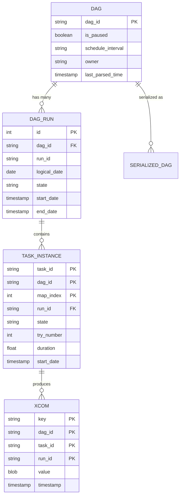

# Metadata Database — Schema & Operations

> **Module 01 · Topic 01 · Explanation 05** — Production database management for Airflow

---

## Core Schema



---

## Production Operations

### Database Sizing

| Scale | Rows (90-day retention) | DB Size | Recommended |
|-------|------------------------|---------|-------------|
| 50 DAGs, 10 tasks each | ~135K task instances | 1-5 GB | Small RDS |
| 500 DAGs, 20 tasks each | ~2.7M task instances | 10-50 GB | Medium RDS |
| 5,000 DAGs, 30 tasks each | ~40M task instances | 100-500 GB | Large RDS + PgBouncer |

### Maintenance Commands

```bash
# Clean old data (CRITICAL for production stability)
airflow db clean --clean-before-timestamp "2024-01-01" --yes

# Check database schema version
airflow db check

# Upgrade schema after Airflow version upgrade
airflow db migrate

# Export current connections (for migration)
airflow connections export connections.json
```

---

## Interview Q&A

**Q: Your Airflow metadata database is running out of storage. What do you do?**

> Immediate: Run `airflow db clean` to purge old task instances, DAG runs, and XCom data older than 90 days. Long-term: (1) Set up automated cleanup via a DAG that runs `airflow db clean` weekly, (2) Review XCom usage — large return values from tasks bloat the xcom table. Use external storage (S3) for large data and pass only references via XCom. (3) Monitor table sizes: `SELECT relname, pg_size_pretty(pg_total_relation_size(oid)) FROM pg_class WHERE relkind = 'r' ORDER BY pg_total_relation_size(oid) DESC LIMIT 10;`

---

## Self-Assessment Quiz

**Q1**: Explain why PgBouncer is critical at scale. What problem does it solve?
<details><summary>Answer</summary>PostgreSQL has a connection limit (default 100). Each Airflow scheduler, webserver, and worker opens multiple connections. At 20+ workers with connection pooling, you easily exceed 100 connections. PgBouncer sits between Airflow and PostgreSQL, multiplexing many client connections over a smaller pool of database connections. Without it, you'll see "FATAL: too many connections" errors that freeze the entire Airflow instance.</details>

### Quick Self-Rating
- [ ] I can draw the ER diagram of Airflow's core tables from memory
- [ ] I can size a metadata database for a given scale
- [ ] I can perform maintenance operations (clean, migrate, export)
