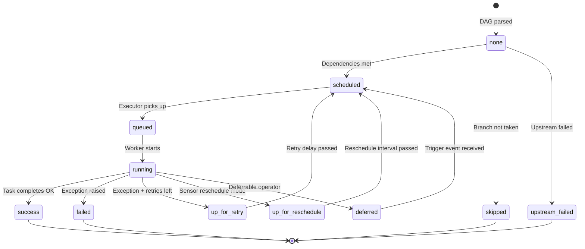

# Task States — The Complete State Machine

> **Module 01 · Topic 02 · Explanation 01** — Every state a task can be in, and why

---

## The State Machine



---

## Every State Explained

| State | Meaning | Action Required? |
|-------|---------|-----------------|
| `none` | Task exists but hasn't been evaluated yet | No — scheduler will process it |
| `removed` | Task was in a previous DAG version, no longer exists | No — historical record |
| `scheduled` | All upstream dependencies met, waiting for an executor slot | Check if pools/parallelism are full |
| `queued` | Executor accepted the task, waiting for a worker | Check worker availability |
| `running` | Worker is actively executing the task code | Monitor, check logs |
| `success` | Task completed without exception | Pipeline continues |
| `failed` | Task raised an exception, no retries left | Debug logs, fix code |
| `up_for_retry` | Task failed but has retries remaining | Wait for retry or investigate |
| `up_for_reschedule` | Sensor checked but condition not met yet | Wait — sensor will retry |
| `upstream_failed` | A required upstream task failed | Fix the upstream task first |
| `skipped` | BranchOperator chose a different path | Normal — not a problem |
| `deferred` | Deferrable operator waiting for external event | Triggerer component manages this |

---

## Debugging Guide by State

```
╔══════════════════════════════════════════════════════════════╗
║  STATE: "scheduled" for > 5 minutes                         ║
║  ─────────────────────────────────────────                   ║
║  CHECK:                                                      ║
║  1. Pool slots: airflow pools list                          ║
║  2. Parallelism: is core.parallelism reached?               ║
║  3. max_active_tasks_per_dag: DAG hitting limit?            ║
║  4. Executor health: is the executor process running?       ║
╠══════════════════════════════════════════════════════════════╣
║  STATE: "queued" for > 5 minutes                            ║
║  ─────────────────────────────────────────                   ║
║  CHECK:                                                      ║
║  1. Workers alive: check worker process/pod status          ║
║  2. Message broker: is Redis/RabbitMQ responsive?           ║
║  3. K8s: can pods be scheduled? (resource quota, node gp)   ║
╠══════════════════════════════════════════════════════════════╣
║  STATE: "running" for > expected duration                    ║
║  ─────────────────────────────────────────                   ║
║  CHECK:                                                      ║
║  1. Actually running: check task logs for output             ║
║  2. Zombie: worker died, scheduler hasn't detected yet      ║
║  3. Stuck: external call (API, DB) hanging                  ║
║  4. Set execution_timeout to prevent infinite tasks         ║
╚══════════════════════════════════════════════════════════════╝
```

---

## Interview Q&A

**Q: A task has been in "queued" state for 30 minutes. Walk me through your debugging process.**

> Systematic approach: (1) **Check workers** — `airflow celery worker --help` or `kubectl get pods`. Are workers running? (2) **Check the broker** — if CeleryExecutor, is Redis/RabbitMQ reachable? `redis-cli ping` returns `PONG` if healthy. (3) **Check pool availability** — `airflow pools list`. If the task's pool has `open_slots = 0`, it's waiting for another task to finish. (4) **Check `parallelism`** — if the global limit is reached, no new tasks can start. (5) **Check scheduler logs** — the scheduler should log when it queues tasks. If there are errors, you'll find them here.

**Q: What's the difference between "failed" and "upstream_failed"?**

> `failed` means THIS task's code raised an exception — the error is in this task's logs. `upstream_failed` means an *ancestor* task failed, and this task can never run because its input data is missing. A task in `upstream_failed` never executed — you won't find logs for it. The fix is always to fix the actual failed upstream task first, then clear the downstream tasks to re-run them.

---

## Self-Assessment Quiz

**Q1**: Draw the happy path (most common) state transition from beginning to end.
<details><summary>Answer</summary>none → scheduled → queued → running → success. This is the standard lifecycle: (1) Task is created when the DAG Run starts (none), (2) All upstream dependencies are met (scheduled), (3) Executor picks it up and sends to worker queue (queued), (4) Worker starts executing the code (running), (5) Code completes without exception (success).</details>

**Q2**: A Sensor task is stuck cycling between `running` and `up_for_reschedule`. Is this a problem?
<details><summary>Answer</summary>Not necessarily — this is normal sensor behavior in `reschedule` mode. The sensor runs, checks the condition (e.g., file exists?), finds it's not met, and goes to `up_for_reschedule`. After the `poke_interval`, it schedules again and re-checks. This is PREFERRED over `poke` mode because it frees the worker slot between checks. It only becomes a problem if the sensor never resolves (condition never met), which is why you should always set `timeout` on sensors.</details>

### Quick Self-Rating
- [ ] I can name all 12 task states from memory
- [ ] I can draw the state machine diagram from memory
- [ ] I can debug tasks stuck in any state
