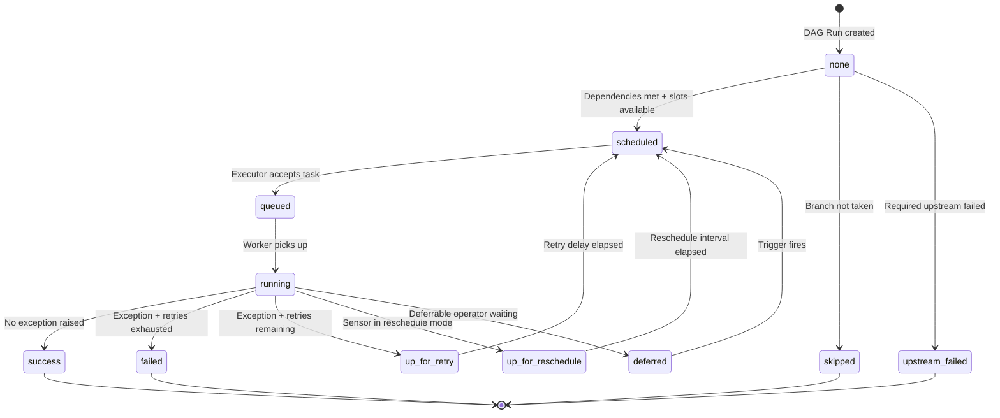

# Task States — The Complete State Machine

> **Module 01 · Topic 02 · Explanation 01** — Every state a task can be in, and why

---

## The Problem This Solves

A task in Airflow is not a simple "run/done" binary. It moves through a sequence of states, each representing a specific point in its journey from definition to completion. Understanding these states is the difference between a data engineer who can diagnose pipeline failures in 2 minutes and one who spends 2 hours checking the wrong things. When you see `upstream_failed`, you look upstream. When you see `queued`, you check your executor and pools. The state tells you exactly where to look.

Think of it like a hospital's patient tracking system. A patient's status moves from *admitted* → *in triage* → *with doctor* → *receiving treatment* → *discharged*. If a patient is stuck in "in triage" for 6 hours, you know the problem is in the triage department, not in surgery. Airflow's task states work the same way — each state maps to a specific system component responsible for the transition.

In production at scale, task state patterns reveal systemic problems. A "queued" storm (hundreds of tasks stuck in queued) means executor or worker failure. A wave of "up_for_retry" on the same task means your external dependency is flaky. A system-wide `upstream_failed` spread means one root task failed and infected the entire pipeline.

---

## The State Machine



---

## Every State and Its Meaning

```
╔══════════════════════════════════════════════════════════════╗
║  TASK STATE REFERENCE                                        ║
║                                                              ║
║  State              │ Who sets it    │ What it means         ║
║  ───────────────────┼────────────────┼──────────────────    ║
║  none               │ Scheduler      │ Created, not yet eval ║
║  scheduled          │ Scheduler      │ Ready, waiting slot   ║
║  queued             │ Executor       │ Sent to worker queue  ║
║  running            │ Worker         │ Executing right now   ║
║  success            │ Worker         │ Completed OK          ║
║  failed             │ Worker         │ Aborted, no retries   ║
║  up_for_retry       │ Worker         │ Failed, will retry    ║
║  up_for_reschedule  │ Worker/Sensor  │ Sensor poked, waiting ║
║  deferred           │ Operator       │ Async trigger pending ║
║  skipped            │ Branch Operator│ Path not chosen       ║
║  upstream_failed    │ Scheduler      │ Ancestor failed       ║
║  removed            │ Scheduler      │ Task deleted from DAG ║
╚══════════════════════════════════════════════════════════════╝
```

---

## Working Python Code — Observing Task States

```python
from airflow.decorators import dag, task
from airflow.operators.empty import EmptyOperator
from airflow.models import TaskInstance
import pendulum


@dag(
    dag_id="observe_task_states",
    schedule=None,
    start_date=pendulum.datetime(2024, 1, 1, tz="UTC"),
    catchup=False,
    tags=["module-01", "task-lifecycle"],
)
def observe_task_states():
    """
    Query task instance states programmatically from within a DAG.
    Demonstrates how the scheduler records state transitions.
    """

    @task()
    def inspect_own_state(**context):
        """A task that inspects its own TaskInstance state in the DB."""
        ti: TaskInstance = context["task_instance"]

        print(f"  Task ID:       {ti.task_id}")
        print(f"  DAG ID:        {ti.dag_id}")
        print(f"  Run ID:        {ti.run_id}")
        print(f"  Current State: {ti.state}")    # 'running' at this point
        print(f"  Try Number:    {ti.try_number}")  # 1 on first attempt
        print(f"  Start Date:    {ti.start_date}")

        # Lookup another task's state — useful for conditional logic
        from airflow.settings import Session
        session = Session()
        try:
            other_ti = (
                session.query(TaskInstance)
                .filter(
                    TaskInstance.dag_id == ti.dag_id,
                    TaskInstance.run_id == ti.run_id,
                    TaskInstance.task_id == "gate",
                )
                .first()
            )
            if other_ti:
                print(f"  Gate task state: {other_ti.state}")
        finally:
            session.close()

        return {"my_state": ti.state, "try_num": ti.try_number}

    gate = EmptyOperator(task_id="gate")
    gate >> inspect_own_state()


observe_task_states()
```

---

## State Transition Debugging Guide

| Task Stuck In | Check First | Check Second | Check Third |
|---------------|------------|-------------|------------|
| `scheduled` | Pool slots (all used?) | `parallelism` global limit | Executor health |
| `queued` | Worker processes alive? | Message broker (Redis/RabbitMQ)? | K8s pod schedulability? |
| `running` too long | Task logs for output | Zombie detection (worker died?) | External call hanging? |
| `up_for_retry` repeated | Task logs for error pattern | Is it a flaky dependency? | Set `execution_timeout` |

---

## Real Company Use Cases

**LinkedIn — State Monitoring as an SLA System**

LinkedIn's data platform team built an internal Airflow monitoring tool that polls task instance states every 60 seconds and writes them to a ClickHouse table. When any task spends > 30 minutes in `queued` state, an automated alert fires to the on-call engineer. When `up_for_retry` spikes above baseline by 10x for a specific task, a Jira ticket is automatically created with the task's recent log excerpt attached. This state-aware monitoring system reduced their mean time to detection (MTTD) for pipeline failures from 45 minutes (someone noticing in the UI) to 3 minutes (automated detection via state polling). The key insight: task states are a structured, queryable representation of your pipeline's health.

**Robinhood — Using `deferred` State for Cost Optimisation**

Robinhood's market data pipeline uses deferrable operators extensively. Before deferrable operators existed (added in Airflow 2.2), their sensors that waited for market data files to land in S3 held worker slots for the entire waiting duration — sometimes 2-4 hours between market close and complete data landing. By migrating these sensors to deferrable mode, tasks now enter `deferred` state instead of blocking a worker. The Triggerer process (a single asyncio event loop) monitors S3 for file landing events and re-queues the task when ready. This change reduced their worker infrastructure requirements by 40% during non-market hours, directly lowering cloud spend.

---

## Anti-Patterns and Common Mistakes

**1. Clearing ALL tasks in a large DAG run to fix one failure**

When `task_B` fails, engineers sometimes click "Clear All" in the DAG Run, which resets every task to `none` and re-runs everything from scratch. If `task_A` (which succeeded) took 3 hours, you've just added 3 hours of unnecessary re-work.

**Fix:** Use "Clear → Downstream Only" from the failed task. This resets only `task_B` and everything after it, leaving the expensive completed tasks untouched.

```bash
# CLI equivalent — clear only the failed task and downstream
airflow tasks clear dag_id -t task_B --downstream -s 2024-03-15 -e 2024-03-15
```

**2. Not setting `execution_timeout` on long-running tasks**

A task that hangs indefinitely stays in `running` state forever. The worker slot stays occupied, pool slots stay occupied, and the DAG Run never completes. You won't notice until 8 hours later when someone checks the UI.

**Fix:** Always set `execution_timeout` on tasks with external dependencies:

```python
@task(execution_timeout=pendulum.duration(hours=2))
def call_external_api():
    # If this takes > 2 hours, Airflow raises AirflowTaskTimeout
    # and sets state to 'failed', freeing the worker slot
    response = requests.get("https://slow-api.example.com/data", timeout=7200)
    return response.json()
```

**3. Treating `upstream_failed` as the root cause**

Developers new to Airflow see `upstream_failed` and start debugging that task. But `upstream_failed` is a victim state — it's set automatically by the scheduler when a required upstream task fails. The actual bug is always in the first task that shows `failed`, not in the tasks showing `upstream_failed`.

**Fix:** In the Grid View, scan columns from left (oldest task) to right. The `failed` cell is upstream from all `upstream_failed` cells. Fix the root `failed` task first.

---

## Interview Q&A

### Senior Data Engineer Level

**Q: You check the Airflow UI and see 50 tasks in `queued` state for 20 minutes, across 5 different DAGs. What is your systematic diagnostic process?**

I'd start at the executor layer, not the task level. With multiple DAGs affected simultaneously, this is almost certainly an infrastructure issue, not a task bug. First: is the executor process running? For CeleryExecutor, `celery inspect active` tells you if workers are alive. For KubernetesExecutor, `kubectl get pods -n airflow` shows if worker pods are being created. Second: if workers are alive, check the message broker — a Redis or RabbitMQ outage silently causes queued tasks to never be picked up. Third: check the global `parallelism` setting and pool utilisation — if `parallelism=32` and 32 tasks are already running, new tasks queue until slots open. Fourth: examine the scheduler logs at the time queueing started — the scheduler logs every dispatch decision. A pattern like "task X enqueued, no worker available" confirms the worker issue.

**Q: A task shows `up_for_retry` three times, each time failing 45 seconds in. The error message is "Connection refused." What does this pattern tell you and how do you investigate?**

The consistent 45-second failure time is a strong signal: the task runs for exactly 45 seconds before hitting the connection error. This means it's NOT failing immediately on connection (which would fail in 1-2 seconds) — it's successfully connecting initially, then losing the connection mid-stream. This is a timeout pattern, not a connection availability pattern. I'd look for `socket_timeout` or `connect_timeout` settings in the external system's connection config — 45 seconds is suspiciously close to common default TCP timeout values. Check if the query or API call the task makes takes > 30-45 seconds, exceeding the external system's idle connection timeout. Fix by either reducing the query window size or explicitly setting `keepalive` on the connection.

**Q: Your DAG has `depends_on_past=True` set on a task. That task failed yesterday. What happens today?**

Today's run of that task will not be scheduled at all — it will stay in `none` state indefinitely. `depends_on_past=True` causes the scheduler to check if the same task in the *previous* DAG Run completed successfully before scheduling the current run. This is an intentional constraint for tasks where today's output depends on yesterday's being correct (e.g., a cumulative aggregation). To unblock: either clear yesterday's failed task instance and fix its root cause (so it can succeed), or mark it as "success" in the UI if you're certain the data is acceptable. Warning: marking failed tasks as success to unblock `depends_on_past` chains is a dangerous pattern that can corrupt incremental data pipelines.

### Lead / Principal Data Engineer Level

**Q: You're designing an SLA monitoring system for 500 DAGs across 20 teams. Task states are a queryable data source. How do you build this system inside Airflow itself?**

I would build a dedicated `sla_monitor` DAG that runs every 5 minutes and queries the `task_instance` table directly. It uses SQLAlchemy (or the Airflow Session) to find task instances that have been in `queued` or `running` states longer than their team-defined SLA threshold — stored as Airflow Variables in a JSON structure keyed by team. The monitor then pushes metrics to Datadog or Prometheus via their respective hooks. For critical violations (> 2× SLA), it triggers a PagerDuty alert via the HTTP operator. The key architectural decision: this monitoring DAG itself must have a separate pool assignment (`sla_pool`, 5 slots) so that if the main worker pool is saturated, the monitor is not blocked. I'd also add a `max_active_runs=1` constraint so alerts don't cascade if monitoring falls behind.

**Q: A task is in `deferred` state. What exactly is happening at the infrastructure level, and what fails if the Triggerer process goes down?**

When a deferrable operator reaches its trigger point (e.g., "wait for this S3 file"), it serialises a "trigger" object — containing the condition to watch for and the task's current context — into the metadata DB and sets its state to `deferred`. It then releases its worker slot entirely. The Triggerer process (an asyncio event loop) polls the DB for deferred task trigger objects, creates Python coroutines for each, and runs them concurrently. When a trigger fires (the condition is met), the Triggerer updates the task instance state back to `scheduled`, and the scheduler picks it up normally for re-execution. If the Triggerer goes down: all deferred tasks remain stuck in `deferred` state indefinitely — they are not re-scheduled until a Triggerer comes back online. This is why the Triggerer process should be monitored with the same priority as the Scheduler, and should have health checks and auto-restart configured in your container orchestration system.

---

## Self-Assessment Quiz

**Q1**: Draw the happy-path state transition from DAG Run creation to task success.
<details><summary>Answer</summary>none → scheduled → queued → running → success. Trigger: (1) DAG Run is created, task instances are created in "none" state, (2) Scheduler evaluates dependencies — all upstream tasks succeeded, so state moves to "scheduled", (3) Executor accepts the task and puts it on the worker queue — state moves to "queued", (4) A worker picks it up and starts executing — state moves to "running", (5) Code completes without raising an exception — state moves to "success".</details>

**Q2**: You see 100 tasks in `upstream_failed`. None of them are in `failed`. How is this possible, and what do you do?
<details><summary>Answer</summary>This happens when the root failed task itself has been cleared or marked as success after its failure, but the downstream tasks were never cleared. The root task no longer shows "failed" (it's been reset), but the downstream tasks were never re-evaluated by the scheduler. Fix: Clear all the "upstream_failed" tasks (they have no log since they never ran), which resets them to "none". The scheduler will then re-evaluate their dependencies and schedule them if the upstream task is now in "success" state.</details>

**Q3**: What is the difference between `failed` and `upstream_failed` in terms of which system component sets each state?
<details><summary>Answer</summary>`failed` is set by the **Worker** — it was executing the task code, the code raised an uncaught exception (or the task was killed via SIGTERM/timeout), and the worker recorded the failure in the metadata DB. `upstream_failed` is set by the **Scheduler** — it evaluated the task's upstream dependencies, found that a required upstream task (with trigger_rule="all_success") is in the "failed" state, and determined this task can never run. The task with "upstream_failed" never executed at all — there are no logs for it at the task_id level.</details>

### Quick Self-Rating
- [ ] I can name all 12 task states from memory
- [ ] I can trace a task stuck in any state to its root cause component
- [ ] I understand `deferred` state and what the Triggerer does
- [ ] I know the difference between clearing "downstream only" vs "all"

---

## Further Reading

- [Airflow Docs — Task Instances and States](https://airflow.apache.org/docs/apache-airflow/stable/core-concepts/tasks.html)
- [Airflow Docs — Deferrable Operators](https://airflow.apache.org/docs/apache-airflow/stable/authoring-and-scheduling/deferring.html)
- [Airflow AIP-40 — Deferrable Operators Design](https://cwiki.apache.org/confluence/display/AIRFLOW/AIP-40+Smarter+scheduling+with+deferrable+operators)
