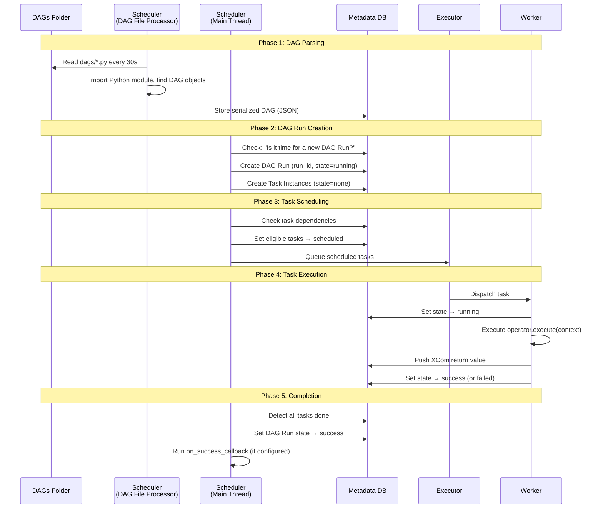

# Task Execution Flow — End to End

> **Module 01 · Topic 02 · Explanation 02** — From DAG file to task completion

---

## Why the Execution Flow Matters

Understanding the complete task execution flow is what separates engineers who debug Airflow by guessing from those who debug by reasoning. Every failure mode — tasks stuck in SCHEDULED, zombie tasks, catchup explosions, XCom size issues — becomes immediately diagnosable once you can trace exactly what Airflow does from the moment a DAG file lands on disk to the moment a task writes `SUCCESS` to the metadata DB.

Think of the flow like **a package travelling through a logistics system**. The package arrives at a sorting facility (your DAG file lands in the `dags/` folder). The system scans and logs the package's details (the scheduler parses the DAG, stores a serialized copy). When shipping conditions are met (the schedule interval trigger time passes), the package is assigned to a route (a DAG Run is created). Sorting machinery checks which items can be dispatched (the scheduler evaluates task dependencies). Items are loaded onto trucks (tasks sent to the executor). Drivers deliver them (workers execute). Delivery confirmation is recorded (task state updated to SUCCESS). If a truck breaks down mid-route (worker crash = zombie task), the system detects the missing delivery and reroutes (scheduler zombie detection kicks in). Every step is traceable, every failure has a specific cause.

---

## The Complete Journey



---

## Phase Breakdown

### Phase 1: DAG Parsing

```
╔══════════════════════════════════════════════════════════════╗
║  WHAT HAPPENS WHEN AIRFLOW PARSES YOUR DAG FILE             ║
║                                                              ║
║  1. The DagFileProcessorManager scans dags/ directory       ║
║  2. Each .py file is imported as a Python module            ║
║  3. Any top-level code EXECUTES (this is why heavy imports  ║
║     at module level slow down parsing!)                     ║
║  4. Airflow looks for variables of type DAG                 ║
║  5. Found DAGs are serialized to JSON and stored in DB      ║
║  6. If the file has syntax errors → logged, file skipped    ║
║                                                              ║
║  COMMON MISTAKE:                                             ║
║    import pandas as pd  # ← RUNS on every parse (30s)!     ║
║                                                              ║
║  CORRECT:                                                    ║
║    @task()                                                   ║
║    def process():                                            ║
║        import pandas as pd  # ← RUNS only when task executes║
╚══════════════════════════════════════════════════════════════╝
```

### Phase 2: DAG Run Creation

The scheduler checks: "Given this DAG's `schedule` and `start_date`, should a new DAG Run exist that doesn't yet?"

Key concept: **data_interval**

```
schedule: "@daily"
start_date: 2024-03-01

DAG Run for March 1:
  data_interval_start: 2024-03-01 00:00 UTC
  data_interval_end:   2024-03-02 00:00 UTC
  logical_date:        2024-03-01 00:00 UTC
  Actually runs at:    2024-03-02 00:00 UTC  ← AFTER the interval!
```

> **This trips up everyone**: A daily DAG's first run happens at `start_date + 1 day`, not at `start_date`. The DAG processes *yesterday's* data.

### Phase 3: Task Scheduling

The scheduler iterates through all Task Instances in a DAG Run:

```python
# Pseudocode of what the scheduler does:
for task_instance in dag_run.task_instances:
    if task_instance.state == "none":
        upstream_states = [t.state for t in task_instance.upstream_tasks]
        if all(s == "success" for s in upstream_states):
            task_instance.state = "scheduled"
            executor.queue(task_instance)
```

### Phase 4: Task Execution

What happens inside the worker:

```python
# Pseudocode of worker task execution:
def run_task(task_id, dag_id, logical_date):
    # 1. Import the DAG file
    dag = DagBag().get_dag(dag_id)
    task = dag.get_task(task_id)

    # 2. Build the context
    context = {
        "logical_date": logical_date,
        "task_instance": task_instance,
        "dag_run": dag_run,
        "params": dag_run.conf,
        # ... many more
    }

    # 3. Execute
    task_instance.state = "running"
    try:
        result = task.operator.execute(context)
        task_instance.xcom_push(key="return_value", value=result)
        task_instance.state = "success"
    except Exception as e:
        if task_instance.try_number < task.retries:
            task_instance.state = "up_for_retry"
        else:
            task_instance.state = "failed"
            task.on_failure_callback(context)
```

---

## Real Company Use Cases

**Shopify — Catchup Explosion Incident**

Shopify's data engineering team learned the hard way about `catchup=True` combined with a `start_date` set months in the past. A new DAG was deployed to calculate merchant revenue metrics, with `start_date = pendulum.datetime(2023, 1, 1)` and `schedule='@hourly'`. The deployment happened in September 2023 — 8 months after `start_date`. With `catchup=True` (the default), Airflow scheduled 5,832 backfill runs simultaneously (8 months × 30 days × 24 hours). The scheduler was overwhelmed creating task instances, the metadata DB grew by 200 GB in minutes from the sheer volume of task instance rows, and the PostgreSQL connection pool was exhausted. Legitimate production DAGs were blocked for 45 minutes. The immediate fix: paused the DAG, deleted all queued DAG Runs via `airflow dags backfill --reset-dagruns`, then redeployed with `catchup=False`. The lesson driven into their onboarding: **always set `catchup=False` unless backfilling is explicitly required, and always combine historical `start_date` values with `catchup=False`**.

**Twitter/X — data_interval Confusion Causing Double-Processing**

Twitter's ads revenue reconciliation pipeline processed ad impression data by day. Engineers set `start_date = pendulum.datetime(2023, 6, 1)` expecting the first run to process June 1 data. However, they also wrote the task using `{{ ds }}` (the `logical_date` formatted as YYYY-MM-DD) to form the S3 path: `s3://bucket/impressions/{{ ds }}/`. What they didn't account for: the first DAG Run's `logical_date` is June 1, but it actually runs on June 2 at midnight. It reads from the `2023-06-01/` S3 path correctly. But a second engineer, confused about why there was no run on June 1, manually triggered a run with `logical_date=2023-06-01`. Now two runs both targeted the same S3 path, and the reconciliation table got doubled impressions for that date. Airflow's design (logical date = data interval start, run happens after interval end) is correct — but engineers must understand it before using `{{ ds }}` in data paths. Twitter now mandates that all new DAGs include a comment explaining the data_interval logic.

---

## Anti-Patterns and Common Mistakes

**1. Setting `catchup=True` with a historical `start_date` in production**

The default `catchup=True` means Airflow will create a DAG Run for every missed interval since `start_date`. A DAG with a 6-month-old `start_date` running hourly will create 4,380 runs on first deployment.

```python
# ✗ WRONG: historical start_date + catchup=True = scheduler explosion
@dag(
    dag_id="merchant_revenue",
    schedule="@hourly",
    start_date=pendulum.datetime(2023, 1, 1),  # 8 months ago!
    # catchup defaults to True
)
def merchant_revenue_dag():
    ...

# ✓ CORRECT: set catchup=False unless you explicitly need backfill
@dag(
    dag_id="merchant_revenue",
    schedule="@hourly",
    start_date=pendulum.datetime(2024, 1, 1),
    catchup=False,  # Only process from the most recent interval onward
)
def merchant_revenue_dag():
    ...

# If backfilling IS required, do it explicitly and controlled:
# airflow dags backfill merchant_revenue \
#   --start-date 2023-01-01 \
#   --end-date 2024-01-01 \
#   --max-active-runs 2  # limit concurrency
```

**2. Using `execution_date` (deprecated) instead of `logical_date` / `data_interval_start`**

`execution_date` was renamed to `logical_date` in Airflow 2.2. Using the old name works but generates deprecation warnings and will break in a future major version. More importantly, it signals that the engineer may not understand the data_interval model.

```python
# ✗ WRONG: using deprecated execution_date
@task()
def process_data(**context):
    exec_date = context["execution_date"]  # Deprecated
    s3_path = f"s3://bucket/data/{exec_date.strftime('%Y-%m-%d')}/"
    # Also uses string formatting instead of the built-in template rendering

# ✓ CORRECT: use logical_date and the data_interval variables
@task()
def process_data(**context):
    logical_date = context["logical_date"]       # Start of the data interval
    data_interval_end = context["data_interval_end"]  # End of the data interval
    # Use Jinja templates for simple date substitution:
    # {{ ds }} = logical_date formatted as YYYY-MM-DD
    # {{ data_interval_start }} = start of interval (ISO format)
    # {{ data_interval_end }} = end of interval (ISO format)
    s3_path = f"s3://bucket/data/{logical_date.date()}/"
```

**3. Mutating state during DAG file parsing (side effects at module level)**

The DAG file is parsed every 30 seconds. Code that runs at module level (outside a function/class) executes on every parse. Writing files, making API calls, or modifying databases at module level causes side effects thousands of times per day.

```python
# ✗ WRONG: API call at module level
import requests

# This runs every 30 seconds as the scheduler parses the file!
response = requests.get("https://api.internal/config/pipeline")
PIPELINE_CONFIG = response.json()  # API called ~2880 times/day!

@dag(...)
def my_dag():
    ...

# ✓ CORRECT: fetch config inside a task at execution time
@dag(...)
def my_dag():
    @task()
    def load_config():
        import requests
        response = requests.get("https://api.internal/config/pipeline")
        return response.json()  # Called once per DAG Run, when the task runs

    @task()
    def process(config: dict):
        ...

    process(load_config())
```

---

## Interview Q&A

### Senior Data Engineer Level

**Q: Why does a daily DAG's first run happen at `start_date + 1 day`?**

Because Airflow processes data for a *completed* interval, not an ongoing one. A daily DAG with `start_date = 2024-03-01` is scheduled to process data from the interval `[March 1, March 2)`. That interval isn't complete until March 2 at midnight. So the DAG Run is created and triggered at March 2 00:00 UTC to process March 1's data. This is called the "end-of-interval" execution model, and it's the number-one source of confusion for Airflow beginners. The practical consequence: if you wake up and set `start_date = today`, no runs will appear today. The first run appears tomorrow.

**Q: What's the difference between a DAG Run's `logical_date`, `data_interval_start`, and `data_interval_end`?**

All three are distinct properties of a DAG Run: `data_interval_start` is the beginning of the data window this run is processing (e.g., 2024-03-01 00:00 UTC). `data_interval_end` is the end of the data window (e.g., 2024-03-02 00:00 UTC for a daily DAG). `logical_date` equals `data_interval_start` — it's an alias introduced in Airflow 2.2 to replace the confusingly named `execution_date`. The actual wall-clock time the run was triggered is available as `run_id` start time and is always at or after `data_interval_end`. So: for a daily DAG, `logical_date = 2024-03-01`, `data_interval_end = 2024-03-02`, actual run time ≈ `2024-03-02 00:00 UTC + scheduler lag`.

**Q: A task is in the NONE state. What does that mean and what transitions it to SCHEDULED?**

NONE is the initial state assigned to a Task Instance when it's first created (as part of DAG Run creation). It means the task exists in the metadata DB but hasn't been evaluated yet. The transition from NONE to SCHEDULED happens when the scheduler's main loop evaluates the Task Instance and finds that: (1) all upstream tasks have state SUCCESS (or are in an accepted upstream failure state if `trigger_rule` is set to something other than `all_success`), (2) pool slots are available for the task's pool, (3) the task isn't blocked by execution date constraints or `depends_on_past=True` requirements. Once all conditions are met, the scheduler atomically sets the state to SCHEDULED and sends it to the executor queue.

### Lead / Principal Data Engineer Level

**Q: Walk me through exactly what happens in the metadata DB during a single task's complete lifecycle, including every state transition and the component responsible for each.**

A Task Instance goes through these state transitions, each written by a specific component: (1) NONE → written on DAG Run creation by the **Scheduler main thread**. (2) NONE → SCHEDULED → written by **Scheduler main thread** when upstream deps are met. (3) SCHEDULED → QUEUED → written by the **Executor** when it accepts the task. (4) QUEUED → RUNNING → written by the **Worker** (via DB) when it starts executing the operator. The worker also writes a heartbeat timestamp every few seconds while running. (5a) RUNNING → SUCCESS → written by the **Worker** on successful operator completion; also writes XCom return value. (5b) RUNNING → FAILED → written by **Worker** on exception; if retries remain, Worker writes UP_FOR_RETRY and Scheduler creates a new attempt. (5c) RUNNING → FAILED → written by **Scheduler zombie detection** if heartbeat timestamps are stale (worker crashed). The scheduler reads the final task states to determine if all tasks in a DAG Run are complete, then updates DAG Run state to SUCCESS or FAILED.

**Q: Your pipeline requires that Task B never runs if Task A failed, even if `trigger_rule` on Task B is set to `all_done`. Explain how Airflow handles this and how you'd design around it.**

`all_done` runs a task as soon as all upstream tasks have completed — regardless of whether they succeeded or failed. If Task A fails and Task B uses `all_done`, Task B will run. If you need Task B to be skipped when Task A fails, you have two options: (1) Use the default `trigger_rule='all_success'` on Task B — Task B will be SKIPPED (not FAILED) when Task A fails, unless you have other DAG-level configurations. Actually, with `all_success` and Task A FAILED, Task B enters UPSTREAM_FAILED state, not SKIPPED. (2) For more nuanced logic, use a ShortCircuitOperator as Task A: it runs code that returns `False` on failure, which marks all downstream tasks as SKIPPED (not UPSTREAM_FAILED). This is more graceful for optional pipelines. (3) For the most control, use a BranchPythonOperator before Task B that checks a condition and routes to either Task B or a no-op EmptyOperator based on upstream results checked via XCom.

---

## Self-Assessment Quiz

**Q1**: You deploy a new DAG with `start_date = pendulum.datetime(2024, 1, 1)`, `schedule="@daily"`, and `catchup=True`. Today is March 15, 2024. How many DAG Runs will be created?
<details><summary>Answer</summary>74 DAG Runs (from Jan 1 to March 14). The first run processes Jan 1 data (created at Jan 2 00:00). The last catches up to yesterday (March 14 data, created at approximately the current time). Today's data hasn't completed yet (interval ends March 16), so March 15 won't be created until tomorrow. With `catchup=False`, only the most recent interval would run.</details>

**Q2**: A task has been in RUNNING state for 6 hours. The operator typically completes in 10 minutes. How do you diagnose this?
<details><summary>Answer</summary>(1) Check if the worker process is still alive: `airflow tasks states-for-dag-run my_dag run_id`. (2) Look at the task logs from the Airflow UI (or S3 if remote logging is configured) for the most recent output — is the task actively logging or silent? (3) If the worker process is still alive and logging, the task is genuinely slow (query running long, API timeout, infinite loop). Check database/external system for the blocking query. (4) If worker logs are absent, the worker may have crashed. Check for zombie task detection — run `airflow tasks list --tree` or query `SELECT state, queued_dttm, start_date FROM task_instance WHERE task_id='my_task'` to see heartbeat data. (5) If confirmed zombie, use `airflow tasks clear my_dag -t my_task -s run_date` to reset and retry.</details>

**Q3**: What is the `logical_date` for a weekly DAG with `start_date = 2024-01-01` (Monday) on its third run?
<details><summary>Answer</summary>The `logical_date` for the third run is `2024-01-15` (the Monday of the third week). The first run's `logical_date` is `2024-01-01` (it runs at 2024-01-08). The second run's `logical_date` is `2024-01-08` (it runs at 2024-01-15). The third run's `logical_date` is `2024-01-15` (it runs at 2024-01-22). The `logical_date` always represents the START of the data interval being processed, not when the run actually occurs.</details>

### Quick Self-Rating
- [ ] I can trace a task from file parse to completion through all 5 phases
- [ ] I can explain the data_interval model and why DAGs run "at the end of the interval"
- [ ] I can explain every task state transition and which component causes it
- [ ] I can design safe catchup strategies for historical backfills

---

## Further Reading

- [Airflow Docs — DAG Runs](https://airflow.apache.org/docs/apache-airflow/stable/core-concepts/dag-run.html)
- [Airflow Docs — Task Instances](https://airflow.apache.org/docs/apache-airflow/stable/core-concepts/tasks.html)
- [Airflow Docs — Trigger Rules](https://airflow.apache.org/docs/apache-airflow/stable/core-concepts/tasks.html#trigger-rules)
- [Airflow Docs — Catchup](https://airflow.apache.org/docs/apache-airflow/stable/core-concepts/dag-run.html#catchup)
