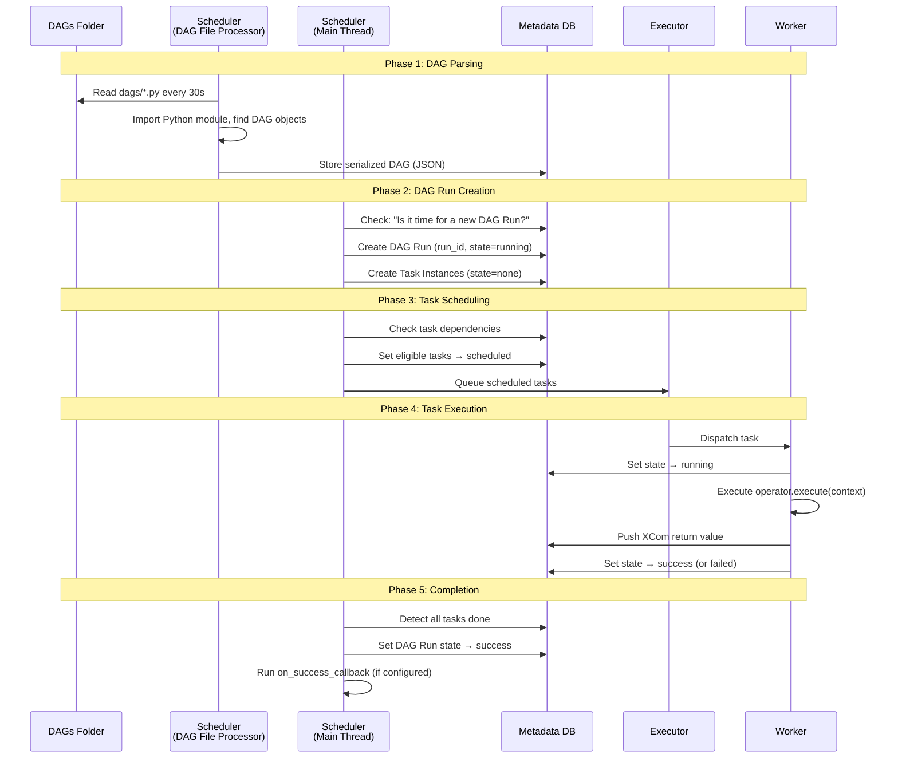

# Task Execution Flow — End to End

> **Module 01 · Topic 02 · Explanation 02** — From DAG file to task completion

---

## The Complete Journey



---

## Phase Breakdown

### Phase 1: DAG Parsing

```
╔══════════════════════════════════════════════════════════════╗
║  WHAT HAPPENS WHEN AIRFLOW PARSES YOUR DAG FILE             ║
║                                                              ║
║  1. The DagFileProcessorManager scans dags/ directory       ║
║  2. Each .py file is imported as a Python module            ║
║  3. Any top-level code EXECUTES (this is why heavy imports  ║
║     at module level slow down parsing!)                     ║
║  4. Airflow looks for variables of type DAG                 ║
║  5. Found DAGs are serialized to JSON and stored in DB      ║
║  6. If the file has syntax errors → logged, file skipped    ║
║                                                              ║
║  COMMON MISTAKE:                                             ║
║    import pandas as pd  # ← RUNS on every parse (30s)!     ║
║                                                              ║
║  CORRECT:                                                    ║
║    @task()                                                   ║
║    def process():                                            ║
║        import pandas as pd  # ← RUNS only when task executes║
╚══════════════════════════════════════════════════════════════╝
```

### Phase 2: DAG Run Creation

The scheduler checks: "Given this DAG's `schedule` and `start_date`, should a new DAG Run exist that doesn't yet?"

Key concept: **data_interval**

```
schedule: "@daily"
start_date: 2024-03-01

DAG Run for March 1:
  data_interval_start: 2024-03-01 00:00 UTC
  data_interval_end:   2024-03-02 00:00 UTC
  logical_date:        2024-03-01 00:00 UTC
  Actually runs at:    2024-03-02 00:00 UTC  ← AFTER the interval!
```

> **This trips up everyone**: A daily DAG's first run happens at `start_date + 1 day`, not at `start_date`. The DAG processes *yesterday's* data.

### Phase 3: Task Scheduling

The scheduler iterates through all Task Instances in a DAG Run:

```python
# Pseudocode of what the scheduler does:
for task_instance in dag_run.task_instances:
    if task_instance.state == "none":
        upstream_states = [t.state for t in task_instance.upstream_tasks]
        if all(s == "success" for s in upstream_states):
            task_instance.state = "scheduled"
            executor.queue(task_instance)
```

### Phase 4: Task Execution

What happens inside the worker:

```python
# Pseudocode of worker task execution:
def run_task(task_id, dag_id, logical_date):
    # 1. Import the DAG file
    dag = DagBag().get_dag(dag_id)
    task = dag.get_task(task_id)

    # 2. Build the context
    context = {
        "logical_date": logical_date,
        "task_instance": task_instance,
        "dag_run": dag_run,
        "params": dag_run.conf,
        # ... many more
    }

    # 3. Execute
    task_instance.state = "running"
    try:
        result = task.operator.execute(context)
        task_instance.xcom_push(key="return_value", value=result)
        task_instance.state = "success"
    except Exception as e:
        if task_instance.try_number < task.retries:
            task_instance.state = "up_for_retry"
        else:
            task_instance.state = "failed"
            task.on_failure_callback(context)
```

---

## Interview Q&A

**Q: Why does a daily DAG's first run happen at `start_date + 1 day`?**

> Because Airflow processes data for a *completed* interval. A daily DAG with `start_date = 2024-03-01` processes data from the interval `[March 1, March 2)`. That interval isn't complete until March 2 at midnight. So the DAG Run is created at March 2 00:00 UTC to process March 1's data. This is called the "end-of-interval" execution model. It's the #1 source of confusion for Airflow beginners.

---

## Self-Assessment Quiz

**Q1**: You deploy a new DAG with `start_date = pendulum.datetime(2024, 1, 1)`, `schedule="@daily"`, and `catchup=True`. Today is March 15, 2024. How many DAG Runs will be created?
<details><summary>Answer</summary>74 DAG Runs (from Jan 1 to March 14). The first run processes Jan 1 data (created at Jan 2 00:00). The last catches up to yesterday (March 14 data, created at approximately the current time). Today's data hasn't completed yet (interval ends March 16), so March 15 won't be created until tomorrow. With `catchup=False`, only the most recent interval would run.</details>

### Quick Self-Rating
- [ ] I can trace a task from file parse to completion
- [ ] I can explain the data_interval and why DAGs run "late"
- [ ] I can explain what happens at each phase of execution
