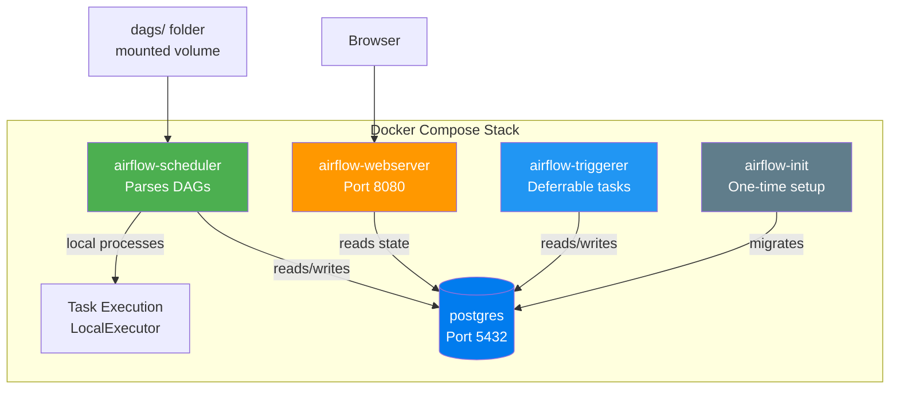

# Docker Compose Explained — Every Service Dissected

> **Module 02 · Topic 01 · Explanation 01** — Understanding every line of the Airflow docker-compose.yml

---

## Architecture Overview



---

## The YAML Anchor Pattern

The compose file uses a YAML anchor (`&airflow-common`) to avoid repeating config:

```yaml
# Define shared config once
x-airflow-common:
  &airflow-common          # ← Anchor
  image: apache/airflow:2.10.4
  environment:
    AIRFLOW__CORE__EXECUTOR: LocalExecutor
  volumes:
    - ./dags:/opt/airflow/dags

# Reuse it in each service
services:
  airflow-webserver:
    <<: *airflow-common     # ← Merge the anchor
    command: webserver
    ports:
      - "8080:8080"
```

> **Key pattern**: `x-` prefix means it's an extension field — Docker ignores it but YAML processes it. The `<<: *airflow-common` syntax merges all keys from the anchor into the service.

---

## Service-by-Service Breakdown

### 1. postgres (Metadata Database)

```
╔══════════════════════════════════════════════════════════════╗
║  SERVICE: postgres                                           ║
║                                                              ║
║  Image:     postgres:16                                      ║
║  Port:      5432 (exposed for debugging)                    ║
║  Volume:    postgres-db-volume (persistent data)            ║
║  Health:    pg_isready -U airflow                           ║
║                                                              ║
║  WHY:                                                        ║
║  The metadata DB stores ALL Airflow state. Uses a named     ║
║  volume so data persists across container restarts.          ║
║  In production: use RDS, Cloud SQL, or Azure DB.            ║
╚══════════════════════════════════════════════════════════════╝
```

### 2. airflow-webserver

| Config | Value | Why |
|--------|-------|-----|
| `command` | `webserver` | Starts the Flask/Gunicorn UI server |
| `port` | `8080:8080` | UI accessible at `localhost:8080` |
| `healthcheck` | `curl /health` | Docker monitors webserver health |
| `depends_on` | `postgres`, `airflow-init` | Wait for DB and init to complete |

### 3. airflow-scheduler

The **most important** service. It:
- Scans `dags/` folder for Python files
- Parses DAGs and stores them in the DB
- Creates DAG Runs based on schedules
- Queues tasks via the LocalExecutor

### 4. airflow-triggerer (Airflow 2.2+)

Handles **deferrable operators** — tasks that wait for external events without blocking a worker slot. Uses Python's `asyncio` loop.

### 5. airflow-init (One-Time Setup)

Runs once to:
1. `airflow db migrate` — create/upgrade database schema
2. `airflow users create` — create the admin user
3. Sets `_AIRFLOW_DB_MIGRATE: 'true'` flag

---

## Volume Mounts

| Local Path | Container Path | Purpose |
|-----------|---------------|---------|
| `./dags/` | `/opt/airflow/dags/` | Your DAG Python files |
| `./logs/` | `/opt/airflow/logs/` | Task execution logs |
| `./plugins/` | `/opt/airflow/plugins/` | Custom operators, hooks |
| `./config/` | `/opt/airflow/config/` | airflow.cfg overrides |

---

## Environment Variables Pattern

Airflow uses a specific naming convention for env var overrides:

```
AIRFLOW__<SECTION>__<KEY>=<VALUE>

Examples:
AIRFLOW__CORE__EXECUTOR=LocalExecutor
  → maps to airflow.cfg [core] executor = LocalExecutor

AIRFLOW__DATABASE__SQL_ALCHEMY_CONN=postgresql+psycopg2://...
  → maps to airflow.cfg [database] sql_alchemy_conn = ...
```

Double underscores (`__`) separate the section and key. This pattern lets you override ANY airflow.cfg setting via environment variables.

---

## Interview Q&A

**Q: Why does the docker-compose use LocalExecutor instead of CeleryExecutor?**

> For development and small production, LocalExecutor is simpler — it forks local processes without needing Redis or RabbitMQ infrastructure. One fewer service to manage, debug, and monitor. The trade-off: you can't distribute tasks across multiple machines. For a single-machine deployment running < 100 DAGs, LocalExecutor is the right choice. Scale to CeleryExecutor when you need horizontal scaling or KubernetesExecutor when you need task-level isolation.

---

## Self-Assessment Quiz

**Q1**: You update a DAG file but the change doesn't appear in the UI. The scheduler container is running. What could be wrong?
<details><summary>Answer</summary>Three possibilities: (1) Volume mount issue — the file on your host isn't mounted into the container. Check `docker compose exec airflow-scheduler ls /opt/airflow/dags/` to see if the file exists inside the container. (2) Parse error — the scheduler can't parse the file. Check `docker compose logs airflow-scheduler | grep ERROR` for Python import errors. (3) Timing — the scheduler re-parses every 30 seconds (default). Wait 30-60 seconds and refresh.</details>

### Quick Self-Rating
- [ ] I can explain every service in the docker-compose.yml
- [ ] I can explain the YAML anchor pattern
- [ ] I can override any airflow.cfg setting via environment variables
