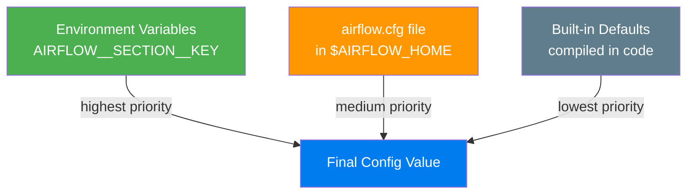

# Configuration Files — airflow.cfg and Environment Variables

> **Module 02 · Topic 01 · Explanation 03** — How Airflow reads its configuration

---

## Configuration Hierarchy



> **Key insight**: Environment variables ALWAYS override airflow.cfg. This is the recommended approach in Docker/Kubernetes because you don't need to mount config files.

---

## Critical Configuration Sections

| Section | Key Settings | Impact |
|---------|-------------|--------|
| `[core]` | `executor`, `parallelism`, `dags_folder` | Runtime behavior |
| `[database]` | `sql_alchemy_conn` | Which DB to use |
| `[scheduler]` | `min_file_process_interval`, `parsing_processes` | DAG parsing speed |
| `[webserver]` | `web_server_port`, `workers` | UI performance |
| `[logging]` | `remote_logging`, `remote_base_log_folder` | Log storage |

---

## Environment Variable Naming Convention

```
AIRFLOW__<SECTION>__<KEY>=<VALUE>

Section      Key                    Env Variable
─────────────────────────────────────────────────────────────
[core]       executor             → AIRFLOW__CORE__EXECUTOR
[core]       parallelism          → AIRFLOW__CORE__PARALLELISM
[database]   sql_alchemy_conn     → AIRFLOW__DATABASE__SQL_ALCHEMY_CONN
[scheduler]  min_file_process_    → AIRFLOW__SCHEDULER__MIN_FILE_PROCESS_INTERVAL
             interval                
[webserver]  web_server_port      → AIRFLOW__WEBSERVER__WEB_SERVER_PORT
```

```bash
# View current configuration
airflow config list

# Get a specific value
airflow config get-value core executor
```

---

## Interview Q&A

**Q: How do you manage Airflow secrets (database passwords, API keys) in production?**

> Three approaches, from simplest to most secure: (1) **Environment variables** — set via K8s Secrets or docker compose `.env` file. Simple but limited to env var format. (2) **Airflow Connections** — stored in the metadata DB, encrypted with Fernet key. Good for database/API credentials. (3) **Secrets Backend** — integrate with HashiCorp Vault, AWS Secrets Manager, or GCP Secret Manager. `AIRFLOW__SECRETS__BACKEND=airflow.providers.hashicorp.secrets.vault.VaultBackend`. Best for enterprise with centralized secret management.

---

## Self-Assessment Quiz

**Q1**: You set `AIRFLOW__CORE__EXECUTOR=CeleryExecutor` as an env var, but airflow.cfg has `executor=LocalExecutor`. Which one takes effect?
<details><summary>Answer</summary>The environment variable wins — `CeleryExecutor`. Environment variables always have the highest priority in Airflow's config hierarchy: env vars > airflow.cfg > defaults. This is by design so you can override config without touching files.</details>

### Quick Self-Rating
- [ ] I can translate any airflow.cfg setting to its env var equivalent
- [ ] I can explain the 3-tier configuration priority
- [ ] I can set up a secrets backend for production
