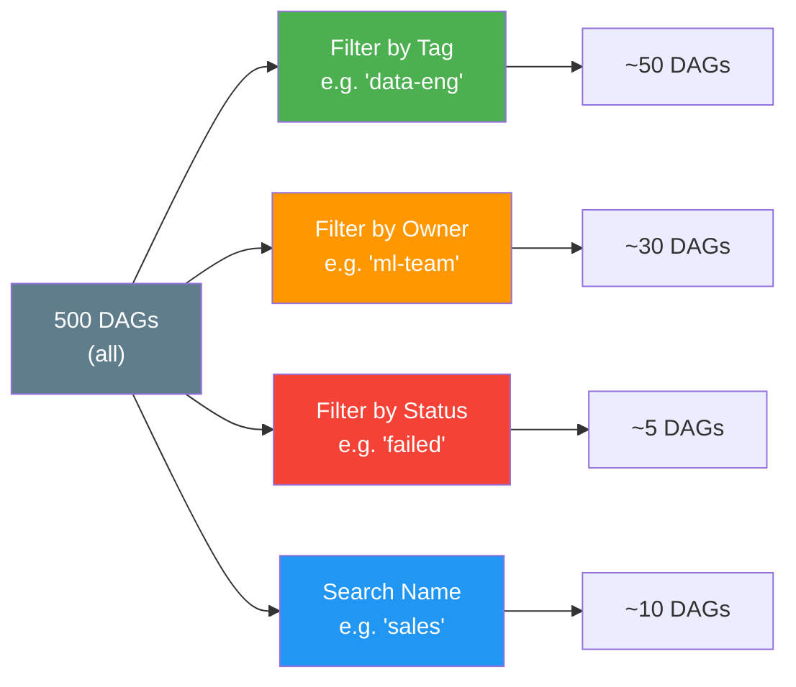

# DAG List View — The Main Dashboard

> **Module 03 · Topic 01 · Explanation 01** — Your command centre for pipeline health

---

## What This View Is and Why It Matters

The DAG List View is your first screen every morning. It shows every DAG in your deployment — whether it ran on schedule, whether it's healthy, and what actions you can take. At 5 DAGs, it's easy to scan manually. At 500 DAGs (a common production scale), the filtering, tagging, and status indicators on this screen are the difference between a data engineer who can spot a problem in 30 seconds and one who spends 10 minutes clicking around.

Think of it like an **air traffic control radar display**. Every blip represents an aircraft (a DAG). Each blip's colour tells you its current status. The controller (you) doesn't fly every plane — you monitor them all at once, and you intervene only when something deviates from the expected path. The radar display's value is not in the detail it shows about any single aircraft — it's in providing a unified view of the entire airspace at a glance.

In production, the DAG List View earns its value through operational routines. On-call engineers start their shift here, checking for any red circles in the "Runs" column. Platform teams use the "Owner" filter to view only their domain's pipelines. When a data consumer reports stale data, the first diagnostic step is always: open DAG List, find the pipeline, check last run status.

---

## What You See

```
╔══════════════════════════════════════════════════════════════════╗
║  AIRFLOW DAG LIST VIEW — Production Instance                    ║
║                                                                  ║
║  [Search DAGs...]  [Tags ▼]  [Owner ▼]  [Status ▼]             ║
║                                                                  ║
║  ┌───┬──────────────┬───────────┬──────────┬──────────┬───────┐ ║
║  │ ⊙ │ DAG ID       │ Owner     │ Runs     │ Schedule │ Last  │ ║
║  ├───┼──────────────┼───────────┼──────────┼──────────┼───────┤ ║
║  │ ● │ etl_sales    │ data-eng  │ ●●●●●●●● │ @daily   │ 2h ago│ ║
║  │ ○ │ ml_training  │ ml-team   │ ●●●○●●●● │ @weekly  │ 3d ago│ ║
║  │ ● │ report_daily │ analytics │ ●●●●●●●● │ 0 6 * * *│ 1h ago│ ║
║  │ ● │ user_events  │ data-eng  │ ●●●●●✗●● │ @hourly  │ 45m   │ ║
║  └───┴──────────────┴───────────┴──────────┴──────────┴───────┘ ║
║                                                                  ║
║  ● = On   ○ = Paused   ✓ = success   ✗ = failed   ⟳ = running  ║
╚══════════════════════════════════════════════════════════════════╝
```

---

## Key Columns Decoded

| Column | What It Shows | Production Insight |
|--------|--------------|-------------------|
| **Toggle (⊙/○)** | Paused/Active | Paused DAGs create no new runs |
| **DAG ID** | `dag_id` from your Python file | Click → enters Grid/Graph/Gantt views |
| **Owner** | From `default_args["owner"]` | Filter by team — essential at scale |
| **Runs** | Last 25 DAG Run statuses (coloured) | Quick health trend at a glance |
| **Schedule** | Cron expression or preset | Shows the DAG's next trigger time |
| **Last Run** | Timestamp of most recent run | Detects stale/stopped pipelines |
| **Next Run** | Next scheduled execution | Quickly verify schedule is correct |

---

## Filtering at Scale



> **Best practice**: Every DAG must have `tags` defined. Without tags, a 500-DAG deployment is unmanageable.

---

## Working Python Code — Tags and Owner Configuration

This is how you set the metadata the DAG List View displays:

```python
from airflow.decorators import dag, task
import pendulum


@dag(
    dag_id="sales_daily_etl",
    description="Extract, transform and load daily sales data from Postgres to BigQuery",
    schedule="0 6 * * *",  # 6AM UTC daily
    start_date=pendulum.datetime(2024, 1, 1, tz="UTC"),
    catchup=False,
    # These fields appear in the DAG List View
    tags=["data-eng", "sales", "production", "tier-1"],  # Filter by these
    default_args={
        "owner": "data-engineering",       # Shows in Owner column
        "retries": 3,
        "retry_delay": pendulum.duration(minutes=5),
        "email_on_failure": True,
        "email": ["data-eng-alerts@company.com"],
    },
    # Controls how many concurrent runs are allowed
    max_active_runs=1,
    # SLA for the entire DAG Run (alerts if exceeded)
    # sla_miss_callback=send_sla_alert,
)
def sales_daily_etl():
    """
    DAG docstring appears in the Code View tab.
    Write it for the operations team, not for yourself.
    Describe: what data, where from, where to, what frequency.
    """
    @task()
    def extract():
        return {"rows": 1000}

    @task()
    def load(data: dict):
        print(f"Loading {data['rows']} rows")

    load(extract())


sales_daily_etl()
```

---

## Real Company Use Cases

**Shopify — Tag-Based On-Call Routing**

Shopify's data platform runs 800+ DAGs. Their on-call structure maps directly to the Airflow tagging system: every DAG has a `team:` tag (e.g., `team:payments`, `team:inventory`) and a `tier:` tag (`tier:1` for customer-facing SLA-critical pipelines, `tier:3` for internal reporting). When a pipeline fails, the automated alerting system reads the DAG's tags from the metadata DB to determine which PagerDuty rotation to page. `tier:1` failures page the on-call immediately; `tier:3` failures create a Jira ticket for the next business day. This tag-based routing means no manual maintenance of "which team owns which pipeline" spreadsheets — the DAG file itself is the source of truth.

**Stripe — Paused DAGs as Feature Flags**

Stripe uses DAG pausing as a lightweight feature flag mechanism. When a new analytics pipeline is deployed to production but not yet validated, it's deployed in its paused state (`is_paused_upon_creation=True` in the DAG's config). The data team validates the pipeline by manually triggering it via the API without it running on schedule. Once validated, they unpause it — at which point it begins scheduling normally. This pattern prevents "dark launches" where an unvalidated pipeline runs silently and corrupts a data warehouse before anyone notices. The DAG List View's pause toggle is their deployment gate, not just a convenience feature.

---

## Anti-Patterns and Common Mistakes

**1. No tags on production DAGs**

In a 100-DAG deployment, an untagged DAG is invisible during incidents. When 3 AM strikes and you need to find "the sales pipeline that feeds the CEO dashboard", you shouldn't be scrolling through 100 alphabetically-sorted DAG IDs.

**Fix:** Enforce tags at the CI/CD level — fail any pull request that adds a DAG without at least one tag. Add a validation step to your CI pipeline:

```python
# In your CI validation script
import ast, sys

def check_dag_has_tags(filepath: str) -> bool:
    """Ensure every DAG definition includes tags."""
    with open(filepath) as f:
        tree = ast.parse(f.read())
    # Look for @dag decorator with tags argument
    for node in ast.walk(tree):
        if isinstance(node, ast.Call):
            for kw in node.keywords:
                if kw.arg == "tags" and isinstance(kw.value, (ast.List, ast.Constant)):
                    return True
    return False
```

**2. New DAGs starting active (causing immediate catchup)**

By default, `is_paused_upon_creation` is `False` in many Airflow configurations. If you deploy a new DAG with `start_date = 90 days ago` and `catchup=True`, Airflow immediately creates 90 DAG Runs. This can overwhelm the scheduler and executor, delay other pipelines, and run un-validated code on production data.

**Fix:** Set `is_paused_upon_creation = True` in `airflow.cfg` and always explicitly unpause after validation:

```bash
# In airflow.cfg (or via env var):
AIRFLOW__CORE__DAGS_ARE_PAUSED_AT_CREATION=True

# After deployment and validation:
airflow dags unpause sales_daily_etl
```

**3. Using DAG ID as the only identifier — no description field**

The `description` parameter appears in the DAG List View as a tooltip and in the Grid View header. Engineers commonly leave it empty, making it impossible to understand a DAG's purpose without opening the Code View.

**Fix:** Always set `description`:

```python
@dag(
    dag_id="acct_monthly_reconciliation",
    description="Monthly reconciliation of Stripe payouts vs internal ledger. "
                "Runs on 1st of each month. Owner: finance-data-team.",
    ...
)
```

---

## Interview Q&A

### Senior Data Engineer Level

**Q: A DAG shows as "paused" in the UI but you didn't pause it. The last run was 3 days ago. What's your diagnostic process?**

First, check the Audit Log (Browse → Audit Log in the UI) — Airflow logs every state change with the user who triggered it and the timestamp. If the audit log shows an automated system (like a CI/CD deploy pipeline) pausing it, check the deployment scripts. Second, `is_paused_upon_creation` in airflow.cfg defaults to `True` in some Airflow versions and configurations — if the DAG was recently re-deployed (forcing a re-parse as a "new" DAG), it may have reset to the paused state. Third, check if there's an automated DAG management tool (like Astronomer's deployment tooling or custom scripts) that toggles pause states. The three-day gap narrows it to a specific deployment window.

**Q: You have 20 DAGs for the "payments" team. How do you implement a policy so that when any one of them fails, the on-call engineer gets paged with the right context?**

Implement a shared `on_failure_callback` function that reads the DAG's tags to determine the PagerDuty routing key, then attach it to all payments DAGs. Store the tag-to-routing mapping in an Airflow Variable as JSON:

```python
def payments_failure_alert(context):
    """Shared failure callback for all payments DAGs."""
    from airflow.models import Variable
    import requests

    routing = Variable.get("pagerduty_routing", deserialize_json=True)
    dag_tags = context["dag"].tags  # ['payments', 'tier-1', 'team:payments']

    tier = next((t for t in dag_tags if t.startswith("tier:")), "tier:3")
    routing_key = routing.get(tier, routing["default"])

    payload = {
        "routing_key": routing_key,
        "event_action": "trigger",
        "payload": {
            "summary": f"Airflow DAG {context['dag'].dag_id} failed",
            "source": "airflow",
            "severity": "critical" if tier == "tier:1" else "warning",
        }
    }
    requests.post("https://events.pagerduty.com/v2/enqueue", json=payload)
```

**Q: You deploy 50 new DAGs and the scheduler starts slow-starting DAG Runs — tasks that should start at 6 AM start at 6:08 AM. What's your investigation plan?**

The 8-minute delay is the scheduler struggling with the additional parse load. My first step: `airflow dags report` — this shows parse time per file. If any file takes > 2 seconds to parse, it's likely doing top-level imports or expensive computations at module load time. Multiply 50 new files × 30 seconds default parse interval and you can see how parse overhead accumulates. Second: check `min_file_process_interval` — reducing this means more frequent parsing, paradoxically increasing the delay. Set it to 60 seconds for large fleets. Third: increase `parsing_processes` to utilise more CPU cores for parallel file processing. Fourth: check if any new DAG files are importing heavy libraries (pandas, sklearn) at module level — move those imports inside task functions.

### Lead / Principal Data Engineer Level

**Q: Your company is migrating from a monolithic Airflow instance (800 DAGs, all teams) to per-team Airflow instances. How do you design the tagging and ownership strategy to make this migration smooth?**

The migration strategy starts with the tagging data that already exists. First, I'd query the metadata DB to build a DAG-to-team mapping by analysing existing tags and `owner` fields — this becomes the migration manifest. DAGs with clear team ownership (`team:payments` tag) go to that team's instance. DAGs with ambiguous ownership get a 2-week review period where we tag-debate with team leads. During the migration, I'd run both old and new instances simultaneously with a "shadow mode" — new instance runs all DAGs but sends alerts to `/dev/null`. After 2 weeks of shadow validation, we flip routing of the actual consumer systems to the new instances. The tagging structure in the old instance becomes the authoritative source for workload distribution decisions. Post-migration, I'd enforce a rule that cross-team DAG dependencies must use Airflow Assets or external task sensors — no more implicit ordering via shared load times.

**Q: The CEO wants a "data pipeline health score" — a single percentage showing how healthy all pipelines are this week. How do you build this from Airflow task state data?**

I'd query the `task_instance` and `dag_run` tables directly using a scheduled analytics DAG. The health score formula: `(successful_task_instances / total_expected_task_instances) × 100`, computed over a rolling 7-day window, weighted by DAG tier (`tier:1` failures count 3× against the score). Expected task instances = sum across all active DAGs of `tasks_per_dag × runs_per_day × 7`. Actual successes = count of `task_instance.state = 'success'` in the same window. The DAG pushes the result to a Grafana dashboard metric and to a Slack `#data-health` channel every Monday. The key design decision: use a separate Airflow instance (or at minimum a separate metadata DB read replica) to run this analytics DAG, so its queries don't add load to the production scheduler's database.

---

## Self-Assessment Quiz

**Q1**: You have 500 DAGs and your on-call engineer needs to see only failed DAGs that belong to the "payments" team. How do you achieve this in the UI?
<details><summary>Answer</summary>Two steps: (1) In the DAG List View, click the "Status" filter → select "Failed" to show only DAGs with recent failures, (2) Click the "Tags" filter → select "payments" to narrow to the payments team. This requires that all payments DAGs have `tags=["payments"]` in their definition. Without the tag, you'd have to visually scan the Owner column, which is error-prone at scale.</details>

**Q2**: A new DAG was deployed at 10 AM. At 10:05 AM, the scheduler should have triggered it but the DAG List View shows it's paused. What's the most likely configuration issue?
<details><summary>Answer</summary>The deployment pipeline or Airflow configuration has `dags_are_paused_at_creation=True` (or equivalently `is_paused_upon_creation=True`). New DAGs start in paused state and don't trigger until explicitly unpaused. Fix: either change the global setting to `False` for auto-start, or add an explicit unpause step to your deployment pipeline (`airflow dags unpause <dag_id>`).</details>

**Q3**: You notice the "Runs" column for a DAG shows 8 green circles followed by 2 red circles (most recent). What are the three most likely root causes you'd investigate first?
<details><summary>Answer</summary>(1) A recent code deployment changed the DAG or a shared utility — check git log for changes 2 runs ago (correlate with run timing), (2) An external dependency changed — the database schema, API endpoint, or file format that the DAG reads from may have changed silently, (3) Data volume growth — the task exceeded its `execution_timeout` because the data grew too large for the current implementation. Click the first red run → navigate to the failed task → read logs to determine which of these three applies.</details>

### Quick Self-Rating
- [ ] I can navigate and filter the DAG list efficiently for 500+ DAGs
- [ ] I understand every column in the DAG List View
- [ ] I can set tags, owner, and description correctly in my DAG definitions
- [ ] I know how to audit who paused a DAG using the Audit Log

---

## Further Reading

- [Airflow Docs — DAG Views](https://airflow.apache.org/docs/apache-airflow/stable/ui.html)
- [Airflow Docs — DAG Tags](https://airflow.apache.org/docs/apache-airflow/stable/howto/add-dag-tags.html)
- [Airflow Docs — DAG Pausing](https://airflow.apache.org/docs/apache-airflow/stable/core-concepts/dags.html#dag-pausing-deactivation-and-deletion)
