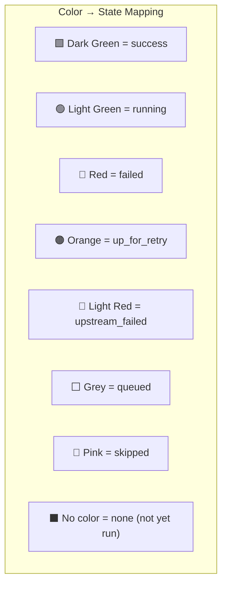

# Grid View (Tree View) — DAG Runs × Tasks Matrix

> **Module 03 · Topic 01 · Explanation 02** — The most powerful monitoring view in the Airflow UI

---

## 🎯 The Real-World Analogy: A Spreadsheet Attendance Register

Think of the Grid View as a **classroom attendance register**:

| Grid Concept | Attendance Register Equivalent |
|--------------|-------------------------------|
| **Rows** = Tasks | **Rows** = Student names |
| **Columns** = DAG Runs | **Columns** = School days |
| **Green cell** = success | **✓** = present |
| **Red cell** = failed | **✗** = absent (unexplained) |
| **Orange cell** = retrying | **⚠** = late/tardy |
| **Red column** = entire run failed | **Entire day column red** = school was cancelled |
| **Red row** = same task always fails | **Same student always absent** = systemic issue |

A good teacher scans the register and instantly spots: "Maria has been absent every Monday for 3 weeks" — exactly how a data engineer reads the Grid View to spot "the `transform` task fails every time there's a Monday scheduled run."

---

## Layout

```
╔══════════════════════════════════════════════════════════════════╗
║  GRID VIEW                                                       ║
║                                                                   ║
║  Task ↓ / DAG Run →  │ Run 1  │ Run 2  │ Run 3  │ Run 4  │     ║
║  ─────────────────────┼────────┼────────┼────────┼────────┤     ║
║  extract              │  ✓     │  ✓     │  ✓     │  ⟳     │     ║
║  transform            │  ✓     │  ✓     │  ✗     │  ○     │     ║
║  load                 │  ✓     │  ✓     │  ↗     │  ○     │     ║
║  notify               │  ✓     │  ✓     │  ↗     │  ○     │     ║
║                                                                   ║
║  ✓ = success  ✗ = failed  ⟳ = running  ○ = none  ↗ = upstream  ║
╚══════════════════════════════════════════════════════════════════╝
```

---

## Reading the Grid — Color Coding



**Rows** = Tasks (ordered by dependency) | **Columns** = DAG Runs (newest first, left to right)

---

## Pattern Recognition: What to Look For

| Visual Pattern | What It Means | Immediate Action |
|---------------|---------------|-----------------|
| **Single red cell** | One task failed on one run | Check that task's logs |
| **Red column** | Entire DAG Run failed | Find first failed task in that column |
| **Red row** | Same task fails across multiple runs | Bug in that task's code or data |
| **Orange row** | Task retrying repeatedly | Flaky dependency or timeout |
| **Staircase pattern** | Tasks running sequentially | Normal for sequential DAG |
| **All grey cells** | DAG is paused | Unpause via UI or CLI |

---

## Working with the Grid: Code Examples

```python
# This TaskFlow API DAG creates the Grid View pattern below:
from airflow.decorators import dag, task
from datetime import datetime, timedelta

@dag(
    dag_id="sales_etl_pipeline",
    schedule="@daily",
    start_date=datetime(2024, 1, 1),
    catchup=False,
    default_args={
        "retries": 2,
        "retry_delay": timedelta(minutes=5),
    },
)
def sales_etl():
    @task()
    def extract_sales() -> dict:
        """Grid View: row 1 — extracts from source DB."""
        return {"rows": 10000, "date": "{{ ds }}"}

    @task()
    def validate_data(raw: dict) -> dict:
        """Grid View: row 2 — fails if data quality check fails."""
        if raw["rows"] < 100:
            raise ValueError(f"Too few rows: {raw['rows']} — pipeline halted")
        return raw

    @task()
    def transform(validated: dict) -> dict:
        """Grid View: row 3 — becomes upstream_failed if validate fails."""
        return {"transformed_rows": validated["rows"]}

    @task()
    def load(transformed: dict):
        """Grid View: row 4 — upstream_failed chains from transform."""
        print(f"Loading {transformed['transformed_rows']} rows")

    # Chain creates the dependency graph visible in Grid View
    raw = extract_sales()
    validated = validate_data(raw)
    transformed = transform(validated)
    load(transformed)

sales_etl()
```

---

## 🏢 Real Company Use Cases

**Airbnb** built their internal data quality dashboard on top of the Grid View API. Their data platform team created a custom monitoring dashboard that queries the Airflow REST API to retrieve task instance states across 500+ DAGs and renders a company-wide "pipeline health grid" — essentially a Grid View for executives that aggregates across all Airflow clusters. When a column turns red, automated alerts fire.

**Uber** uses Grid View as the primary SLA monitoring tool for their marketplace data pipelines. Their DE team maintains a convention: any DAG that powers a business KPI (rider demand, driver supply) must have ≤2 consecutive red cells in the Grid View before an on-call page fires. They built a Prometheus exporter that reads the Airflow metadata DB and exposes task instance state counts as time-series metrics, enabling alerts on Grid View patterns before engineers even open the UI.

**Lyft** uses the Grid View to monitor their feature engineering pipelines for ML model training. Their MLOps team uses the grid's color pattern to detect "data lag" — when new features aren't ready in time for the daily model re-training job. A yellow/orange pattern in specific upstream tasks correlates strongly with model accuracy drops, so the Grid View is part of their daily model health review.

---

## ❌ Anti-Patterns

### Anti-Pattern 1: Ignoring the Grid View — Using Only Logs for Debugging

```
# ❌ BAD APPROACH:
# 1. Task fails
# 2. Engineer opens 20 separate log files
# 3. Spends 2 hours reading logs line-by-line
# 4. Misses the pattern: this task fails every Monday

# ✅ GOOD APPROACH:
# 1. Open Grid View for the past 30 days
# 2. Look at the "transform" row
# 3. INSTANTLY see: red every Monday, green other days
# 4. Conclude: weekend data batch doesn't run → Monday's incremental load
#    tries to process 3 days of data → times out
# 5. Fix: increase timeout on Monday runs or add a pre-check task
```

---

### Anti-Pattern 2: Clearing Tasks Without Understanding the Grid Pattern First

```python
# ❌ BAD: Clear individual failed task and re-run immediately
# Without reading the Grid View pattern first

# Common mistake: clearing a task that's "upstream_failed" (pink)
# instead of the actual root cause (red)

# The "upstream_failed" task is a VICTIM, not the culprit
# Clearing it does nothing — it will immediately become upstream_failed again

# ✅ GOOD: Read the Grid first
# 1. Find the first RED cell in the column (actual failure)
# 2. NOT the pink cells (upstream_failed victims)
# 3. Click the red task → read logs → fix root cause
# 4. Clear the ROOT task with "downstream" checked
#    → this propagates the re-run to all victims automatically
```

---

### Anti-Pattern 3: Setting catchup=True Without Monitoring Grid View

```python
# ❌ BAD: catchup=True with no monitoring
@dag(
    dag_id="backfill_dag",
    schedule="@hourly",
    start_date=datetime(2024, 1, 1),  # 3 months ago!
    catchup=True,  # ← Creates 2,160 DAG Runs immediately!
)
def my_dag():
    ...
# Result: Grid View shows 2,160 columns, scheduler overwhelmed,
# metadata DB fills with tens of thousands of rows instantly
```

```python
# ✅ GOOD: Control catchup, monitor Grid View
@dag(
    dag_id="safe_dag",
    schedule="@hourly",
    start_date=datetime(2024, 3, 20),  # Recent start date
    catchup=False,  # Default to False
    max_active_runs=3,  # Limit concurrent runs if catchup needed
)
def my_dag():
    ...
# If you DO need to backfill, use:
# airflow dags backfill -s 2024-01-01 -e 2024-03-20 --max-active-runs 5 <dag_id>
```

---

## 🎤 Senior-Level Interview Q&A

**Q1: A manager asks "How healthy is our ETL pipeline this month?" How do you answer using only the UI?**

> Open Grid View → set date range to current month → scan visually. Mostly green = healthy. Count red cells per row to identify the most failure-prone tasks. Count red columns to get the DAG Run failure rate. If >5% of DAG Runs have failures, drill into the first failed task per run to identify patterns. Export quantitative data using the REST API: `GET /api/v1/dagRuns?dag_id=X&state=failed`. Combine with `GET /api/v1/taskInstances` to get per-task failure rates. Present as: "Pipeline X had a 94% success rate this month; task `transform` caused 78% of the failures."

**Q2: In the Grid View, you see a task that's green for 10 consecutive runs, then red for the last 3. What's your debugging approach?**

> Pattern indicates an **external change**, not a code bug (code didn't change, behavior did). Debugging steps: (1) Click the first red task instance → read logs for the specific error. (2) Check the timestamp of the first failure against: deployment history (were any changes released?), infrastructure change logs (did database schema change?), upstream data source behavior (new columns, changed data types?). (3) Compare the inputs/outputs using XCom — what data did the task receive vs. what it expected? (4) Check if the failure is time-related: is there a new data volume hitting a timeout? The 3-failure pattern usually points to a schema change, upstream data format change, or a resource limit being hit.

**Q3: You have 200 DAGs in the Airflow cluster. How would you use the Grid View efficiently at scale? What are its limitations?**

> The Grid View shows one DAG at a time — it doesn't scale to 200 DAGs monitoring. Effective strategies at scale: (1) **Aggregate monitoring**: use the REST API to pull task instance states programmatically and feed into Grafana/Datadog dashboards. (2) **Alert-first**: configure SLA miss alerts so you get notified before you need to look at Grid View. (3) **Tag filtering**: organize DAGs with tags (`team:finance`, `sla:critical`) and use the tag filter in the DAG list view to narrow scope. (4) **Grid View for deep-dives**: use it reactively when an alert fires, not proactively for all 200 DAGs. The Grid View is excellent for per-DAG forensics; Prometheus + Grafana is better for fleet-wide monitoring.

---

## 🏛️ Principal-Level Interview Q&A

**Q1: Design a monitoring system for 500 DAGs across 3 Airflow clusters that gives a single-pane-of-glass view equivalent to the Grid View but at fleet scale.**

> **Architecture**: (1) **Metrics collection** — deploy a Prometheus exporter per cluster that queries the Airflow metadata DB every 30s: task instance states by DAG, run duration percentiles, SLA miss counts. (2) **Aggregation layer** — Prometheus federation or Thanos to merge metrics from 3 clusters into a single query endpoint. (3) **Grafana dashboards** — "Fleet Health" dashboard: top-20 DAGs by failure rate (heatmap), time-series of failure counts, SLA miss rate by team. Drilldown: per-DAG grid equivalent using Grafana's status panel with time as X-axis and tasks as Y-axis. (4) **Alerting** — PagerDuty routing rules: `sla:critical` DAGs page the on-call DE; `sla:standard` DAGs create Jira tickets. (5) **Access control** — teams see only their DAGs' metrics via Grafana's team-scoped data source permissions.

**Q2: The Grid View shows a systematic "orange then red" pattern on your most important DAG every day at 3am. Describe your root cause analysis (RCA) and fix strategy.**

> **Triage**: Orange = task is being retried. After exhausting retries, it goes red. This is time-based (3am daily) suggesting either a scheduled external job competing for resources or a data volume pattern. **RCA steps**: (1) Check Gantt View for the failing task's duration trend — is it getting slower over time (data growth)? (2) Check what else runs at 3am on the same cluster (other DAGs with `schedule="0 3 * * *"`). (3) Check infrastructure metrics at 3am — CPU, memory, DB connections. (4) Examine the task's error: timeout error = resource contention or genuine slowness. Connection error = external dependency unavailable at 3am (maintenance window?). **Fix strategy**: (a) If external maintenance window: change schedule to `schedule="0 4 * * *"` to run after the window. (b) If resource contention: stagger schedules across competing DAGs. (c) If data growth: implement incremental processing with `{{ ds }}` partitioning. (d) Short-term: increase `retries` and `retry_delay` to ride out the transient window.

**Q3: A junior engineer argues "The Grid View is just a pretty picture — we should use SQL on the metadata DB directly for real monitoring." How do you respond?**

> The junior engineer is correct that SQL queries on the metadata DB are more flexible, but the Grid View solves a specific human perception problem that raw SQL cannot: **instant pattern recognition**. A human brain processes color patterns in milliseconds; parsing 10,000 rows of SQL output takes minutes. The practical answer is: use BOTH. Grid View = **tactical, on-call debugging** (find root cause in 30 seconds). SQL/Prometheus = **strategic, fleet-wide monitoring** (aggregated metrics, trends, alerts). The Grid View also has a critical safety advantage: it's read-only and doesn't require direct DB access — juniors can use it safely. Direct DB access needs careful privilege management, especially if the metadata DB also stores encrypted connection credentials. In production, limit direct metadata DB access to platform engineers only.

---

## 📝 Self-Assessment Quiz

**Q1**: In the Grid View, you see a task that's green for 10 consecutive runs, then red for the last 3. What is your FIRST debugging step?
<details><summary>Answer</summary>
Click the FIRST red task instance (not a later one) and open its Log tab. The first failure log contains the original error. Later failures may show different errors caused by the first. Look for what changed externally: deployment events, infrastructure changes, upstream data source schema changes. A task that worked 10 times then broke indicates an external change, not a code bug.
</details>

**Q2**: The Grid View shows pink (upstream_failed) cells for the `load` and `notify` tasks. The `transform` task is red. What should you clear?
<details><summary>Answer</summary>
Clear the `transform` task (the red one — the actual root cause), NOT the pink tasks. Use "Clear + Downstream" when clearing `transform` so that `load` and `notify` are automatically re-queued after `transform` succeeds. Clearing the pink tasks directly does nothing — they will immediately become upstream_failed again because their dependency (`transform`) is still in failed state.
</details>

**Q3**: You set `catchup=True` on a DAG with `start_date=datetime(2024, 1, 1)` and `schedule="@hourly"`. What will the Grid View show when you deploy it today?
<details><summary>Answer</summary>
Thousands of columns — one per hour since January 1st. For example, from January 1 to March 29 = ~87 days × 24 hours = ~2,088 DAG Runs all created simultaneously. The Grid View will be unreadably wide and the scheduler will be overwhelmed trying to queue thousands of task instances. Fix: set `catchup=False` and use `airflow dags backfill` with `--max-active-runs` rate limiting if you legitimately need historical data.
</details>

**Q4**: What is the difference between "failed" (red) and "upstream_failed" (pink) in the Grid View?
<details><summary>Answer</summary>
**Failed (red)**: The task itself executed and its code raised an exception or returned a non-zero exit code. This is the ROOT CAUSE of a failure chain. **Upstream_failed (pink)**: The task did NOT execute at all — it was blocked because a task it depends on is in `failed` state. This task is a VICTIM of the failed task. When debugging: always fix the red task first; the pink tasks will resolve automatically once the dependency succeeds.
</details>

### Quick Self-Rating
- [ ] I can read Grid View patterns instantly and identify failure types
- [ ] I know the difference between `failed` (red) and `upstream_failed` (pink)
- [ ] I can identify if a failure is systematic (same task) vs random (scattered)
- [ ] I know how to clear tasks correctly (root cause + downstream)
- [ ] I understand why `catchup=True` with old `start_date` is dangerous

---

## 📚 Further Reading

- [Airflow Grid View Documentation](https://airflow.apache.org/docs/apache-airflow/stable/ui.html#grid-view) — Official UI documentation
- [Airflow REST API — Task Instances](https://airflow.apache.org/docs/apache-airflow/stable/stable-rest-api-ref.html#tag/TaskInstance) — Programmatic access to task states
- [Airflow Metrics Reference](https://airflow.apache.org/docs/apache-airflow/stable/administration-and-deployment/logging-monitoring/metrics.html) — Prometheus metrics for fleet monitoring
- [DAG Scheduling Concepts](https://airflow.apache.org/docs/apache-airflow/stable/authoring-and-scheduling/timetable.html) — Understanding DAG Runs and catchup
