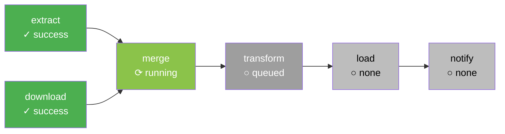

# Graph View — Visual DAG Structure

> **Module 03 · Topic 01 · Explanation 03** — See your pipeline's dependency graph live, in real time

---

## 🎯 The Real-World Analogy: A Subway Map

The Graph View is like a **subway system map with live train positions**:

| Graph View Concept | Subway Equivalent |
|-------------------|------------------|
| **Nodes (tasks)** | **Stations** — stopping points on the route |
| **Edges (arrows)** | **Track segments** — connecting one station to the next |
| **Node color** | **Platform light** — green = train arrived (success), red = derailed (failed) |
| **`upstream_failed`** | **Train delayed** — the station is fine, but the train from the previous stop never arrived |
| **Parallel branches** | **Split lines** — two trains running simultaneously on different branches |
| **Fan-in node** | **Junction station** — waits for ALL incoming trains before proceeding |

Just as you use a subway map to understand why your train is delayed (trace backwards from your station to find which earlier station caused the holdup), you use the Graph View to trace `upstream_failed` tasks back to the actual root-cause failure.

---

## What You See

The Graph View renders your DAG as a **visual directed acyclic graph**: nodes represent tasks, edges represent `>>` dependencies. Each node is color-coded with the **live task instance state** for the selected DAG Run.



```
╔══════════════════════════════════════════════════════════════╗
║  KEY INTERACTIONS IN GRAPH VIEW                              ║
║                                                              ║
║  Click a node → opens Task Instance panel                   ║
║  Click "Log" in panel → task execution log                  ║
║  Click "Clear" → re-queue this task                         ║
║  Click "Mark Success" → skip this task                      ║
║                                                              ║
║  Hover over a node → shows: start time, end time,           ║
║                              duration, try number            ║
╚══════════════════════════════════════════════════════════════╝
```

---

## When to Use Graph View

| Scenario | Why Graph View Wins |
|----------|-------------------|
| Understanding a new DAG's structure | See ALL dependencies at once — better than reading code |
| Debugging "why didn't my task run?" | Trace upstream → find the failed ancestor instantly |
| Code review: verifying dependency correctness | Visual validation — catch accidental fan-out or missing edges |
| Explaining a pipeline to non-engineers | Stakeholders understand visual graphs, not Python code |
| Finding overly sequential pipelines | Spot tasks that could run in parallel but don't |

---

## Python Code: Graph View Reflects These Dependencies

```python
from airflow.decorators import dag, task
from datetime import datetime

@dag(
    dag_id="graph_view_demo",
    schedule="@daily",
    start_date=datetime(2024, 1, 1),
    catchup=False,
)
def sales_pipeline():
    """This DAG creates a fan-out → fan-in pattern visible in Graph View."""

    @task()
    def extract_sales() -> dict:
        """Graph View: single source node at top."""
        return {"rows": 50000}

    @task()
    def extract_returns() -> dict:
        """Graph View: parallel branch alongside extract_sales."""
        return {"rows": 1200}

    # These two tasks run IN PARALLEL — Graph View shows them side by side
    @task()
    def transform_sales(sales: dict) -> dict:
        return {"net_sales": sales["rows"] * 150}

    @task()
    def transform_returns(returns: dict) -> dict:
        return {"total_returns": returns["rows"] * -50}

    # Fan-in: this node waits for BOTH transforms — Graph View shows 2 arrows in
    @task()
    def merge_results(sales: dict, returns: dict) -> dict:
        return {"revenue": sales["net_sales"] + returns["total_returns"]}

    @task()
    def load_warehouse(results: dict):
        print(f"Loading revenue: ${results['revenue']:,}")

    # Build the graph — exactly what Graph View renders
    sales = extract_sales()
    returns = extract_returns()
    merged = merge_results(
        transform_sales(sales),
        transform_returns(returns)
    )
    load_warehouse(merged)

sales_pipeline()
```

**What Graph View shows for this DAG:**
```
extract_sales  ──►  transform_sales  ──►  merge_results  ──►  load_warehouse
extract_returns ──►  transform_returns ──►↗
```

---

## 🏢 Real Company Use Cases

**Netflix** uses the Graph View for their content recommendation pipeline review process. When a new data scientist proposes a pipeline change, the PR review includes a screenshot of the Graph View from a test deployment — reviewers can immediately see if new dependencies were added, if fan-out patterns are appropriate, or if the pipeline serialized tasks that could run in parallel. This visual review catches architectural issues that are invisible in a `>>` dependency chain in Python code.

**Shopify** uses the Graph View in their incident response playbook. When an on-call alert fires for a failed pipeline, the first step is always: "Open Graph View for the affected DAG and screenshot the current run state." This screenshot is attached to the incident ticket and provides immediate context for everyone joining the bridge call — no need to explain which tasks failed when you can show a graph with red and pink nodes.

**DoorDash** built tooling that programmatically generates Graph View-equivalent visualizations from DAG definitions using the Airflow REST API (`GET /api/v1/dags/{dag_id}/tasks` + task dependencies). They embed these SVG visualizations in their internal data catalog, so data consumers can understand pipeline dependencies without needing Airflow UI access.

---

## ❌ Anti-Patterns

### Anti-Pattern 1: Creating a "God DAG" — Unreadable Graph View

```python
# ❌ BAD: 50+ tasks in a single DAG creates an unreadable graph
@dag(dag_id="everything_in_one_dag")
def monolithic_pipeline():
    # extract from 8 sources, 12 transforms, 6 loads, 10 notifications...
    # Graph View becomes a spaghetti diagram — impossible to read
    task_1 >> task_2 >> task_3 >> ... >> task_50
```

```python
# ✅ GOOD: Split into sub-DAGs or use TriggerDagRunOperator
@dag(dag_id="extract_sales")           # DAG 1: extraction only
@dag(dag_id="transform_sales")        # DAG 2: transformation
@dag(dag_id="load_warehouse")         # DAG 3: loading

# Or use TaskGroups for visual organization within one DAG:
from airflow.utils.task_group import TaskGroup

@dag(dag_id="organized_pipeline")
def clean_pipeline():
    with TaskGroup("extract") as extract_group:
        extract_sales()
        extract_returns()
    
    with TaskGroup("transform") as transform_group:
        transform_sales()
        transform_returns()
    
    extract_group >> transform_group
```

---

### Anti-Pattern 2: Unnecessary Sequential Dependencies Invisible Until Graph View

```python
# ❌ BAD: All tasks in sequence when they could be parallel
# This code LOOKS fine in text; the problem is only visible in Graph View
@dag(dag_id="sequential_antipattern")
def pipeline():
    extract_us = extract_region("US")
    extract_eu = extract_region("EU")     # Could run parallel!
    extract_apac = extract_region("APAC") # Could run parallel!
    
    # Accidental dependency chain:
    extract_us >> extract_eu >> extract_apac >> merge()
    # Graph View reveals: EU waits for US, APAC waits for EU
    # Total time: 3x single region time instead of 1x
```

```python
# ✅ GOOD: Parallel extraction — Graph View shows branching
@dag(dag_id="parallel_extraction")
def pipeline():
    us = extract_region("US")
    eu = extract_region("EU")
    apac = extract_region("APAC")
    
    # All three run simultaneously, Graph View shows side-by-side nodes:
    [us, eu, apac] >> merge()   # Fan-in to merge after all 3 complete
```

---

### Anti-Pattern 3: Using Graph View for the Wrong DAG Run

```
# ❌ BAD: Debugging with Graph View showing the LATEST run
#         while the failure was in a PREVIOUS run

# Engineer opens Graph View
# Current run: green/running (no failures)
# They conclude: "No problem, everything is working!"
# They miss the 5 consecutive failures from earlier today

# ✅ GOOD: Use the DAG Run selector in Graph View
# → Click the "DAG Run" dropdown in Graph View
# → Select the SPECIFIC failed run (it will show red/pink nodes)
# → The run_id or execution_date identifies which run you're viewing
# → Cross-reference with Grid View to find the right run's column
```

---

## 🎤 Senior-Level Interview Q&A

**Q1: A task shows as "upstream_failed" (pink) in the Graph View. How do you trace the root cause?**

> Follow the edges backwards (upstream/left). Each ancestor node shows its state. The ROOT CAUSE is the first node in "failed" (red) state — NOT the pink nodes. All pink nodes are victims of the red node. Click the red node → read its logs → fix the actual error. Then clear the red task with "Include Downstream" checked — this automatically re-queues all pink victims. Rule: never clear a pink node directly; always clear the red ancestor.

**Q2: Explain how the Graph View renders dependency relationships defined in Python code. What's the underlying data model?**

> The Graph View is rendered from the **serialized DAG** stored in the metadata DB (`dag` table + `task` table + `task_dependency` relationship). When the scheduler parses a DAG file, it serializes the task objects and their `>>` / `<<` dependency definitions into JSON structures stored in the DB. The webserver reads these serialized structures — not the Python file — and renders the graph using a JavaScript visualization library (D3.js). This means the Graph View can render even if the DAG file is deleted, as long as the serialized version remains in the DB. The `task_dependency` table stores `from_task_id` and `to_task_id` pairs defining each edge in the graph.

**Q3: A data engineer adds 20 new tasks to a DAG and the Graph View becomes cluttered and hard to read. What architectural recommendation do you make?**

> Three approaches by severity: (1) **TaskGroups** — wrap related tasks in `TaskGroup("extract")`, `TaskGroup("transform")` etc. The Graph View collapses groups into single collapsed nodes that can be expanded. Best for 20-40 tasks. (2) **DAG decomposition** — split into multiple DAGs with explicit handoffs via `TriggerDagRunOperator` or sensors. Each DAG's Graph View remains clean. Best for >40 tasks or logically separate phases. (3) **SubDAGOperator** (deprecated) — avoid in Airflow 2.x. Use TaskGroups instead. The right answer depends on whether the tasks are logically one pipeline (use TaskGroups) or independent pipelines that happen to run in sequence (use separate DAGs with triggers).

---

## 🏛️ Principal-Level Interview Q&A

**Q1: How would you use the Airflow REST API to build a Graph View equivalent for a company-wide data pipeline visualization tool?**

> **Data collection layer**: (1) `GET /api/v1/dags` — list all DAG IDs. (2) For each DAG: `GET /api/v1/dags/{dag_id}/tasks` — get all task definitions with their `task_id` and `task_type`. (3) `GET /api/v1/dags/{dag_id}/taskDependencies` — get the edge list (from_task_id, to_task_id pairs). (4) `GET /api/v1/dags/{dag_id}/dagRuns?state=running,failed&limit=1` — get current execution state. (5) Join task definitions with task instance states. **Rendering layer**: Build a directed graph from the edge list using D3.js or Cytoscape.js. Color nodes by state. **Augmentation**: Overlay metadata from your data catalog (owner, SLA, downstream consumers). Add time annotations from Gantt data. The result is a cross-DAG pipeline visualization — tasks in one DAG that feed into another via sensors become visible as cross-DAG edges.

**Q2: A team proposes dynamically generating DAGs based on database configuration (one DAG per client). The resulting Graph Views will all look identical structurally. What architectural concerns do you raise?**

> **Concern 1 — Scheduler overload**: 100 clients = 100 DAGs. Each DAG is parsed every 30s. Graph View won't be the issue, but the scheduler's parse overhead will be. Use **Dynamic Task Mapping** (Airflow 2.3+) instead: one DAG, tasks dynamically mapped across clients. Graph View shows one node per client input — much neater. **Concern 2 — Maintenance burden**: identical Graph Views mean identical bugs. If the template has a flaw, it's a flaw in 100 DAGs. Use dynamic task mapping or DAG factory patterns with a single source template. **Concern 3 — UI navigability**: 100 DAGs in the DAG list view with similar names is hard to navigate. Enforce naming conventions (`client_{id}_pipeline`) and use tags for filtering. **Concern 4 — Isolation vs. efficiency**: if one client's data causes a failure, does it affect other clients? DAG-per-client provides isolation (one DAG failing doesn't affect others). TaskMapping within one DAG means one bad client can block all others if not handled with `trigger_rule=TriggerRule.ALL_DONE`.

**Q3: The Graph View in your organization's Airflow is slow to load for large DAGs (50+ tasks). What are the root causes and how do you fix them?**

> **Root cause analysis**: (1) **DAG serialization size**: large DAGs produce large JSON blobs in the `dag` table. Webserver deserializes + renders on every page load. Check: `SELECT length(data) FROM serialized_dag WHERE dag_id = 'my_dag'`. Over 1MB is problematic. (2) **Metadata DB query latency**: the Graph View queries task instances for the selected run. With many runs and tasks, this can be slow. Add indexes on `(dag_id, run_id, state)` in `task_instance`. (3) **JavaScript rendering**: 50+ nodes with complex edges stress the client-side D3 renderer. **Fixes**: (1) Use TaskGroups to reduce rendered node count. (2) Enable DAG serialization compression (Airflow 2.4+). (3) Add a metadata DB read replica for UI queries. (4) Increase webserver gunicorn worker timeout (`--timeout 120`). (5) Paginate the task instance query using `GET /api/v1/taskInstances?limit=50`.

---

## 📝 Self-Assessment Quiz

**Q1**: You see a task in "upstream_failed" state in the Graph View. How do you trace the root cause?
<details><summary>Answer</summary>
Follow the dependency arrows backwards (upstream/left). The root cause is the first task you find in "failed" (red) state — NOT the pink upstream_failed tasks. Pink tasks are victims that didn't execute because their dependency failed. Click the red task → open Log tab → read the actual error. Fix the root cause, then clear the RED task with "Include Downstream" checked to re-queue all victims.
</details>

**Q2**: You're looking at the Graph View and see two parallel branches (two nodes at the same level with no dependency between them). What does this mean for execution?
<details><summary>Answer</summary>
Those two tasks run SIMULTANEOUSLY — Airflow will queue both as soon as their common upstream task completes, and they execute in parallel (subject to available worker slots). This is good for performance: instead of running sequentially (time = A + B), they run in parallel (time = max(A, B)). If parallel execution causes resource contention (both hitting the same DB), you can add artificial dependencies or use pools to limit concurrency.
</details>

**Q3**: The Graph View shows your DAG but all nodes are grey. What state is the DAG in?
<details><summary>Answer</summary>
Grey nodes mean the tasks are in "none" state — they haven't been scheduled or they were cleared. This usually means: (1) The DAG is paused (check the pause toggle in the DAG list), (2) No DAG Run has been triggered yet, (3) The selected DAG Run was cleared and is waiting to be re-scheduled, (4) `catchup=False` and the schedule hasn't triggered yet. Check the DAG Run selector dropdown — if no runs exist, trigger one manually with the "Trigger DAG" button.
</details>

**Q4**: How is the Graph View data sourced — does it read your Python DAG file in real time?
<details><summary>Answer</summary>
No — the Graph View reads from the **serialized DAG** stored in the metadata DB, not the Python file. The scheduler parses the Python file and serializes the DAG structure (tasks, dependencies, parameters) as JSON into the `serialized_dag` table. The webserver reads this serialized version. This means: (1) The Graph View works even if the Python file is deleted. (2) If you edit the Python file, the Graph View doesn't update until the scheduler re-parses it (up to 30s delay). (3) If the file has a syntax error and can't be parsed, the Graph View shows the last successfully parsed version.
</details>

### Quick Self-Rating
- [ ] I can read and explain any dependency pattern in the Graph View
- [ ] I can trace upstream_failed tasks back to the root cause
- [ ] I know what each node color means and what action to take
- [ ] I can explain how Graph View data is sourced (serialized DAG in metadata DB)
- [ ] I understand the parallel vs sequential patterns visible in the Graph View

---

## 📚 Further Reading

- [Airflow Graph View Documentation](https://airflow.apache.org/docs/apache-airflow/stable/ui.html#graph-view) — Official UI documentation
- [TaskGroup Documentation](https://airflow.apache.org/docs/apache-airflow/stable/core-concepts/dags.html#taskgroups) — Organizing Graph View with groups
- [Dynamic Task Mapping](https://airflow.apache.org/docs/apache-airflow/stable/authoring-and-scheduling/dynamic-task-mapping.html) — Alternative to DAG-per-entity patterns
- [Airflow REST API — Task Dependencies](https://airflow.apache.org/docs/apache-airflow/stable/stable-rest-api-ref.html#tag/DAG) — Programmatic access to DAG structure
