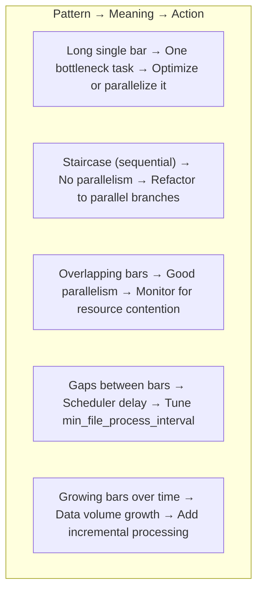

# Gantt Chart — Performance Analysis

> **Module 03 · Topic 01 · Explanation 04** — Find your pipeline's bottleneck in seconds

---

## 🎯 The Real-World Analogy: A Construction Project Schedule

Think of the Airflow Gantt Chart as a **construction project timeline**:

| Gantt Concept | Construction Equivalent |
|--------------|------------------------|
| **Each bar** | A construction phase (foundation, framing, plumbing, electrical) |
| **Bar length** | How long that phase takes |
| **Bars starting after another** | Sequential work — plumbing can't start until framing is done |
| **Overlapping bars** | Parallel work — landscaping and interior painting happen simultaneously |
| **The longest bar** | The **critical path** — the phase that determines the total project duration |
| **A gap between bars** | Idle time — contractor waiting for materials or permits |

A project manager looks at the Gantt and immediately knows: "Framing takes 40% of total time. If I speed up framing, I shorten the whole project. Everything else is fast." That's exactly what the Airflow Gantt Chart tells you about your pipeline.

---

## Reading the Gantt Chart

```
╔══════════════════════════════════════════════════════════════╗
║  GANTT CHART                                                 ║
║                                                              ║
║  Time →  00:00    00:05    00:10    00:15    00:20           ║
║          ├────────┼────────┼────────┼────────┤              ║
║  extract ████████░░░░░░░░░░░░░░░░░░░░░░░░░  (5 min)        ║
║  download ███████████░░░░░░░░░░░░░░░░░░░░░  (5 min)        ║
║  merge   ░░░░░░░░░░░██████████████░░░░░░░░  (7 min)  ←!!  ║
║  transform ░░░░░░░░░░░░░░░░░░░░░░██░░░░░░  (1 min)        ║
║  load      ░░░░░░░░░░░░░░░░░░░░░░░░██░░░░  (1 min)        ║
║  notify    ░░░░░░░░░░░░░░░░░░░░░░░░░░██░░  (1 min)        ║
║                                                              ║
║  BOTTLENECK: merge takes 7 min = 47% of total pipeline time ║
╚══════════════════════════════════════════════════════════════╝
```

The task with the **longest bar** is your bottleneck. Optimize it first — everything else is noise.

---

## Gantt Chart Patterns



| Pattern | What It Means | Action |
|---------|-------------|--------|
| Long single bar | One slow task is the critical path | Optimize that task's logic |
| Staircase (sequential) | No parallelism | Add parallel task branches |
| Overlapping bars | Good parallelism | Monitor for resource contention |
| Gaps between task starts | Scheduler delay or slot unavailability | Check `parallelism` config |
| Bars growing week-over-week | Data volume growth | Implement incremental processing |

---

## Python Code: Measuring What the Gantt Shows

```python
from airflow.decorators import dag, task
from datetime import datetime
import time

@dag(
    dag_id="gantt_performance_demo",
    schedule="@daily",
    start_date=datetime(2024, 1, 1),
    catchup=False,
)
def pipeline_with_bottleneck():
    """
    This DAG creates a Gantt pattern showing a clear bottleneck.
    Gantt will show: extract (2s) + download (2s) → merge (8s) → load (1s)
    The 'merge' bar will be visibly the longest.
    """

    @task()
    def extract_sales() -> dict:
        """Gantt: short bar, ~2 seconds."""
        time.sleep(2)  # Simulates fast extraction
        return {"rows": 10000}

    @task()
    def download_enrichment() -> dict:
        """Gantt: parallel to extract_sales, also ~2 seconds."""
        time.sleep(2)  # Runs simultaneously with extract_sales
        return {"enrichment_rows": 500}

    @task()
    def merge_datasets(sales: dict, enrichment: dict) -> dict:
        """
        Gantt: THE BOTTLENECK — starts after both parallel tasks, takes ~8 seconds.
        Fix: partition the merge by date range and run sub-tasks in parallel.
        """
        time.sleep(8)  # <-- This is the critical path item
        return {"merged_rows": sales["rows"] + enrichment["enrichment_rows"]}

    @task()
    def load_warehouse(merged: dict):
        """Gantt: short final bar after the bottleneck."""
        time.sleep(1)
        print(f"Loaded {merged['merged_rows']} rows")

    # Parallel initial tasks fan into merge
    sales = extract_sales()
    enrichment = download_enrichment()
    merged = merge_datasets(sales, enrichment)   # Waits for both
    load_warehouse(merged)

pipeline_with_bottleneck()
```

---

## 🏢 Real Company Use Cases

**Pinterest** uses the Gantt Chart as a mandatory step in their Data SLA review process. Every quarter, the data platform team reviews the Gantt patterns for the top 50 business-critical DAGs. Any task that represents >30% of pipeline execution time is flagged for optimization. Pinterest reduced their morning data delivery SLA from 9am to 7am by identifying and parallelizing three sequential Snowflake transformations that the Gantt revealed — each only took 15 minutes but they ran back-to-back instead of in parallel.

**Booking.com** builds automated "Gantt regression detection" into their CI pipeline. When a DAG is modified, they run it against a production-sized dataset in staging and compare the Gantt pattern (via `GET /api/v1/taskInstances` duration fields) against the baseline. If any task's P95 duration increases by >20%, the PR is flagged for performance review before merge. They caught three major performance regressions this way before they reached production.

**Zalando** (European e-commerce) uses Gantt analysis to optimize their financial reporting pipelines that must complete before European market open (8am CET). The Gantt revealed that their `currency_conversion` task was running sequentially after all country-level aggregations despite having no dependency on them. Moving it to run in parallel saved 12 minutes — enough margin to safely meet the SLA.

---

## ❌ Anti-Patterns

### Anti-Pattern 1: Optimizing the Wrong Task (Not Reading Gantt First)

```python
# ❌ BAD: Engineer "feels" that extract is slow and optimizes it
# Without looking at the Gantt first

# They spend 2 days optimizing extract from 5 min → 3 min
# But "merge" takes 15 minutes (the bottleneck the Gantt would have showed)
# Total pipeline time: 21 min → 19 min (only 10% improvement)

# ✅ GOOD: Read Gantt FIRST, then optimize
# Gantt shows: extract=5min, merge=15min, load=2min
# Optimizing MERGE from 15min → 5min:
# Total pipeline time: 22 min → 12 min (45% improvement!)
# Always optimize the longest bar, not the most "obvious" one
```

---

### Anti-Pattern 2: Ignoring Scheduler Gaps in the Gantt

```
# ❌ BAD: Seeing gaps and assuming the tasks are slow

# Gantt shows:
# extract:   |████|                          (2 min actual)
# transform: |░░░░░░░░████|                  (5 min WAIT + 2 min actual)
#                   ^
#                   This 5-minute gap is NOT the task being slow
#                   It's the scheduler delay — no available worker slot

# The engineer optimizes the transform task code, reducing it from 2min to 1min
# But the 5-minute scheduling gap remains → pipeline still takes 8 minutes total

# ✅ GOOD: Distinguish scheduling gaps from execution time
# Hover over the Gantt bar to see "Queued duration" vs "Running duration"
# If "Queued duration" > "Running duration": fix parallelism/slots, not task code
# Increase: AIRFLOW__CORE__PARALLELISM or add more workers
```

---

### Anti-Pattern 3: Not Using Gantt for SLA Root Cause Analysis

```python
# ❌ BAD: Pipeline misses SLA. Engineer assumes "the whole pipeline is slow"
# and blindly adds more resources to all tasks

# ✅ GOOD: Use Gantt to pinpoint the SLA-breaking task
# Step 1: Open Gantt for the run that missed SLA
# Step 2: Look at start time of the LAST task vs SLA deadline
# Step 3: Trace backwards to find which task's bar CROSSED the SLA threshold
# Step 4: Check: is the bar longer than historical baseline? (Growing data volume?)
#          Or is there a new scheduling gap? (Resource contention?)

# Example: SLA = pipeline done by 8:00 AM
# Gantt shows: merge ended at 7:58 AM (fine), load started 7:58, ended 8:07 AM (MISS)
# Root cause: load task took 9 minutes vs historical 3-minute average
# Actual fix: load task now processes 3x data (new region added) → partition the load
```

---

## 🎤 Senior-Level Interview Q&A

**Q1: Your DAG takes 30 minutes. The Gantt shows 3 tasks of 10 minutes each running sequentially. How could you reduce total time?**

> If the 3 tasks have no data dependency between them (they don't pass output to each other), remove the sequential `>>` dependencies and let them run in parallel. A 3-task DAG with each taking 10 minutes runs in ~10 minutes total when parallel (time = max of parallel durations), vs 30 minutes when sequential. However, BEFORE parallelizing: (1) Verify they don't share a resource that causes contention (same DB with limited connections, same S3 bucket with rate limits). (2) Check if worker slots are available — parallelizing adds no value if the cluster is already at capacity. (3) Verify correct results — sometimes sequential ordering encodes a business logic dependency that isn't expressed as a code dependency.

**Q2: The Gantt shows a task whose bar is growing 5% longer every week. What's the root cause and how do you fix it?**

> **Root cause**: almost always data volume growth. The task processes "all data since the last run" — as the table grows, so does the runtime. **Verification**: plot task duration over time (available from `GET /api/v1/taskInstances` duration field). If linear growth matches data volume growth, this is confirmed. **Fixes in order of preference**: (1) **Incremental processing**: change from `SELECT * FROM table` to `SELECT * FROM table WHERE date = '{{ ds }}'` — process only the partition for that run's date. (2) **Partitioning**: if already incremental, the data for one day is growing — check if the business has more volume on certain days. (3) **Query optimization**: add indexes, pushdown filters to the source. (4) **Horizontal scaling**: if query must process all data, parallelize it using Dynamic Task Mapping across date partitions.

**Q3: The Gantt shows overlapping bars (parallel execution) but performance is WORSE than when tasks ran sequentially. Why?**

> Resource contention. When tasks run in parallel, they compete for shared resources: (1) **Database connections**: if both tasks query the same Postgres database and the connection pool is exhausted, tasks wait for each other in the connection queue — serial execution at the DB level despite parallel scheduling. (2) **Memory**: if both tasks load large DataFrames into memory simultaneously and the worker runs out of RAM, the OS starts swapping — massively slowing both tasks. (3) **CPU**: for CPU-heavy transformations, two tasks on one worker compete for the same cores. (4) **API rate limits**: two tasks hitting the same API endpoint simultaneously may trigger rate limiting, causing backoff delays. Fix: use Airflow Pools to limit concurrent task execution for shared resources: `pool='snowflake_pool', pool_slots=1` ensures only one task uses Snowflake at a time.

---

## 🏛️ Principal-Level Interview Q&A

**Q1: Design a "Gantt-based SLA monitoring" system that automatically alerts before a pipeline misses its SLA, not after.**

> **Predictive SLA alerting architecture**: (1) **Historical baseline**: collect Gantt duration data for each task via `GET /api/v1/taskInstances` for the last 30 runs. Compute P50, P90, P99 durations per task per day-of-week (weekend patterns differ). (2) **In-flight prediction**: as the DAG Run progresses, after each task completes, compute: `remaining_time_estimate = sum(P90_duration for remaining_tasks)`. Compare `current_time + remaining_time_estimate` against the SLA deadline. (3) **Early alert**: if `predicted_completion_time > SLA_deadline * 0.95` (within 5% of SLA), fire an alert: "Pipeline X is running 12 minutes behind — predicted to miss 8am SLA by 3 minutes." (4) **Confidence bands**: use P90 (not P50) for alerts to avoid false positives. (5) **Implementation**: Lambda function polling Airflow API every 5 minutes per critical DAG Run, publishing to SNS → PagerDuty.

**Q2: Your Gantt shows the same task taking 20 minutes on Mondays and 2 minutes Tuesday–Friday. What architectural explanation and fix would you propose?**

> **Architectural explanation**: Monday runs process **accumulated weekend data** — typically 3× the daily volume (Friday close of business through Monday morning). The task's runtime is proportional to data volume. **Verification**: check `ds` (execution date) in the task logs — Monday's `ds` = Sunday's date, processing 3 days of accumulation. **Fixes**: (1) **Weekend sub-DAGs**: create a separate `weekend_etl` DAG that runs at end-of-weekend specifically for high-volume processing with more resources (larger Spark cluster, more DB connections). (2) **Incremental micro-batching**: switch from daily to hourly scheduling — each run processes only 1 hour of data. Monday morning is 24× faster individually; slightly more overhead overall. (3) **Dynamic resource scaling**: Monday's task uses `executor_config={"KubernetesExecutor": {"request_memory": "8Gi"}}` while weekday tasks use 2Gi. (4) **SLA differentiation**: Monday SLA = 10am (not 8am) to account for higher volume.

**Q3: At what scale does the Airflow Gantt Chart become insufficient for performance analysis, and what do you replace or augment it with?**

> The Gantt Chart becomes insufficient at: **(1) Fleet scale**: Gantt shows one DAG at a time. For 500 DAGs, you need cross-DAG performance views. **(2) Sub-second precision**: Gantt resolution is seconds to minutes. For high-frequency DAGs (every 5 minutes), performance issues may be millisecond-level. **(3) Infrastructure correlation**: Gantt shows task duration but not why — was it slow because of data volume, CPU, memory, or network? You need infra metrics correlated with Gantt data. **Replacements/augmentations**: (1) **Prometheus + Grafana**: `airflow_task_duration` gauge with `dag_id` and `task_id` labels → fleet-wide performance heatmaps. (2) **OpenTelemetry distributed tracing**: instrument tasks with spans, send to Jaeger/Tempo. Each task's trace shows: time in queue, time connecting to DB, actual computation time. (3) **Custom metadata**: use XCom to push performance metrics (rows processed, MB read) from tasks. Combine with duration to compute throughput metrics. True diagnosis requires all three: Gantt (visualization) + Prometheus (time-series) + traces (causation).

---

## 📝 Self-Assessment Quiz

**Q1**: Your DAG takes 30 minutes. The Gantt shows 3 independent tasks of 10 minutes each running sequentially. How would you reduce total time to ~10 minutes?
<details><summary>Answer</summary>
Remove the sequential dependencies between the 3 tasks and let them run in parallel. Since they're independent (no data flows between them), they can execute simultaneously. Parallel execution time = max(A, B, C) = 10 minutes, vs sequential = A + B + C = 30 minutes. Prerequisites: verify they don't contend for the same limited resource (DB connection pool, API rate limit), and verify sufficient worker slots are available. Use `[task_a, task_b, task_c] >> final_task` to express the fan-in pattern.
</details>

**Q2**: The Gantt shows a 5-minute gap between when `extract` finishes and `transform` starts. Is `transform` slow? What does the gap actually indicate?
<details><summary>Answer</summary>
No — the gap indicates a SCHEDULING delay, not task slowness. The 5-minute gap means: `extract` finished, the scheduler detected it and queued `transform`, but no worker slot was available for 5 minutes. `transform`'s actual execution time (the colored bar) may be only 1 minute. Fix: increase `AIRFLOW__CORE__PARALLELISM`, add more workers, or check if other tasks are monopolizing the worker pool. The Gantt hover tooltip shows "Queued duration" separately from "Running duration".
</details>

**Q3**: The Gantt shows your bottleneck task `merge_datasets` is taking 15 minutes — 60% of total pipeline time. What are three specific optimization strategies?
<details><summary>Answer</summary>
(1) **Parallelization**: if merge processes multiple datasets sequentially within the task, split into parallel sub-tasks using Dynamic Task Mapping — merge each dataset partition independently. (2) **Incremental processing**: if the task processes all historical data, switch to processing only today's partition using `{{ ds }}` — if data grows daily, this keeps runtime constant. (3) **Push computation to the source**: if merge is doing a Python-level join of DataFrames, push it to SQL — the database engine is orders of magnitude faster at joins. `SELECT a.*, b.val FROM table_a a JOIN table_b b ON a.id = b.id WHERE a.date = '{{ ds }}'` is faster than loading both tables into pandas and merging.
</details>

**Q4**: How do you access the Gantt chart programmatically to build automated SLA risk alerts?
<details><summary>Answer</summary>
Use the Airflow REST API: `GET /api/v1/taskInstances?dag_id={dag_id}&dag_run_id={run_id}` returns each task instance with `start_date`, `end_date`, and `duration` fields — the same data the Gantt visualizes. For historical baselines: `GET /api/v1/taskInstances?dag_id={dag_id}&state=success&limit=100` to get the last 100 successful runs per task. Compute P90 duration per task. For in-flight monitoring: poll the API every 5 minutes during active runs, sum remaining task P90 durations, and alert if predicted completion exceeds the SLA deadline.
</details>

### Quick Self-Rating
- [ ] I can identify the critical path (bottleneck) from the Gantt Chart
- [ ] I know the difference between scheduling gaps and task execution time
- [ ] I can explain 3 strategies to optimize a bottleneck task
- [ ] I understand patterns: sequential vs parallel in Gantt terms
- [ ] I can access Gantt data programmatically via the REST API

---

## 📚 Further Reading

- [Airflow Gantt Chart Docs](https://airflow.apache.org/docs/apache-airflow/stable/ui.html#gantt-chart) — Official UI documentation
- [Airflow REST API — Task Instances](https://airflow.apache.org/docs/apache-airflow/stable/stable-rest-api-ref.html#tag/TaskInstance) — Programmatic Gantt data access
- [Dynamic Task Mapping](https://airflow.apache.org/docs/apache-airflow/stable/authoring-and-scheduling/dynamic-task-mapping.html) — Parallelizing within tasks
- [Airflow Pools](https://airflow.apache.org/docs/apache-airflow/stable/administration-and-deployment/pools.html) — Managing resource contention
- [Apache Airflow Metrics](https://airflow.apache.org/docs/apache-airflow/stable/administration-and-deployment/logging-monitoring/metrics.html) — `airflow_task_duration` for fleet monitoring
