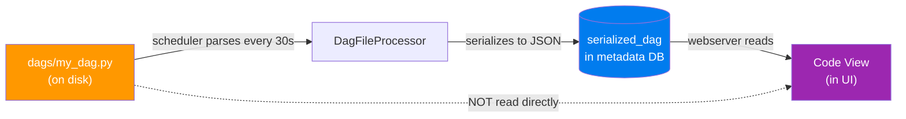

# Code View — DAG Source Code in the UI

> **Module 03 · Topic 01 · Explanation 05** — Read-only view of the serialized DAG, not the live file

---

## 🎯 The Real-World Analogy: A Laminated Reference Card

Think of Code View as a **laminated procedure card on the office wall** — it shows the current approved procedure, it's read-only (laminated), it updates when someone reprints it (scheduler re-parse), and it may lag if someone just changed the procedure manual but hasn't reprinted yet.

---

## What the Code View Shows

The Code View displays the **serialized Python source code** stored in the `serialized_dag` metadata DB table — not read from the Python file on disk.

```
╔══════════════════════════════════════════════════════════════╗
║  CODE VIEW — Key Properties                                  ║
║                                                              ║
║  ✓  Read-only (cannot edit from the UI — intentional)       ║
║  ✓  Python syntax highlighting                              ║
║  ✓  Shows LAST SUCCESSFULLY PARSED version                  ║
║  ✓  Available even if the original .py file is deleted      ║
║  ✗  NOT real-time — updates after scheduler re-parses       ║
║  ✗  Stays on old version if file has a syntax error         ║
╚══════════════════════════════════════════════════════════════╝
```

---

## Data Flow: From File to Code View



**Key insight**: Code View reads from the database, not the Python file. The scheduler is the middleman.

---

## Practical Uses

```python
# Programmatic access — same data as Code View:
import requests

response = requests.get(
    "http://airflow-webserver:8080/api/v1/dags/my_dag_id/source",
    auth=("admin", "admin")
)
print(response.text)   # Returns the serialized Python source

# Use cases:
# 1. Incident debugging — verify code without SSH
# 2. Confirm a deployment took effect (wait 30s then check)
# 3. Compliance audit — read-only access for non-engineers
# 4. Verify serialization matches your file (catch import errors)
```

---

## 🏢 Real Company Use Cases

**Robinhood** uses Code View in their incident response playbook — engineers open Grid View (what failed) + Code View (current logic) in the first 60 seconds of an incident, without needing VPN or SSH access to the server.

**Stripe** uses Code View for quarterly compliance audits. Data governance analysts review DAG code via a read-only Airflow user role without needing developer access to the codebase.

**Atlassian** used Code View to diagnose a subtle deployment bug: the scheduler was caching an older DAG version after a silent import error. The Code View showed the old version still in place, revealing the issue was a stale cache, not a failed deployment.

---

## ❌ Anti-Patterns

### Anti-Pattern 1: Assuming Code View is Immediately Live After Deploy

```bash
# ❌ BAD: Deploy at 10:00 → check Code View at 10:00 → see old code
# → conclude deployment failed → re-deploy (creates duplicates)

# ✅ GOOD: Wait 30-60 seconds, then check
# OR verify via CLI: airflow dags list-import-errors
# If no errors and code still old: check scheduler is parsing your file
```

### Anti-Pattern 2: Using Code View for Runtime Debugging (Use Logs Instead)

```
# ❌ BAD: Reading Code View to trace "why did this task fail?"
#         (Code shows what SHOULD happen, not what ACTUALLY happened)

# ✅ GOOD: For runtime understanding use:
# → Task Instance → Log tab (actual execution output + stack traces)
# → Task Instance → Rendered Template (Jinja values resolved)
# → Task Instance → XCom tab (data passed between tasks)
```

### Anti-Pattern 3: Wanting to Edit Code Via the UI

```
# ❌ BAD IMPULSE: 2am incident, want to "quickly fix SQL in the UI"
# (Fortunately impossible — Code View is read-only)
# WHY read-only is correct: no audit trail, no review, no version control

# ✅ GOOD emergency workflow:
# 1. Mark Success on the failing task to unblock downstream
# 2. Fix properly in Git → PR → CI deploys → scheduler picks up
```

---

## 🎤 Senior-Level Interview Q&A

**Q1: The Code View shows an old version of your DAG 10 minutes after updating the file. What are three possible causes?**

> (1) **Parse error in the updated file** — scheduler can't parse it and leaves the last working version. Check: `airflow dags list-import-errors`. (2) **High parse queue** — with 100 DAGs and 2 parsing processes, some files wait 2-3 minutes. Check `parsing_processes` config. (3) **File not deployed yet** — your CI/CD pipeline hasn't copied the file to the server's dags/ folder yet. Verify: `ls -la $AIRFLOW_HOME/dags/my_dag.py` modification time on the server.

**Q2: How does Code View get its data? What happens if you delete the DAG file from disk?**

> Code View reads from the `serialized_dag` table in the metadata DB, not the file on disk. If you delete the .py file, Code View continues to show the last parsed version. The DAG remains in the UI until the scheduler detects the missing file and marks it inactive, or you run `airflow dags delete <dag_id>`. This is by design — prevents accidental DAG loss from filesystem issues.

**Q3: You need to know what code was running during a failure 3 days ago. Can Code View help?**

> Only if no deployments happened since. Code View shows the *current* serialized version. For historical versions: check Git history (`git log -- dags/my_dag.py`). Cross-reference deployment timestamps with the failure time. For true time-travel code snapshots, implement GitOps with commit SHA tags tied to deployment timestamps — Code View alone is insufficient for historical analysis.

---

## 🏛️ Principal-Level Interview Q&A

**Q1: Design a "DAG versioning" system that preserves historical Code View snapshots for compliance.**

> On each successful parse, write the serialized DAG to versioned object storage: `s3://airflow-dag-snapshots/{dag_id}/{timestamp}/{git_sha}.json`. Maintain a `dag_version_history` table with `dag_id`, `parsed_at`, `git_sha`, `deployed_by`. Add a UI plugin "Version History" tab that lists versions with diff support. Expose via `GET /api/v1/dags/{dag_id}/versions/{timestamp}`. Retain 1 year for compliance. This gives auditors time-traveling access to any historical DAG version.

**Q2: Your Code View shows code different from your Git repo. This should be impossible in your GitOps setup. What happened?**

> Investigation: (1) Someone with direct server access copied a file bypassing Git — check server write audit logs. (2) Git sync is pulling from wrong branch/commit — check sync job logs. (3) File on disk was partially overwritten — run `md5sum dags/my_dag.py` and compare to Git hash. Preventive fix: embed Git commit SHA in every DAG file via pre-commit hook. Code View will always show the SHA, making discrepancies immediately visible.

**Q3: How do you ensure all code visible in Code View has passed a security scan?**

> Gate the deployment pipeline: every DAG must pass `bandit` (security scanner) + custom DAG linter before reaching the dags/ folder. Mount dags/ as read-only for all services except the CI/CD deployment service account. Embed the CI-verified commit SHA in each file. The metadata DB parse timestamp + SHA can be cross-referenced with CI audit logs to prove every serialized version was security-scanned.

---

## 📝 Self-Assessment Quiz

**Q1**: Where does Code View read the DAG source from?
<details><summary>Answer</summary>
From the `serialized_dag` table in the Airflow metadata database — NOT from the Python file on disk. The scheduler parses the Python file and serializes it to the DB. The webserver reads from there. This means Code View works even if the .py file is deleted, and changes take up to 30s to appear (the scheduler's parse interval).
</details>

**Q2**: The Code View shows an old version 10 minutes after you updated the file. First thing to check?
<details><summary>Answer</summary>
Run `airflow dags list-import-errors`. If the updated file has a syntax or import error, the scheduler fails to parse it and leaves the last working version indefinitely. This is the most common cause of "stale" Code View. If no errors, verify the file was actually copied to the server's dags/ folder.
</details>

**Q3**: Can you edit a DAG's code from the Code View?
<details><summary>Answer</summary>
No — Code View is intentionally read-only. This enforces that all changes go through version control and CI/CD (with review, testing, audit trail). For emergencies, use "Mark Success" to skip a failing task while you fix the code properly in Git.
</details>

**Q4**: You deleted a DAG's Python file. What do you see in Code View?
<details><summary>Answer</summary>
Code View continues to show the last parsed version — it reads from the `serialized_dag` DB table, not the file. The DAG remains in the UI until the scheduler detects the missing file. To fully remove: delete the file AND run `airflow dags delete <dag_id>` to clean up the serialized version from the DB.
</details>

### Quick Self-Rating
- [ ] I know Code View reads from the DB, not the Python file
- [ ] I can explain why Code View may lag behind the actual file
- [ ] I know what to check when Code View shows an old version
- [ ] I understand why Code View is read-only (and why that's correct)
- [ ] I can access Code View data via the REST API

---

## 📚 Further Reading

- [DAG Serialization](https://airflow.apache.org/docs/apache-airflow/stable/administration-and-deployment/dag-serialization.html) — How DAGs are stored in the metadata DB
- [Airflow REST API — DAG Source](https://airflow.apache.org/docs/apache-airflow/stable/stable-rest-api-ref.html#operation/get_dag_source) — Programmatic access to DAG code
- [DagFileProcessor Architecture](https://airflow.apache.org/docs/apache-airflow/stable/administration-and-deployment/scheduler.html) — How the scheduler parses and serializes DAGs
