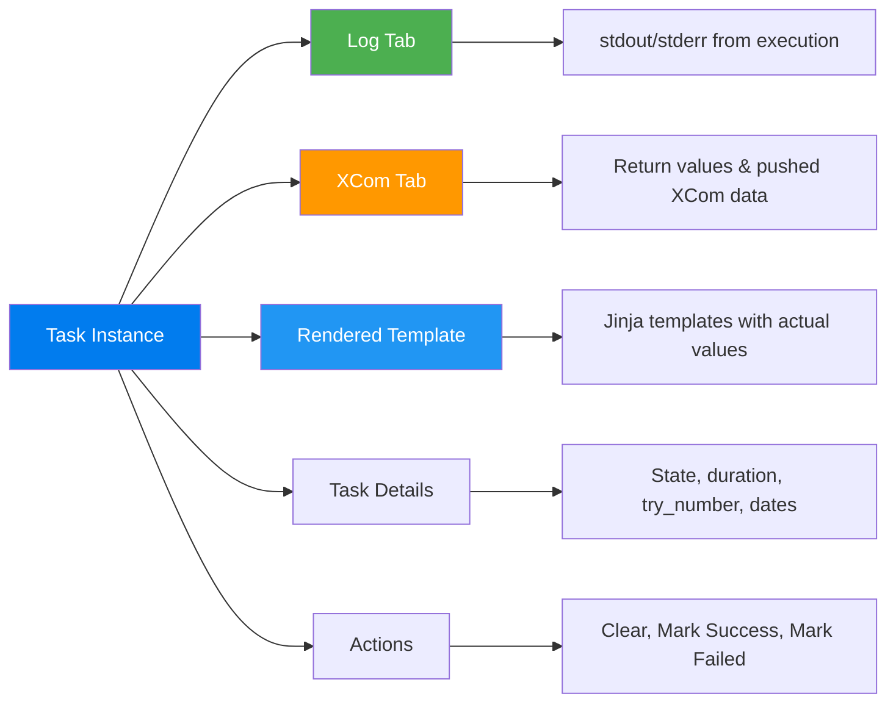

# Task Instance View — The Debugging Powerhouse

> **Module 03 · Topic 01 · Explanation 06** — Where you spend 80% of your debugging time

---

## 🎯 The Real-World Analogy: An Aircraft Black Box

The Task Instance View is like a **flight's black box (Flight Data Recorder)**:

| Task Instance Concept | Black Box Equivalent |
|----------------------|---------------------|
| **Log tab** | Voice + data recordings — exactly what happened, in order |
| **XCom tab** | Cargo manifest — what data was passed between legs of the journey |
| **Rendered Template tab** | Pre-flight checklist with actual values filled in |
| **Task Details** | Flight metadata: departure time, crew, aircraft ID |
| **Actions (Clear/Mark)** | Ground crew overrides: re-fly the leg or mark it complete |
| **Attempt number** | How many times the pilot tried to land before succeeding |

Just as accident investigators go to the black box first — not the pilot's manual — you go to the Task Instance View first, not the DAG code.

---

## Tabs Available



---

## The Log Tab — Most Important

```
╔══════════════════════════════════════════════════════════════╗
║  TASK LOG — extract_sales @ 2024-03-15                      ║
║                                                              ║
║  [2024-03-15 02:01:05] INFO  Starting task execution...     ║
║  [2024-03-15 02:01:06] INFO  Connected to PostgreSQL        ║
║  [2024-03-15 02:01:07] INFO  Extracting 1,000 records...   ║
║  [2024-03-15 02:02:15] ERROR Connection refused to DB       ║
║  [2024-03-15 02:02:15] ERROR Traceback (most recent last):  ║
║  [2024-03-15 02:02:15] ERROR   File "extract.py", line 42  ║
║  [2024-03-15 02:02:15] ERROR   psycopg2.OperationalError   ║
║  [2024-03-15 02:02:16] INFO  Task failed with return code 1 ║
╚══════════════════════════════════════════════════════════════╝
```

**Pro debugging tips**:
- Click **"Full log"** to see complete output (UI shows truncated by default)
- Check **"attempt=2"** log to see if retry behavior differs from attempt=1
- Timestamps are precise — use them to measure which step was slow

---

## Actions: Clear, Mark Success, Mark Failed

| Action | What It Does | When to Use |
|--------|-------------|-------------|
| **Clear** | Resets task to "none" → re-runs on next scheduler cycle | After fixing a bug, retry the task |
| **Clear + Downstream** | Clears task AND all downstream dependencies | Failed task cascades — re-run the chain |
| **Mark Success** | Force-sets state to "success" without running | Skip non-critical task due to external issue |
| **Mark Failed** | Force-sets state to "failed" | Cancel a stuck "running" task |

---

## Working with Task Instances Programmatically

```python
from airflow.decorators import dag, task
from datetime import datetime

@dag(
    dag_id="task_instance_demo",
    schedule="@daily",
    start_date=datetime(2024, 1, 1),
    catchup=False,
    default_args={"retries": 2},
)
def etl_with_xcom():
    @task()
    def extract() -> dict:
        """
        Task Instance View → XCom tab will show this return value.
        Check XCom to verify data is passed correctly between tasks.
        """
        result = {"row_count": 5000, "source": "postgres", "date": "2024-03-15"}
        return result  # Automatically pushed to XCom

    @task()
    def transform(raw: dict) -> dict:
        """
        Task Instance View → Rendered Template shows the SQL with
        actual ds values substituted. Useful for debugging Jinja errors.
        """
        if raw["row_count"] == 0:
            raise ValueError("No data to transform — upstream source empty")
        return {"cleaned_rows": raw["row_count"] - 42}

    @task()
    def load(transformed: dict):
        """
        After failure: Task Instance → Actions → Clear + Downstream
        to re-run transform AND load without re-running extract.
        """
        print(f"Loading {transformed['cleaned_rows']} rows to warehouse")

    raw = extract()
    clean = transform(raw)
    load(clean)

etl_with_xcom()
```

```python
# Access Task Instance data via REST API (same data as UI):
import requests

# Get task instance details
resp = requests.get(
    "http://localhost:8080/api/v1/dags/etl_with_xcom/dagRuns/scheduled__2024-03-15T00:00:00+00:00/taskInstances/extract",
    auth=("admin", "admin")
)
ti = resp.json()
print(f"State: {ti['state']}, Duration: {ti['duration']}s, Try: {ti['try_number']}")

# Get XCom values
xcom_resp = requests.get(
    "http://localhost:8080/api/v1/dags/etl_with_xcom/dagRuns/scheduled__2024-03-15T00:00:00+00:00/taskInstances/extract/xcomEntries",
    auth=("admin", "admin")
)
print(xcom_resp.json())
```

---

## 🏢 Real Company Use Cases

**Airbnb** built their internal "Pipeline Doctor" tool on top of the Task Instance API. When a data engineer files an incident, the tool automatically fetches the Task Instance details (state, duration, try_number, log URL) for all failed task instances in the previous 2 hours and creates a pre-populated incident ticket with debugging context — saving 15-20 minutes of copy-pasting Task Instance data by hand.

**Snowflake** (the data cloud company) uses Task Instance `rendered_template` data in their Airflow integrations. Their Airflow provider automatically logs the rendered SQL queries (from the Rendered Template tab equivalent) to Snowflake's QUERY_HISTORY view, creating an end-to-end audit trail: Airflow task run → rendered SQL → Snowflake execution plan — all correlated by `run_id`.

**Palantir** uses Task Instance `try_number` and duration data from the REST API to build retry efficiency dashboards. They track: what percentage of tasks succeed on the first try vs. require retries, and whether retry success rates differ by time of day. This revealed that 3am runs had 40% retry rates (database maintenance window) while other hours had <5%. They rescheduled the affected DAGs to avoid the maintenance window.

---

## ❌ Anti-Patterns

### Anti-Pattern 1: Clearing Downstream Without Fixing Root Cause First

```python
# ❌ BAD: Pipeline fails at "transform". Engineer clears "transform + downstream"
# without reading the log first.

# What happens:
# → transform re-runs → same error → fails again
# → Now you've wasted a DAG run slot and nothing changed

# ✅ GOOD workflow:
# 1. Click the failed task → Log tab → read the error
# 2. Understand the root cause (data issue? code bug? external system?)
# 3. FIX the root cause (code change, data repair, wait for external system)
# 4. THEN clear the task and let it re-run
# Never clear before you understand WHY it failed
```

---

### Anti-Pattern 2: Marking Tasks as Success to "Bypass" Real Failures

```python
# ❌ BAD: Critical task fails, engineer marks it as "Success" to unblock downstream
# without investigating or fixing the root cause

# Business consequence:
# → downstream "load" task runs with MISSING/INCOMPLETE data
# → warehouse gets partial data silently
# → Monday morning business reports show incorrect numbers
# → 4-hour incident to find the root cause

# ✅ GOOD: "Mark Success" ONLY for genuinely non-critical tasks where:
# 1. The task's output is truly optional (notifications, audit logs)
# 2. You've verified downstream tasks can handle the missing input
# 3. You've documented WHY you marked it success (add a note)
# NEVER use "Mark Success" on data transformation or loading tasks
```

---

### Anti-Pattern 3: Not Checking "Rendered Template" for Jinja Debugging

```python
# ❌ BAD: Task fails with SQL error. Engineer re-reads the DAG code over and over:
@task()
def run_query(ds=None):
    sql = f"SELECT * FROM orders WHERE date = '{ds}'"  # What IS ds here?

# They don't realize ds resolved to '2024-02-29' (leap year edge case)
# which doesn't exist in their non-leap-year data → SQL returns 0 rows

# ✅ GOOD: Check Rendered Template FIRST for any Jinja-related failure
# Task Instance → Rendered Template tab shows:
# sql: "SELECT * FROM orders WHERE date = '2024-02-29'"
# INSTANTLY reveals the actual value that caused the issue
# No guessing, no logic tracing — see the exact expanded template
```

---

## 🎤 Senior-Level Interview Q&A

**Q1: A task failed. You fixed the underlying bug. What's the fastest way to re-run just that task and its downstream dependents?**

> Click the failed task instance in the Graph View or Grid View → Actions panel → "Clear" → check "Include Downstream" → Confirm. This resets the failed task and all its downstream dependents to "none" state. The scheduler automatically re-queues them in dependency order. You don't need to re-trigger the entire DAG Run — only the affected sub-graph is re-run. Key: verify `include_downstream=True` is checked, otherwise only the clicked task is cleared and downstream stays in `upstream_failed` state.

**Q2: How do you use the XCom tab to debug a data quality issue between tasks?**

> Navigate to the Task Instance that PRODUCED the data (upstream task) → XCom tab. This shows all XCom values pushed by that task, including `return_value` (from TaskFlow API). Verify: (1) Is the key correct? (`return_value` for TaskFlow, custom key for `xcom_push()`). (2) Is the value correct? Check row counts, schema, data types. (3) Is the value type correct? (dict vs list — matters for the consuming task). Then navigate to the CONSUMING task → Rendered Template → verify the Jinja template resolved the XCom lookup correctly. This two-tab workflow pinpoints whether the issue is in data production or data consumption.

**Q3: A task shows `try_number=3` (all 3 retries exhausted) in Task Details. How do you investigate if the failure was transient or permanent?**

> Go to the Logs tab and switch between **attempt=1**, **attempt=2**, and **attempt=3** logs. Transient failure pattern: all 3 attempts have identical errors (e.g., "connection refused") at identical timestamps → external dependency was consistently unavailable. Permanent failure pattern: attempt=1 has a different error than attempts 2 and 3 (e.g., attempt=1: "data not found", attempts 2-3: "table locked") → the first failure triggered a state change that caused subsequent attempts to fail differently. For transient: increase retry count or exponential backoff. For permanent: fix the root cause code.

---

## 🏛️ Principal-Level Interview Q&A

**Q1: Design a task instance observability system that gives engineers automatic context when responding to pipeline failures.**

> **Auto-context system at alert time**: (1) **Alert trigger**: Prometheus alert fires when `airflow_task_failures_total` increments for a critical DAG. (2) **Context enrichment Lambda**: alert payload triggers a Lambda function that calls: `GET /api/v1/dags/{dag_id}/dagRuns?state=failed&limit=1` → get the failed run. `GET /api/v1/taskInstances?dag_id={dag_id}&dag_run_id={run_id}&state=failed` → get all failed task instances. For each: `GET /api/v1/taskInstances/{task_id}/logs/{attempt}` → fetch log tail (last 50 lines). `GET /api/v1/taskInstances/{task_id}/xcomEntries` → get XCom values. (3) **Incident ticket creation**: Lambda creates a Jira/PagerDuty incident with all context pre-populated: failed task IDs, error messages from logs, XCom values from upstream tasks, "next step" suggestions based on error type (connection error → check external system, value error → check data schema). Engineers open a pre-diagnosed incident, not a blank page.

**Q2: How would you implement cross-task tracing so you can track a specific record's journey through a multi-task pipeline?**

> **Record-level lineage via XCom + correlation IDs**: (1) Generate a `pipeline_run_id` (UUID) at the first task and push to XCom. All downstream tasks pull this ID and include it in their log messages: `self.log.info(f"[{pipeline_run_id}] Processing row {row_id}")`. (2) In the Load task, write the `pipeline_run_id` to the destination table alongside the record: `INSERT INTO orders (id, value, airflow_run_id) VALUES (...)`. (3) **Tracing query**: given a record that looks wrong in production, query `SELECT airflow_run_id FROM orders WHERE id = 12345` → get the DAG run ID → navigate directly to that Task Instance's XCom and logs. (4) **OpenTelemetry integration**: instrument each task with OTel spans using the `pipeline_run_id` as the trace ID. All spans for a given record flow through the same trace in Jaeger/Tempo — full distributed tracing across tasks.

**Q3: Task Instance logs are stored locally by default. At 1,000 DAG runs/day × 10 tasks × 50KB/log, you fill 500MB daily. How do you architect log management at scale?**

> **Remote logging + tiered retention**: (1) **Day 1**: enable remote logging to S3/GCS from the start: `AIRFLOW__LOGGING__REMOTE_LOGGING=True`, `AIRFLOW__LOGGING__REMOTE_BASE_LOG_FOLDER=s3://airflow-logs/`. Local logs remain as a 2-hour cache, then evicted by the log retention policy. (2) **Lifecycle policies**: S3 bucket lifecycle rule: Standard → Standard-IA (after 7 days) → Glacier (after 30 days) → delete (after 1 year). 500MB/day × 365 days = 182GB/year. With Glacier: storage cost ~$20/year for the year's logs. (3) **Log indexing**: ship key log lines (ERROR, WARNING, task state transitions) to Elasticsearch via a log shipper (Fluentd/Vector). Use Kibana for log search across all tasks without downloading individual files. Full logs stay in S3 for downloads; indexed summaries in ES for search. (4) **Task Instance cleanup**: `airflow db clean --oldest-time 90d` removes old task instance metadata from the DB (not the logs in S3).

---

## 📝 Self-Assessment Quiz

**Q1**: A task failed. You fixed the bug in the database. What's the fastest way to re-run just that task and its downstream dependencies?
<details><summary>Answer</summary>
Click the failed task instance → Actions → Clear → check "Include Downstream" → Confirm. This resets the failed task AND all its downstream dependents to "none" state. The scheduler re-queues them automatically in dependency order. You do NOT need to re-trigger the entire DAG Run — only the affected sub-graph re-runs.
</details>

**Q2**: You need to debug why a task received the wrong input data. Which tab in Task Instance View do you check first?
<details><summary>Answer</summary>
The XCom tab of the UPSTREAM task (the one that produced the data). This shows exactly what was pushed to XCom — the `return_value` for TaskFlow API tasks, or custom keys for `xcom_push()` calls. Verify the value, type, and schema. Then check the Rendered Template tab of the CONSUMING task to see how the XCom value was resolved in the template.
</details>

**Q3**: A task shows `try_number=3` (retries exhausted). How do you tell if the failure was transient vs permanent?
<details><summary>Answer</summary>
Check all 3 attempt logs in the Log tab. Switch between attempt=1, attempt=2, attempt=3. **Transient pattern**: all 3 have the same error at the same point — external dependency was consistently unavailable. Fix: increase retries or add exponential backoff. **Permanent pattern**: the error changes between attempts — the first failure triggered a state change (e.g., data partially written) that causes subsequent attempts to fail differently. Fix: implement idempotency with cleanup on failure.
</details>

**Q4**: When is it acceptable to use "Mark Success" on a failed task?
<details><summary>Answer</summary>
ONLY when: (1) The task's output is genuinely optional (notification, audit log, non-critical enrichment). (2) You've verified downstream tasks can safely handle the missing/absent output (won't produce incorrect results silently). (3) You document WHY you marked it success. NEVER use "Mark Success" on data transformation or loading tasks — downstream will run with missing/incorrect data, causing silent correctness bugs in business reports.
</details>

### Quick Self-Rating
- [ ] I know all 5 tabs in Task Instance View and when to use each
- [ ] I can clear tasks correctly (root cause + include downstream)
- [ ] I know when "Mark Success" is safe vs dangerous
- [ ] I can use XCom tab to debug data-passing issues between tasks
- [ ] I can distinguish transient failures from permanent ones using attempt logs

---

## 📚 Further Reading

- [Airflow Task Instance Documentation](https://airflow.apache.org/docs/apache-airflow/stable/core-concepts/tasks.html) — Task states and lifecycle
- [XCom Documentation](https://airflow.apache.org/docs/apache-airflow/stable/core-concepts/xcoms.html) — Data passing between tasks
- [Airflow REST API — Task Instances](https://airflow.apache.org/docs/apache-airflow/stable/stable-rest-api-ref.html#tag/TaskInstance) — Programmatic access to task state and logs
- [Airflow Remote Logging](https://airflow.apache.org/docs/apache-airflow/stable/administration-and-deployment/logging-monitoring/logging-tasks.html) — S3/GCS log storage setup
