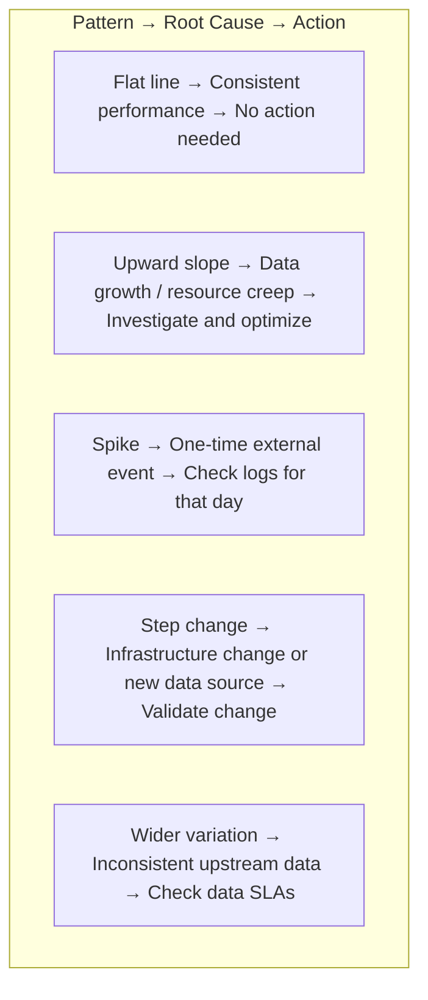

# Landing Times — Scheduling Trend Analysis

> **Module 03 · Topic 01 · Explanation 07** — Detect pipeline degradation before it becomes an SLA miss

---

## 🎯 The Real-World Analogy: A Package Delivery Tracking Chart

Think of Landing Times as a **courier company's delivery performance chart**:

| Landing Times Concept | Courier Equivalent |
|----------------------|--------------------|
| **X-axis (scheduled time)** | The promised delivery date printed on the label |
| **Y-axis (actual completion)** | When the package actually arrived at the door |
| **Flat line** | Every package arrives exactly 2 hours after promised — consistent |
| **Upward slope** | Deliveries are taking longer and longer — driver is covering more stops |
| **Spike** | One day had a traffic gridlock — isolated slowdown |
| **Step change** | A new route was added — permanent increase in delivery time |

A logistics manager sees an upward trend and immediately knows: "Our drivers are covering 30% more stops than 6 months ago. We need another driver or an optimized route." The Airflow Landing Times view tells you the same about your tasks.

---

## What Landing Times Shows

The Landing Times chart shows **how long after the scheduled execution time each completed task instance actually finished**. It's a trend chart, not a point-in-time view.

```
╔══════════════════════════════════════════════════════════════╗
║  LANDING TIMES — extract_sales task (last 30 days)          ║
║                                                              ║
║  Minutes                                                     ║
║  after      ×                                               ║
║  scheduled  ×  ×                                            ║
║  time    ×  ×  ×  ×  ×  ×  ×  ×  ×  ×  ●  ●  ●  ●  ●    ║
║  ──────────────────────────────────────────────────         ║
║  Jan 1                             Jan 15        Jan 31     ║
║                                              ↑              ║
║                                        GROWING TREND        ║
║                                        = data volume growth ║
╚══════════════════════════════════════════════════════════════╝
```

---

## Reading the Patterns



---

## Python Code: Accessing Landing Times Data Programmatically

```python
import requests
from datetime import datetime, timedelta
import statistics

def get_task_landing_times(dag_id: str, task_id: str, days: int = 30) -> list:
    """
    Fetch the same data that Landing Times chart shows, via REST API.
    Returns: list of (scheduled_date, duration_minutes) tuples
    """
    base_url = "http://localhost:8080/api/v1"
    auth = ("admin", "admin")

    # Get task instances for the past N days
    response = requests.get(
        f"{base_url}/dags/{dag_id}/dagRuns",
        params={
            "state": "success",
            "limit": days,
            "order_by": "-start_date"
        },
        auth=auth
    )
    runs = response.json()["dag_runs"]

    landing_times = []
    for run in runs:
        run_id = run["dag_run_id"]
        scheduled = run["scheduled_date"]

        # Get task instance for this run
        ti_resp = requests.get(
            f"{base_url}/dags/{dag_id}/dagRuns/{run_id}/taskInstances/{task_id}",
            auth=auth
        )
        ti = ti_resp.json()

        if ti.get("state") == "success" and ti.get("duration"):
            landing_times.append({
                "scheduled_date": scheduled,
                "duration_minutes": ti["duration"] / 60,
                "end_date": ti["end_date"]
            })

    return landing_times


def detect_degradation(landing_times: list, threshold_pct: float = 0.20) -> bool:
    """
    Alert if the last 7 days' average duration is >20% above
    the previous 23 days' average — early SLA risk detection.
    """
    if len(landing_times) < 14:
        return False  # Not enough history

    recent = [lt["duration_minutes"] for lt in landing_times[:7]]
    baseline = [lt["duration_minutes"] for lt in landing_times[7:]]

    recent_avg = statistics.mean(recent)
    baseline_avg = statistics.mean(baseline)

    degradation = (recent_avg - baseline_avg) / baseline_avg
    if degradation > threshold_pct:
        print(f"⚠️  DEGRADATION DETECTED: {degradation:.1%} slower than baseline")
        print(f"   Recent avg: {recent_avg:.1f}m, Baseline avg: {baseline_avg:.1f}m")
        return True
    return False


# Usage:
landing_times = get_task_landing_times("sales_etl", "extract_sales", days=30)
detect_degradation(landing_times)
```

---

## 🏢 Real Company Use Cases

**Etsy** built an automated Landing Times regression detector for their nightly financial reporting pipeline. They query the Airflow REST API every morning to compute each task's 7-day moving average landing time and compare it against the 30-day baseline. If any task shows >15% degradation trend, an automated Jira ticket is created with the task name and trend chart — ensuring slow creep is caught weeks before it becomes an SLA miss.

**Wayfair** uses Landing Times data to track the impact of their quarterly data model changes. Before and after each major dbt transformation change, they extract Landing Times for affected tasks and compare using a statistical t-test. If the new model's task durations are statistically significantly longer (p<0.05), the change is flagged for optimization before it reaches production. This has caught three major performance regressions in their data modeling pipeline.

**Twitter (now X)** uses Landing Times trends as a leading indicator for infrastructure capacity planning. A slow but consistent upward slope in multiple unrelated tasks — indicating the whole cluster is slowing down — triggers capacity review meetings 4-6 weeks before the trend would cause actual SLA violations. This allows proactive scaling rather than reactive firefighting.

---

## ❌ Anti-Patterns

### Anti-Pattern 1: Only Checking Landing Times After an SLA Miss

```
# ❌ BAD: Reactive monitoring — only open Landing Times when SLA is already missed
# 
# Day 1-60:  Task takes 5 minutes (flat line — no one checks)
# Day 61-90: Task grows to 8 minutes (upward trend — no one checks)
# Day 91:    Task takes 12 minutes — MISSES 8am SLA for the first time
# NOW engineer checks Landing Times and sees obvious 90-day upward trend
#
# ✅ GOOD: Proactive weekly review OR automated degradation alerts
# Set up: if 7-day avg landing time > 120% of 30-day baseline → alert
# Catch it at Day 70 when it's 6 minutes (easy to fix)
# Not at Day 91 when it's 12 minutes (requires emergency optimization)
```

---

### Anti-Pattern 2: Confusing Landing Time with Task Duration

```python
# ❌ CONFUSION: "Landing time" ≠ "task execution time"
#
# Landing time = time from SCHEDULED start to ACTUAL completion
#              = scheduling delay + queue wait + execution time
#
# Example:
# Scheduled: 00:00
# Task started (after queue wait): 00:05
# Task completed: 00:08
# Landing time = 8 minutes (from 00:00 to 00:08)
# Task duration = 3 minutes (from 00:05 to 00:08)
#
# If landing time grows but task duration stays constant:
# → scheduling/queue problem (more tasks competing for workers)
# If landing time grows AND task duration grows:
# → the task itself is slower (data growth, code regression)

# ✅ GOOD: Cross-reference Landing Times with Gantt
# Use Landing Times to detect TRENDS
# Use Gantt to diagnose ROOT CAUSE of slowness
```

---

### Anti-Pattern 3: Not Setting SLA Miss Callbacks

```python
# ❌ BAD: Relying only on manual Landing Times checks
@dag(
    dag_id="critical_pipeline",
    schedule="@daily",
    # No SLA configuration — engineers must manually check Landing Times
)
def pipeline():
    ...
```

```python
# ✅ GOOD: Configure SLA miss callbacks for automatic alerts
from airflow import DAG
from datetime import timedelta

def sla_miss_callback(dag, task_list, blocking_task_list, slas, blocking_tis):
    """Called when any task exceeds its SLA."""
    task_names = [sla.task_id for sla in slas]
    # Send Slack/PagerDuty alert
    send_alert(f"SLA MISS: {dag.dag_id} tasks {task_names} exceeded SLA")

@dag(
    dag_id="critical_pipeline",
    schedule="@daily",
    sla_miss_callback=sla_miss_callback,
    default_args={
        "sla": timedelta(hours=2),  # Each task must complete within 2 hours
    },
)
def pipeline():
    ...
```

---

## 🎤 Senior-Level Interview Q&A

**Q1: Landing times are trending upward over 3 months. What's the most likely cause and how do you investigate?**

> Most likely cause: **data volume growth**. ETL tasks process more data over time, so runtime grows proportionally. Investigation: (1) Check task logs for row counts — compare counts from 3 months ago to today. (2) Query the source table size: `SELECT COUNT(*) FROM orders WHERE date = '{{ ds }}'` — is today's partition larger? (3) Use the Gantt view to see if execution time is growing (data growth) or queue wait time is growing (resource contention). Fix: implement incremental processing (`WHERE updated_at >= '{{ prev_ds }}'`) or partition the source table by date and process only the current partition.

**Q2: Landing times show a spike every Monday but are flat Tuesday through Friday. What's causing it and how do you fix it?**

> Classic pattern: **weekend data accumulation**. The pipeline runs daily but processes "all new data since last run." On Monday, it processes 3 days of accumulated data (Friday–Sunday) instead of 1 day. **Verification**: check Monday's log for row count vs. other days. **Fix options**: (1) **Incremental processing**: instead of processing all rows since last run, process only `WHERE date = '{{ macros.ds_add(ds, -1) }}'` — exactly one day's data. (2) **Separate weekend pipeline**: create a `weekend_etl` DAG that runs Sunday midnight to pre-process the weekend backlog with more resources. (3) **Hourly micro-batching**: switch from daily to hourly schedule — each run always processes exactly 1 hour of data.

**Q3: How do you distinguish a Landing Times trend caused by data growth from one caused by infrastructure degradation?**

> Three diagnostic steps: (1) **Normalize by data volume**: get row counts from task logs over the same time period. If landing time / row count is constant → data growth. If landing time grows but rows/run is the same → infrastructure. (2) **Compare across tasks**: if ALL tasks in the cluster show similar upward trends simultaneously → infrastructure issue (not individual task data growth). If only specific tasks trend up → data growth specific to those tasks. (3) **Correlation check**: plot landing time vs. cluster CPU/memory metrics for the same period (from your infrastructure monitoring). Correlation → infrastructure. No correlation → data growth in the task itself.

---

## 🏛️ Principal-Level Interview Q&A

**Q1: Design an automated "Landing Times degradation detection" system that pages the on-call engineer before an SLA is missed.**

> **Architecture**: (1) **Data collection**: scheduled Lambda/cron job hourly, queries `GET /api/v1/taskInstances?dag_id={dag_id}&state=success&limit=30` to get recent task durations. (2) **Baseline computation**: for each task, compute rolling 30-day P90 duration as the baseline. (3) **Trend detection**: use linear regression on the last 14 days' durations. If slope > 0 AND `current_duration > baseline_duration * 1.15`, trigger alert. (4) **SLA projection**: estimate `days_until_sla_miss = (sla_threshold - current_duration) / daily_growth_rate`. Alert when <14 days. (5) **Alert routing**: P90 degradation >20% → Slack notification to DE team. Projected SLA miss within 7 days → PagerDuty page. (6) **False positive suppression**: require 3 consecutive days of degradation before alerting (avoids one-time spikes).

**Q2: Your Landing Times show performance has improved 40% after an infrastructure change. How do you validate this is real and not a measurement artifact?**

> **Statistical validation**: (1) **Sample size check**: need at least 14 data points before and after the change for statistical significance. (2) **Two-sample t-test**: test if pre-change durations vs. post-change durations are significantly different (p<0.01 for high confidence). Python: `scipy.stats.ttest_ind(pre_durations, post_durations)`. (3) **Control group**: identify a similar pipeline on the SAME infrastructure that was NOT changed. Did its Landing Times also improve? If yes → infrastructure change affected all pipelines. If no → the specific optimization worked. (4) **Confounding variables**: check if the data volume also changed during the same period (business event, new region). Normalize by rows-processed. (5) **Sustained monitoring**: track for 30 days post-change — confirm the improvement persists and isn't a temporary fluctuation.

**Q3: At enterprise scale (500 DAGs, 3 clusters), how do you build a Landing Times view that works across the fleet?**

> **Fleet-wide Landing Times platform**: (1) **Metrics pipeline**: Prometheus exporter per cluster exposes `airflow_task_duration_seconds` histogram with `dag_id` and `task_id` labels. (2) **Aggregation**: Thanos or Prometheus federation merges metrics from all 3 clusters into a single endpoint. (3) **Grafana dashboards**: "Fleet Landing Times" dashboard — heatmap of all tasks × time (color = duration percentile relative to baseline). Instantly shows which tasks degraded across the fleet. (4) **Alerting rules**: PromQL alert: `airflow_task_duration_seconds{quantile="0.9"} > (airflow_task_duration_seconds{quantile="0.9"} offset 7d) * 1.2` → 20% slower than 7 days ago. (5) **Drill-down**: clicking a hot cell in the heatmap links to the specific Airflow cluster's native Landing Times view for that DAG. Fleet view for discovery; native view for deep-dive.

---

## 📝 Self-Assessment Quiz

**Q1**: Landing times are trending upward over 3 months. What's the most likely cause?
<details><summary>Answer</summary>
Data volume growth. Most ETL tasks process more data over time — as business grows, so does the row count per run. The task takes proportionally longer. Confirm by checking row counts in task logs: if rows increase at the same rate as duration, data growth is the cause. Fix: implement incremental processing with date-partitioned loads so each run always processes a fixed window of data.
</details>

**Q2**: What's the difference between "landing time" and "task duration" in the context of this view?**
<details><summary>Answer</summary>
**Landing time** = time from the SCHEDULED start of the DAG run to the ACTUAL completion of the task. It includes: scheduler detection delay + worker queue wait time + actual task execution time. **Task duration** = only the actual execution time from when the task started running to when it finished. If landing time grows but duration stays constant, the scheduling/queueing is the problem. If both grow together, the task itself is slower.
</details>

**Q3**: Landing times show a spike every Monday but flat lines other days. What's the cause?
<details><summary>Answer</summary>
Weekend data accumulation. A daily pipeline that processes "all new data since last run" processes 3 days of data on Monday (Friday + Saturday + Sunday) vs 1 day Tuesday–Friday. Verification: check Monday's task logs for row counts vs other days. Fix options: (1) Incremental processing using only `WHERE date = '{{ prev_ds }}'`, (2) Separate weekend pre-processing DAG, (3) Switch to hourly micro-batching.
</details>

**Q4**: How do you get Landing Times data programmatically for automated monitoring?
<details><summary>Answer</summary>
Use the Airflow REST API: `GET /api/v1/dags/{dag_id}/dagRuns?state=success&limit=30` to get recent successful runs, then for each run: `GET /api/v1/dags/{dag_id}/dagRuns/{run_id}/taskInstances/{task_id}` to get `duration`, `start_date`, and `end_date`. From these: landing_time = end_date - scheduled_date (the run's `scheduled_date`). Compute rolling P90 as baseline and alert if recent runs exceed baseline by a threshold (e.g., 20%).
</details>

### Quick Self-Rating
- [ ] I understand what Landing Times shows (trend, not point-in-time)
- [ ] I can distinguish data growth degradation from infrastructure degradation
- [ ] I know the Monday spike pattern and its root cause
- [ ] I can configure SLA miss callbacks for automatic alerting
- [ ] I can access Landing Times data via the REST API for automated monitoring

---

## 📚 Further Reading

- [Airflow SLA Miss Callbacks](https://airflow.apache.org/docs/apache-airflow/stable/core-concepts/tasks.html#sla-missed-callbacks) — Configuring automatic SLA alerts
- [Airflow REST API — Task Instances](https://airflow.apache.org/docs/apache-airflow/stable/stable-rest-api-ref.html#tag/TaskInstance) — Accessing duration data programmatically
- [Airflow Metrics Reference](https://airflow.apache.org/docs/apache-airflow/stable/administration-and-deployment/logging-monitoring/metrics.html) — `airflow_task_duration_seconds` Prometheus metric
- [Airflow Best Practices — Scheduling](https://airflow.apache.org/docs/apache-airflow/stable/best-practices.html) — Incremental processing patterns
