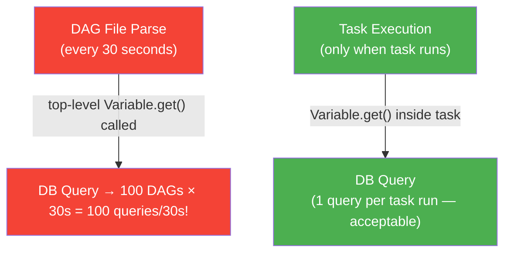

# Variables UI — Key-Value Configuration at Runtime

> **Module 03 · Topic 01 · Explanation 08** — Admin → Variables — the runtime config store

---

## 🎯 The Real-World Analogy: A Restaurant's Daily Specials Board

Think of Airflow Variables as a **restaurant's daily specials chalkboard**:

| Variables Concept | Specials Board Equivalent |
|------------------|--------------------------|
| **Variable key** | The dish category ("Today's Fish") |
| **Variable value** | The specific dish ("Salmon with lemon butter, $24") |
| **Changing a variable** | Erasing and rewriting on the board — instant effect |
| **All DAGs reading the same variable** | All servers reading the same board |
| **Reading at parse time (anti-pattern)** | Printing the specials in the PERMANENT menu — can't change without reprinting |
| **Reading inside a task** | Server checks the board when a customer orders — gets the current value |

When the chef changes today's fish (variable value), every server who looks at the board sees the updated value immediately — no menu reprinting needed. That's why Variables are powerful: they let you change runtime behaviour without redeploying DAG code.

---

## Purpose

Airflow Variables are **runtime key-value pairs** stored in the metadata DB. Use them for configuration that should be changeable without redeploying DAGs.

```
╔══════════════════════════════════════════════════════════════╗
║  VARIABLES UI (Admin → Variables)                            ║
║                                                              ║
║  Key                │ Value                │ Actions         ║
║  ──────────────────┼─────────────────────┼────────         ║
║  env               │ production           │ ✎ ✗            ║
║  api_endpoint      │ https://api.co/v2   │ ✎ ✗            ║
║  max_rows          │ 100000               │ ✎ ✗            ║
║  config            │ {"db":"pg","port":5432} │ ✎ ✗         ║
║  etl_start_date    │ 2024-01-01           │ ✎ ✗            ║
║                                                              ║
║  [+ Add Variable]  [Import Variables]  [Export Variables]   ║
╚══════════════════════════════════════════════════════════════╝
```

---

## Reading Variables: The CRITICAL Rule



---

## Python Code: Correct vs Incorrect Variable Usage

```python
from airflow.decorators import dag, task
from airflow.models import Variable
from datetime import datetime

# ══════════════════════════════════════════════════════════════
# ❌  WRONG — top-level Variable.get = parse-time DB query
# Called every 30 seconds, not just when task runs
# ══════════════════════════════════════════════════════════════
env = Variable.get("env")           # 🔴 Parse-time DB hit
max_rows = Variable.get("max_rows") # 🔴 Parse-time DB hit

@dag(dag_id="wrong_variable_usage", schedule="@daily",
     start_date=datetime(2024, 1, 1), catchup=False)
def bad_dag():
    @task()
    def run():
        print(f"env={env}")  # Uses the parsed-time value, not current!


# ══════════════════════════════════════════════════════════════
# ✅  CORRECT — read Variables inside task functions
# Called only when the task actually executes
# ══════════════════════════════════════════════════════════════
@dag(dag_id="correct_variable_usage", schedule="@daily",
     start_date=datetime(2024, 1, 1), catchup=False)
def good_dag():

    @task()
    def extract() -> dict:
        # ✅ Variable read happens at task execution time only
        env = Variable.get("env", default_var="development")
        max_rows = int(Variable.get("max_rows", default_var="50000"))
        api_url = Variable.get("api_endpoint")

        # ✅ JSON variables — deserialize automatically
        config = Variable.get("config", deserialize_json=True)
        db_host = config["db"]

        print(f"Running in {env}, fetching up to {max_rows} rows from {api_url}")
        return {"rows": max_rows, "env": env}

    @task()
    def load(data: dict):
        # ✅ Each task independently reads fresh variable values
        # If env was changed in the UI between extract and load,
        # load sees the NEW value
        env = Variable.get("env", default_var="development")
        table = f"orders_{env}"  # orders_production or orders_staging
        print(f"Loading to {table}")

    load(extract())

good_dag()
```

---

## Variables vs Connections vs Env Vars

| Feature | Variables | Connections | Env Vars |
|---------|----------|-------------|---------|
| **Purpose** | Config values (strings, JSON) | Credentials (host, port, login, password) | System-level config |
| **Encryption** | Optional (sensitive flag) | Always encrypted (Fernet) | Secret manager required |
| **UI access** | Yes — Admin → Variables | Yes — Admin → Connections | No |
| **Change without redeploy** | Yes | Yes | Requires restart |
| **Best for** | API endpoints, flags, thresholds | Database/API credentials | Airflow core config |

---

## 🏢 Real Company Use Cases

**Stripe** uses Airflow Variables extensively for their payment processing ETL pipelines. Key use case: `env = Variable.get("env")` controls whether the pipeline reads from production Stripe API or the staging sandbox. When QA teams need to run production data tests in staging, an engineer changes the Variable via the UI — no code change, no PR, no deployment. This cut their QA cycle time from 2 days to 2 hours.

**Fiverr** uses Variables to implement a circuit breaker pattern. A `data_source_healthy` Variable is set to `"true"` or `"false"` by a monitoring task. All ETL DAGs check this variable at the start of execution: if `"false"`, they skip the extraction and send an alert instead of failing. This prevents 50 DAGs from simultaneously hammering a struggling data source with retry waves.

**Klarna** uses JSON Variables for pipeline configuration management. Instead of 20 separate variables, they use one `pipeline_config` JSON variable: `{"batch_size": 5000, "timeout_s": 300, "retries": 3, "target_schema": "analytics"}`. Operators read `Variable.get("pipeline_config", deserialize_json=True)`. When performance tuning is needed, one JSON edit in the UI updates all parameters simultaneously — no multi-line PR required.

---

## ❌ Anti-Patterns

### Anti-Pattern 1: Reading Variables at Parse Time (The #1 Variable Anti-Pattern)

```python
# ❌ BAD — global scope = parse time (every 30 seconds)
from airflow.models import Variable

ENV = Variable.get("env")  # DB query every 30 seconds!
MAX_ROWS = int(Variable.get("max_rows"))  # Another DB query!

@dag(dag_id="bad_parse_time_vars")
def pipeline():
    @task()
    def run():
        print(ENV)  # Uses value from parse time, not current!

# With 100 DAGs: 200 DB queries every 30 seconds = ~6-7 queries/second
# During parse queue backlog: this is a significant metadata DB load
```

```python
# ✅ GOOD — inside task function = execution time only
@dag(dag_id="good_runtime_vars")
def pipeline():
    @task()
    def run():
        env = Variable.get("env")          # 1 query per task run
        max_rows = Variable.get("max_rows") # 1 query per task run
        print(env)  # Always gets the CURRENT value
```

---

### Anti-Pattern 2: Storing Secrets in Variables (Use Connections Instead)

```python
# ❌ BAD — credentials in Variables (stored as plaintext by default)
db_password = Variable.get("postgres_password")
api_key = Variable.get("stripe_api_key")
# These appear in clear text in the Variables UI!
# Anyone with Admin access can read them

# ✅ GOOD — use Connections for credentials (always Fernet-encrypted)
from airflow.hooks.base import BaseHook

conn = BaseHook.get_connection("my_postgres")
password = conn.password  # Stored encrypted, masked in UI

# OR for API keys, use the Connections "extra" JSON field:
conn = BaseHook.get_connection("stripe_api")
api_key = conn.extra_dejson.get("api_key")  # Encrypted in DB
```

---

### Anti-Pattern 3: Hardcoding Variable Keys (No Default Value)

```python
# ❌ BAD — no default value, will fail if variable doesn't exist
env = Variable.get("env")  # KeyError if "env" not in DB!

# During development, CI, or first-time setup, variables may not exist
# This causes DAGs to fail with an unclear KeyError rather than a meaningful error

# ✅ GOOD — always provide a sensible default
env = Variable.get("env", default_var="development")
max_rows = int(Variable.get("max_rows", default_var="10000"))

# For required variables (no sensible default), validate explicitly:
def get_required_variable(key: str) -> str:
    value = Variable.get(key, default_var=None)
    if value is None:
        raise ValueError(
            f"Required Airflow Variable '{key}' is not set. "
            f"Set it via Admin → Variables or environment variable "
            f"AIRFLOW_VAR_{key.upper()}={key}"
        )
    return value
```

---

## 🎤 Senior-Level Interview Q&A

**Q1: Why is reading Variables at the top of a DAG file a performance anti-pattern?**

> DAG files are parsed by the scheduler every `min_file_process_interval` (default 30s). A top-level `Variable.get()` executes a SQL `SELECT` against the metadata DB on EVERY parse. With 100 DAGs each having 2 Variable reads: 100 × 2 = 200 DB queries every 30 seconds = ~6-7 queries/second of constant metadata DB load, for zero business value. The values read at parse time may also be stale (read once, not updated when the variable changes). Move ALL Variable reads inside task functions — they execute only when the task runs, which is orders of magnitude less frequent than parse time.

**Q2: A DAG needs to behave differently in dev, staging, and production. How do you implement this using Variables?**

> Set a `env` Variable in each environment's Airflow: `dev`, `staging`, `production`. In the DAG, read inside tasks: `env = Variable.get("env", default_var="development")`. Branch based on env: `table_name = f"orders_{env}"` or use `if env == "production": target_schema = "analytics"; else: target_schema = f"analytics_{env}"`. For complex config differences, use a JSON Variable `pipeline_config_{env}` — but a single `env` Variable is often sufficient. Never inject environment differences via DAG code changes — that defeats the purpose.

**Q3: How do you manage Variables across multiple Airflow environments (dev/staging/prod) without manually clicking "Add" in each UI?**

> Three approaches: (1) **Import/Export**: use Admin → Variables → Export to download a JSON file. Import it in the next environment. Automate via CLI: `airflow variables export vars.json` and `airflow variables import vars.json`. (2) **Environment Variables**: set `AIRFLOW_VAR_ENV=production` in the environment — Airflow auto-creates a Variable from env vars with the `AIRFLOW_VAR_` prefix. CI/CD can inject these without touching the metadata DB. (3) **Terraform/Ansible**: use the Airflow provider for Terraform (`airflow_variable` resource) to manage Variables as infrastructure-as-code. All three approaches enable reproducible environment setup without manual UI clicking.

---

## 🏛️ Principal-Level Interview Q&A

**Q1: Design a feature flag system using Airflow Variables that allows turning off specific DAG features at runtime without code deployments.**

> **Feature flag architecture**: (1) **Variable structure**: `feature_flags` JSON Variable: `{"enable_pii_masking": true, "use_new_transform": false, "send_slack_alerts": true}`. (2) **Task implementation**: tasks check their relevant flag before executing the conditional logic. (3) **Graceful degradation**: if the flag variable doesn't exist (new feature, old environment), default to safe value (usually `False`/disabled). (4) **Flag evaluation helper**:
> ```python
> def is_enabled(flag: str, default: bool = False) -> bool:
>     flags = Variable.get("feature_flags", default_var="{}", deserialize_json=True)
>     return flags.get(flag, default)
> ```
> (5) **Change tracking**: log each flag state to XCom for observability. (6) **Rollback**: disabling a feature is a single JSON edit in the UI — no deployment, 30-second propagation time.

**Q2: A data engineer stored a 5MB JSON blob in an Airflow Variable. What are the consequences and how do you fix it?**

> **Consequences**: (1) **Metadata DB bloat**: the `variable` table now has a 5MB row. Every `Variable.get()` for ANY variable does a full table scan (depending on DB engine) — slow for all variable reads. (2) **Serialized DAG store**: if the Variable is read at parse time, the 5MB blob is processed 3,000+ times per day. (3) **XCom-like misuse**: Variables are for small config values, not datasets. **Fix**: (1) Move the large JSON to object storage (S3/GCS). Store only the path in the Variable: `Variable.set("config_path", "s3://configs/pipeline_config.json")`. (2) Have the task download and parse the config file from S3. (3) Remove the old large Variable. **Rule of thumb**: if a Variable value exceeds 10KB, it belongs in object storage.

**Q3: How do you secure Airflow Variables in a regulated environment where only certain engineers should be able to read/write specific variables?**

> **Multi-layer security**: (1) **Sensitive flag**: mark financial/PII variables as "sensitive" in the UI — they're masked in the UI and excluded from exports. This is UI-level only; DB access still reveals values. (2) **Secrets backend** (production standard): configure Airflow to read Variables from AWS Secrets Manager or HashiCorp Vault: `AIRFLOW__SECRETS__BACKEND=airflow.providers.amazon.aws.secrets.secrets_manager.SecretsManagerBackend`. All sensitive variables live in Secrets Manager with IAM-controlled access; DB Variables become non-sensitive config only. (3) **RBAC**: create separate Airflow roles — `Viewer` (no Variable access), `User` (Variable read-only), `Admin` (Variable CRUD). Grant minimum necessary access. (4) **Audit trail**: enable Airflow's event log for Variable changes: every create/update/delete is logged with the user and timestamp. (5) **Avoid Variables for secrets entirely**: use Connections (always encrypted) for credentials and Secrets Manager for sensitive configuration.

---

## 📝 Self-Assessment Quiz

**Q1**: Why is reading Variables at the top of a DAG file a performance anti-pattern?
<details><summary>Answer</summary>
DAG files are parsed every 30 seconds. A top-level `Variable.get()` executes a SQL query against the metadata DB on every parse. With 100 DAGs doing 2 Variable reads each: 200 DB queries every 30 seconds = ~6-7 constant queries/second of metadata DB load for zero business value. Move Variable reads inside task functions — they execute only when the task runs, which is far less frequent. Bonus: inside the task, you always get the CURRENT value, not a value that was frozen at parse time.
</details>

**Q2**: What's the difference between storing credentials in Variables vs Connections?
<details><summary>Answer</summary>
**Variables**: stored as plaintext by default (unless marked "sensitive"). Anyone with Admin UI access can see the value. No dedicated encryption for values. **Connections**: always stored encrypted using the Fernet key. Passwords are masked (`***`) in the UI even for Admins. Specifically designed for credentials — support structured fields (host, port, login, password, schema, extra). Use Connections for ALL credentials; use Variables for non-sensitive config values like endpoint URLs, thresholds, and feature flags.
</details>

**Q3**: How do you set a Variable without using the UI (for CI/CD automation)?
<details><summary>Answer</summary>
Three methods: (1) **Environment variable**: `AIRFLOW_VAR_ENV=production` — Airflow automatically creates a Variable named `env` with value `production`. CI/CD can inject this without DB access. (2) **CLI**: `airflow variables set env production` or `airflow variables import vars.json` for bulk import. (3) **REST API**: `POST /api/v1/variables` with `{"key": "env", "value": "production"}`. All three enable Variables-as-code without manual UI clicking.
</details>

**Q4**: A Variable value is read to be `None` even though you set it in the UI. What's wrong?
<details><summary>Answer</summary>
The most common cause: you used `Variable.get("key", default_var=None)` and the key doesn't exist in the DB — so the default `None` is returned. Check the exact key spelling (case-sensitive). Other possible causes: (1) You're reading from a different Airflow environment than where you set it. (2) The Variable was set in a different DB than the one the scheduler/worker is connected to. (3) If using `AIRFLOW_VAR_` env var: the env var prefix must be uppercase and exactly match: `AIRFLOW_VAR_MYKEY` creates variable `mykey` (lowercase).
</details>

### Quick Self-Rating
- [ ] I always read Variables inside task functions, never at module level
- [ ] I use Connections for credentials, Variables for config values
- [ ] I use `default_var` to avoid KeyError on missing variables
- [ ] I can import/export Variables for environment parity
- [ ] I know when to use Secrets Manager backend vs plain Variables

---

## 📚 Further Reading

- [Airflow Variables Documentation](https://airflow.apache.org/docs/apache-airflow/stable/core-concepts/variables.html) — Official guide
- [Secrets Backend Configuration](https://airflow.apache.org/docs/apache-airflow/stable/security/secrets/secrets-backend/index.html) — AWS Secrets Manager, HashiCorp Vault integration
- [Airflow Security — Sensitive Variables](https://airflow.apache.org/docs/apache-airflow/stable/security/secrets/mask-sensitive-values.html) — Masking sensitive values
- [REST API — Variables](https://airflow.apache.org/docs/apache-airflow/stable/stable-rest-api-ref.html#tag/Variable) — Programmatic Variable management
